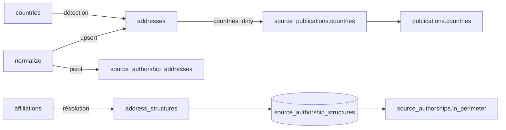

# Adresses — cycle de vie

*À jour le 2026-07-13.*

L'adresse n'a **pas d'objet de domaine** : elle vit comme texte normalisé et lignes SQL. Le mot « agrégat » désigne ici le cluster de tables qu'un repository possède, sans racine d'entité ni logique métier côté `domain/`. Toutes les invariances (autorité `countries` vs `suggested_countries`, états d'un rattachement) sont portées par le SQL et les services.

## Tables du cluster

| Table | Rôle | Colonnes clés |
|---|---|---|
| `addresses` | L'adresse normalisée | `raw_text`, `normalized_text`, `countries CHAR(2)[]`, `suggested_countries`, `countries_dirty`, `pub_count` |
| `address_structures` | Rattachement adresse → structure | `address_id`, `structure_id`, `matched_form_id` (NULL = confirmé manuellement sans détection), `is_confirmed` (NULL pending / TRUE confirmé / FALSE rejeté) |
| `source_authorship_addresses` | Pivot signature ↔ adresse | `source_authorship_id`, `address_id` |
| `place_name_forms` | Formes de noms de lieux → code ISO | `iso_code`, `form_normalized`, `kind` (`country` / `institution` / `city`) |

Unicité d'une adresse : index sur `md5(raw_text)`. Unicité d'un rattachement : `(address_id, structure_id)`. Deux vues matérialisées dérivent du cluster (accès SQL brut) : `source_authorship_structures` (pivot ⋈ `address_structures` ⋈ `perimeter_structures`) et `authorship_structures`.

## Les deux axes

Le cycle de vie se lit selon deux axes orthogonaux : **écriture / lecture** et **pipeline / API**. Les quatre quadrants ci-dessous.

## Écriture — pipeline

Trois phases écrivent le cluster, dans l'ordre `normalize` → `affiliations` → `countries`.

**`normalize`** crée les adresses et le pivot. Cinq sources (hal, openalex, wos, scanr, crossref) partagent l'écriture batch dans `pipeline/normalize/_authorships_batch.py` (`write_source_authorships`) : déduplication des textes d'adresse → `upsert_addresses_batch` (`INSERT … ON CONFLICT (md5(raw_text)) DO NOTHING`) → récupération des ids → `apply_address_countries_batch` (écrit `countries` seulement si NULL — source autoritaire, ScanR) et `apply_address_suggested_countries_batch` (écrit `suggested_countries` — OpenAlex, faillible) → `insert_source_authorship_addresses_batch`. Les nouvelles `source_authorships` héritent du défaut `countries_dirty = true`, ce qui amorce la cascade pays.

theses écrit ses `source_authorships` une par une (`upsert_theses_source_authorship`, `RETURNING`) : ses non-auteurs — jury, rapporteurs — ont `author_position` NULL, que le remap par position du writer batch ne saurait porter. L'écriture des adresses est partagée : theses appelle `write_addresses` avec les `sa_id` récoltés, tous porteurs des mêmes adresses de document (laboratoires partenaires + établissement de soutenance).

**`affiliations`** résout le texte d'adresse en structures (`pipeline/affiliations/resolve_addresses.py`, `run_resolution`). Un `AddressMatcher` Aho-Corasick chargé sur `structure_name_forms` balaie les `addresses` paginées par keyset sur `id`, matche `normalized_text`, et n'écrit que les diffs : suppression des détections obsolètes automatiques, passage de `matched_form_id` à NULL sur les liens manuels/confirmés devenus obsolètes (la ligne survit), upsert des nouvelles détections `(address_id, structure_id, matched_form_id)`.

**`countries`** détecte et écrit les pays (`pipeline/countries/phase.py`) : par nom de pays en fin d'adresse (`detect_by_country_name`), par nom de lieu (`detect_by_place_name`, Aho-Corasick sur les formes `institution`/`city`, n'écrit `countries` que si un seul ISO ressort), puis suggestion inversée (`suggest_countries`, cible les adresses sans pays et écrit `suggested_countries`). `write_countries` pose `countries_dirty = true` dès qu'il écrit dans `countries` — c'est le crochet incrémental.

**Cascade `countries_dirty`** (étape finale de `countries`, `refresh_publication_countries.py`) : rassemble les `source_authorships` « sales » — soit `source_authorships.countries_dirty` posé par `normalize`, soit celles dont une `addresses.countries_dirty` a été posée par `write_countries` — recalcule `source_publications.countries` puis `publications.countries`, et remet les deux flags à zéro.

## Écriture — API (curation admin)

Routeur `interfaces/api/routers/admin/addresses.py`, couche commande transactionnelle `application/services/addresses/commands.py`, briques `structures.py` / `countries.py`, adaptateur `PgAddressRepository`.

**Confirmer / rejeter / réinitialiser un rattachement** : `POST /addresses/{id}/review` et `/batch-review` → `review_structure_link`. Le service lit l'appartenance au périmètre *avant*, applique soit `reset_manual_link` (repasse `is_confirmed` à NULL et supprime le lien automatique), soit `upsert_structure_link` (`is_confirmed` TRUE/FALSE), relit *après*, et renvoie le diff symétrique des `address_ids` réellement touchés (détection des no-op). En cas de changement, une tâche de fond propage `in_perimeter` (recompute sur les `source_authorships` des adresses, puis propagation aux `authorships`) sans rafraîchir les vues matérialisées.

**Override de pays** : `POST /addresses/{id}/country` et `/batch-country` → `set_countries` / `batch_add_country_*`, avec propagation aux adresses de même `normalized_text`. Une tâche de fond recalcule directement `source_publications.countries` et `publications.countries` — chemin distinct de la cascade `countries_dirty` du pipeline.

## Lecture — pipeline

**Rollup `in_perimeter`** (étape 3 de `affiliations`, `populate_affiliations.py`) : rafraîchit `source_authorship_structures` (`REFRESH MATERIALIZED VIEW CONCURRENTLY`) puis `sync_in_perimeter`, un delta CTE qui compare les `sa_id` présents dans la matview (pour les structures du périmètre) à ceux actuellement `in_perimeter`, et n'écrit que l'écart. C'est le point où les rattachements `address_structures` pilotent finalement `source_authorships.in_perimeter`.

**Dérivation des pays** : la cascade `countries_dirty` lit `addresses.countries` (jointe aux `source_authorships` sales) pour écrire les pays des `source_publications` puis des `publications`.

**pub_count** : la phase `publications` lit le pivot ⋈ `source_authorships` ⋈ `source_publications` pour recalculer `addresses.pub_count`.

**Entrées de matching** : `resolve_addresses` lit `addresses(id, normalized_text)` + `structure_name_forms` ; la détection pays lit `addresses` + `place_name_forms`.

## Lecture — API

Routeur `interfaces/api/routers/admin/addresses.py`, port `application/ports/api/addresses_queries.py`, adaptateur `PgAddressesQueries` — **distinct** des modules SQL de résolution/pays du pipeline (séparation lecture-API vs écriture-pipeline).

- **Listing / curation** (`GET /addresses`) : `addresses ⋈ address_structures` filtré sur une structure, avec prédicats détecté / validation / texte ; agrégat JSON des structures par adresse (hors `structure_type = 'site'`).
- **Inspection** (`GET /addresses/{id}/publications`) : texte brut + publications de l'adresse (pivot ⋈ sa ⋈ sp ⋈ publications ⋈ journals) ; les structures d'un rattachement exposent `is_confirmed` et `is_detected` (= `matched_form_id IS NOT NULL`).
- **Facettes pays** (`GET /addresses/countries`, `/suggest-countries`, `/countries`) : lit `countries`, `suggested_countries`, `pub_count` ; facettes construites par `unnest`.
- **Stats** (`GET /admin/address-stats`) : comptes sur `address_structures` (détecté / pending / rejeté / confirmé) pour une structure.

## Points d'attention

1. **`recompute_pub_count` mal rangé.** Cette requête de pipeline (recalcul de `addresses.pub_count`, appelée par la phase `publications`) vit dans `infrastructure/repositories/address_linker.py` — un module de repository — plutôt que dans un module `queries/pipeline`.
2. **Deux dérivations pays → publications.** Le pipeline utilise la cascade incrémentale `countries_dirty` ; le chemin de fond de l'API recalcule en plein via `PgAddressRepository.refresh_*`, sans passer par `countries_dirty`. Deux implémentations de « `addresses.countries` → `publications.countries` » à garder synchronisées.
3. **La couche application compose du SQL.** `application/services/addresses/countries.py` construit une clause `where` SQL (placeholders `%s` et noms de colonnes) passée à `PgAddressRepository.batch_add_country_by_where`, qui substitue les placeholders. De la logique SQL remonte dans la couche application.
4. **Écritures cross-agrégat dans le repo adresses.** `PgAddressRepository` écrit `source_publications.countries` et `publications.countries` (exception documentée dans sa docstring).
5. **Condition miroir couplée par commentaire.** `which_contribute_to_perimeter` (`is_confirmed IS DISTINCT FROM FALSE`) doit rester synchrone avec `recompute_in_perimeter_on_source_authorships` — garanti seulement par un commentaire.
6. **Péremption des matviews assumée.** Le chemin de review de l'API recalcule `in_perimeter` depuis les tables de base mais ne rafraîchit pas `source_authorship_structures` / `authorship_structures` : elles attendent le prochain run pipeline.
