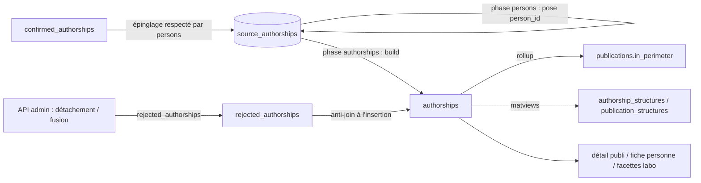

# Authorships — cycle de vie

*À jour le 2026-07-14.*

Une `authorship` est la table de liaison personne ↔ publication : une ligne par couple `(publication_id, person_id)`, consolidée depuis les signatures par-source (`source_authorships`). Au sens DDD, c'est l'entité fille de [publications](publications.md) (`domain/publications/authorship.py`) ; son vocabulaire de rôles et les mappings par source vivent dans `authorship_roles` (`map_role`, `merge_roles`). Contrairement à la publication (dérivée par réconciliation) ou à la personne (construite par matching), l'authorship est un pur **rollup** : la phase `persons` pose le `person_id` sur chaque signature, puis la phase `authorships` promeut les couples attestés dans la table `authorships` et en recompose les attributs.

## Tables du cluster

| Table | Rôle | Colonnes clés |
|---|---|---|
| `authorships` | Table de liaison personne ↔ publication | `(publication_id, person_id)` unique, `publication_id` (FK NOT NULL), `author_position`, `roles`, `is_corresponding`, `in_perimeter` |
| `source_authorships` | Signature par-source (amont) | `authorship_id` (→ `authorships`), `person_id`, `resolution_mode` (cf. [source_publications](source_publications.md)) |
| `confirmed_authorships` | Épinglage humain d'une signature | `(source_authorship_id, person_id)` |
| `rejected_authorships` | Rejet durable d'une paire | `(publication_id, person_id)` |
| `authorship_structures` | Authorship ↔ structure UCA (matview) | `(authorship_id, structure_id)`, dérivée de `source_authorship_structures` |
| `publication_structures` | Publication ↔ structure (matview) | `(publication_id, structure_id)`, dérivée d'`authorships` × `authorship_structures` |

La signature par-source `source_authorships` (avec son identité d'auteur dédupliquée `author_identifying_keys`) relève du bilan [source_publications](source_publications.md) ; ce bilan la couvre comme source du rollup.

## Les deux axes

L'écriture de la table est **exclusivement pipeline** (un rollup convergent) ; la curation admin agit sur les stores en amont.

## Écriture — pipeline (phase `authorships`)

`application/pipeline/authorships/phase.py` enchaîne trois temps : le **build** (une transaction), puis la **purge** des publications restées à zéro authorship (par lots, maintenance physique hors transaction), puis le **refresh des `pub_count`** journaux/éditeurs (qui dérivent de `in_perimeter`).

Le build (`build_authorships.py`) est idempotent et convergent — cinq étapes :

1. **Insertion + purge** : insère les couples `(publication_id, person_id)` attestés par au moins une `source_authorship` (avec `person_id`) et absents, en **anti-join sur `rejected_authorships`** (une paire rejetée n'est jamais recréée) ; supprime les authorships que plus aucune source n'atteste.
2. **Liaison** : pose `source_authorships.authorship_id` (source-agnostique, un seul UPDATE).
3. **Recomposition convergente** des attributs dérivés : `author_position` = valeur de la source la plus prioritaire (`SOURCE_PRIORITY`), `is_corresponding` et `in_perimeter` en `bool_or`, `roles` en union triée. Convergente (`IS DISTINCT FROM`, sans garde `IS NULL`) : un attribut que plus aucune source n'atteste **retombe** (rôle disparu retiré, périmètre perdu → `FALSE`).
4. **Rollup** `publications.in_perimeter` : vrai si la publication a ≥1 authorship in-périmètre d'une personne **non rejetée** — exactement le prédicat du filtre de périmètre.
5. **Refresh** des matviews `authorship_structures` puis `publication_structures` (`CONCURRENTLY`).

`rebuild_full` (`run_pipeline --rebuild-authorships`) purge d'abord la table (reconstruction de récupération). Des `ANALYZE` intra-transaction sont intercalés entre les étapes : sans stats fraîches, l'UPDATE de l'étape 3 partirait en Nested Loop sur des estimations périmées (des heures sur ~100 k authorships fraîchement insérées).

## Écriture — API

La table `authorships` n'est **jamais écrite directement par l'API** : elle est le produit du build. La curation admin agit sur les stores en amont, côté [personnes](persons.md) :

- **Détachement** (`POST /api/persons/{id}/detach-authorships`) : inscrit la paire dans `rejected_authorships`, détache les signatures et supprime l'authorship devenue orpheline.
- **Épinglage** : `confirmed_authorships` fige une signature ; la phase `persons` la repose en tête (`enforce_confirmed_authorships`) avant tout re-matching, si bien que le `person_id` porté par les signatures — et donc les authorships promues — respecte les décisions humaines.
- **Fusion** (personnes ou publications) : `merge_into` déduplique et repointe les authorships vers la cible.

Le `person_id` des signatures vient de la cascade `persons` ; l'authorships build ne fait que promouvoir les couples et recomposer leurs attributs.

## Lecture — pipeline

- `publications.in_perimeter` (matérialisé à l'étape 4) est le drapeau lu par le filtre de périmètre dans tout le pipeline et l'API.
- La matview `publication_structures` sert la ventilation par laboratoire (comptage par structure sans jointure ni `DISTINCT`).

## Lecture — API

- **Détail publication** : auteurs canoniques via `authorships` ⨝ `persons` ⨝ `authorship_structures` (avec leurs structures et le drapeau de correspondance).
- **Fiche / dashboard personne** : publications et thèses via `authorships` ⨝ `publications`.
- **Listes / facettes / stats** : facette laboratoire via `publication_structures` ; décomptes de publications scopés `in_perimeter`.

## Points d'attention

1. **L'authorship est un pur dérivé.** Elle n'est jamais éditée à la main : tout l'état vient des `source_authorships` liées (leur `person_id`, leurs attributs). La curation passe par les stores `confirmed_authorships` / `rejected_authorships`, pas par la table canonique.
2. **Recomposition sans garde `IS NULL`.** Un attribut (rôle, correspondance, périmètre) que plus aucune source n'atteste retombe au run suivant. Voulu (convergence), mais implique qu'aucune valeur ne survit à la disparition de sa source.
3. **`ANALYZE` intra-transaction obligatoire** entre les étapes du build : dette de performance documentée dans l'adapter (sans elle, le planner s'effondre sur des colonnes fraîchement peuplées), pas un défaut.

## Invariants métier

Portés par le domaine (`domain/publications/`), le SQL et la phase.

- **Identité.** `(publication_id, person_id)` unique ; la FK `publication_id NOT NULL` verrouille l'entité fille au root `Publication`.
- **Rejet durable.** Une paire inscrite dans `rejected_authorships` n'est jamais recréée par le build (anti-join à l'insertion).
- **Périmètre matérialisé.** `publications.in_perimeter` = « ≥1 authorship in-périmètre d'une personne non rejetée » — prédicat unique, recalculé à chaque build.
- **Convergence.** Le build (insertion + purge + recomposition) est idempotent : un rejeu sans `rebuild_full` converge vers le même état.
