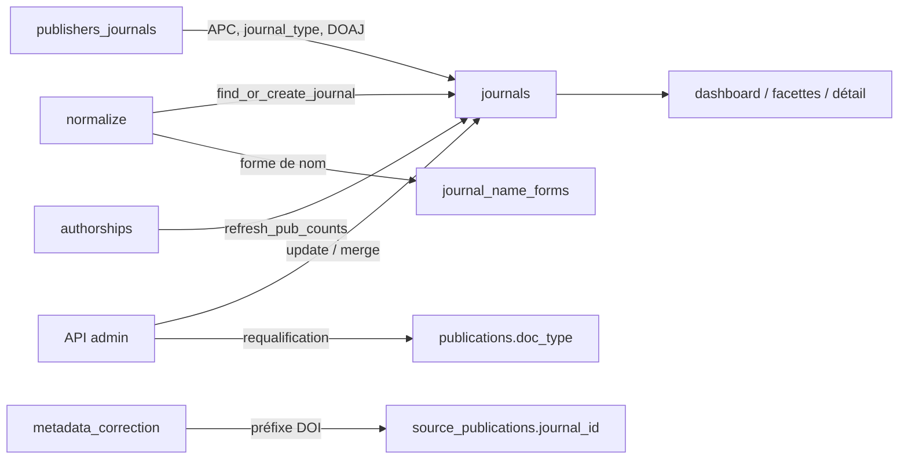

# Journals — cycle de vie

*À jour le 2026-07-13.*

L'aggregate root `Journal` (`domain/journals/journal.py`) représente une revue, une conférence, un dépôt ou un autre support de publication. Identité = `id` (clé surrogate) ; identifiant naturel = `title` via la normalisation de `journal_name_forms` ; les ISSN sont fortement discriminants mais facultatifs. `publisher_id` référence l'aggregate `Publisher` par son id. L'objet de domaine est un simple porteur de données : la logique de matching, de fusion et d'enrichissement vit dans `application/services/journals/`.

## Tables du cluster

| Table | Rôle | Colonnes clés |
|---|---|---|
| `journals` | La revue | `title` / `title_normalized`, `issn` / `eissn` / `issnl`, `publisher_id`, `openalex_id` (unique), `journal_type` (enum SQL), `oa_model` (text libre), `is_in_doaj`, `apc_amount` / `apc_currency`, `doaj_payload`, `pub_count` |
| `journal_name_forms` | Formes de nom → revue, pour le matching par titre | `journal_id` (ON DELETE CASCADE), `form_normalized`, `publisher_id`, unicité `(form_normalized, publisher_id)` |

Trois tables référencent `journals.id` sans faire partie du cluster : `publications.journal_id` et `source_publications.journal_id` (rattachement des publications), `apc_payments.journal_id` (ON DELETE SET NULL). Les politiques de suppression divergent, d'où la fusion manuelle en plusieurs étapes (cf. points d'attention).

## Les deux axes

Le cycle de vie se lit selon deux axes orthogonaux : **écriture / lecture** et **pipeline / API**.

## Écriture — pipeline

**Création et matching (`normalize`)** : les six normaliseurs de sources appellent `find_or_create_journal` (`application/services/journals/core.py`), dont la cascade de résolution est `openalex_id` → ISSN / eISSN / ISSN-L (`find_journal_by_issn_any`) → titre (`find_journal_by_name_form`, qui priorise les revues avec eISSN) → création + `add_journal_name_form`. L'enrichissement opportuniste passe par `enrich_journal` (COALESCE, jamais de downgrade). Le `journal_id` est porté par la publication via `extract_pub_metadata`. `normalize_openalex` dérive aussi l'`oa_model` (`full_oa` / `subscription`) du `is_oa` de la source.

**Rattachement tardif par préfixe DOI (`metadata_correction`)** : `journal_by_doi.py` pose `source_publications.journal_id` quand un préfixe DOI unique désigne une revue (décision pure dans `domain/source_publications/correction.py`).

**Enrichissement du référentiel (`publishers_journals`)** : l'orchestrateur `phase.py` enchaîne, sous gardes de config, la résolution des éditeurs (`resolve_publishers.py`), l'enrichissement OpenAlex (`enrich_journals_from_openalex.py` : APC + `journal_type` sur les revues `unknown`, via `map_openalex_source_type`), et l'import du dump DOAJ (`import_journals_from_doaj_dump.py` : `doaj_payload` + `is_in_doaj`). Adapters d'écriture : `PgJournalRepository` (`create_journal`, `enrich_journal`, `update_journal_apc`, `update_journal_doaj`, `update_journal_fields`) et `PgEnrichQueries`.

## Écriture — API (curation admin)

Routeur `interfaces/api/routers/journals.py`, command handlers `application/services/journals/commands.py`, cœur métier `core.py`, adaptateur `PgJournalRepository`.

- **Édition** (`PUT /api/journals/{id}`) : `update_journal` normalise `title` → `title_normalized` ; si `journal_type` change, `requalify_publications_for_journal` rejoue le `doc_type` des publications de la revue et émet un audit `journal.type_requalified`.
- **Fusion** (`POST /api/journals/{id}/merge`) : `merge_journals` → `merge_journal_into`, cinq étapes SQL qui repointent `publications`, `source_publications`, `apc_payments`, `journal_name_forms` puis recalent `pub_count`.
- **Prévisualisation** (`GET .../type-change-impact`) : exécute le chemin d'écriture réel dans un `SAVEPOINT` annulé (`begin_nested` + `rollback`).

## Lecture — pipeline

**`pub_count`** : `infrastructure/queries/pipeline/pub_counts.py` recalcule `journals.pub_count` (puis `publishers.pub_count`) — variante bulk `refresh_pub_counts` (phase `authorships`, après pose de `in_perimeter`), variante scopée `refresh_journal_pub_count` (fusions admin). Un module de requêtes unique sert pipeline et API, conforme au pattern « queries mutualisées, ports par contexte » (cf. [03-application.md](../architecture/03-application.md)).

**`journal_type`** : `refresh_from_sources` (`application/services/publications/core.py`) lit `get_journal_type` pour rejouer les règles de `doc_type` dépendantes de la revue.

**Matching** : `find_journal_by_openalex_id`, `find_journal_by_issn_any`, `find_journal_by_name_form`, `find_by_id` (`PgJournalRepository`).

## Lecture — API

Port `application/ports/api/journals_queries.py` (DTOs co-localisés), adaptateur `PgJournalQueries`, routeur `interfaces/api/routers/journals.py`.

- **Listing / facettes** (`GET /api/journals`, `/facets`) : `list_journals` (WHERE composé par `_build_journal_where`), `journals_facets` (comptes exclusifs par dimension). Le filtre « avec publications » s'appuie sur le cache `journals.pub_count`.
- **Détail / dashboard** (`GET /{id}`, `/{id}/dashboard`) : le dashboard **consomme `domain/journals/expected.py`** (`is_doc_type_expected` / `is_oa_status_expected`) pour signaler les publications hors du cadre annoncé, et recompte l'appartenance au périmètre en direct.
- **Enums** (`GET /api/journal-types`, `/api/journals/oa-models`) : exposent `JOURNAL_TYPE_LABELS_FR` / `OA_MODEL_LABELS_FR`, source de vérité Python de `domain/journals/journal.py`.

## Points d'attention

Dette assumée et décisions d'architecture propres à cet agrégat, gardées explicites.

1. **`map_openalex_source_type` dans le domaine.** `domain/journals/journal.py` porte la taxonomie `type` des Sources OpenAlex (`conference`, `book series`…). Le domaine connaît le vocabulaire d'une source externe — préoccupation plus proche d'un adaptateur source ou de la phase d'enrichissement que du domaine pur.
2. **Agrégat anémique.** `Journal` est une dataclass de données sans comportement ni invariant maintenu ; le label « aggregate root » est aspirationnel. L'opportunité d'un objet de domaine riche rejoint le catalogue d'invariants évalué en fin de tour.
3. **`merge_journal_into` : SQL cross-agrégat et contrainte gérée à la main.** La fusion mêle SQLAlchemy Core et `text()` pour écrire `publications` / `source_publications` / `apc_payments` (tables hors MetaData du repo journal), et neutralise l'`openalex_id` source avant le COALESCE pour éviter une violation d'unicité — logique sensible à l'ordre des statements.
4. **Cascade `find_or_create_journal` incohérente entre branches.** Les chemins openalex / ISSN réenregistrent une forme de nom via `enrich_journal`, mais le chemin par titre ne le fait pas ; un `# TODO` explicite subsiste dans `core.py`.

## Invariants métier

Règles métier de l'agrégat maintenues par discipline — ni par une contrainte de base, ni par un objet de domaine — et dispersées dans le SQL et les services.

- **Cohérence `journal_type` → `doc_type`.** Le `doc_type` canonique d'une publication dépend du `journal_type` de sa revue (règles journal-dépendantes d'`effective_metadata`). L'invariant est tenu par deux chemins selon le contexte : la phase pipeline `metadata_correction`, qui recalcule tous les `doc_type` depuis le brut reconstruit, en aval de `publishers_journals` (idempotente, auto-cicatrisante) ; et le hook API `requalify_publications_for_journal`, qui requalifie sur-le-champ les publications de la revue éditée, sans attendre le prochain run.

La minceur de cette section confirme le caractère anémique de l'agrégat : la règle est portée par la phase de correction et le service, pas par le concept `Journal` lui-même.
