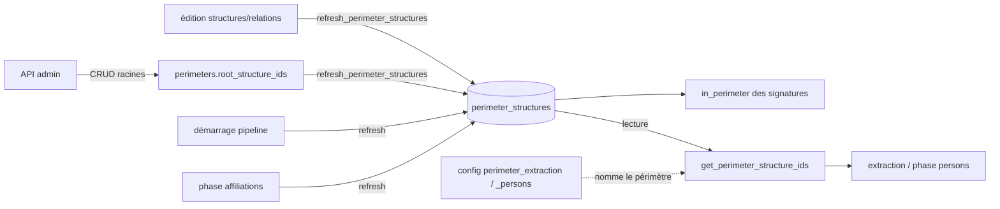

# Périmètres — cycle de vie

*À jour le 2026-07-13.*

L'entité `Perimeter` (`domain/perimeters/perimeter.py`) est un petit agrégat : `id`, `code` (identifiant naturel), `name`, et `root_structure_ids` — les structures **racines** du périmètre. Ses fabriques et mutateurs (`create`, `set_name`, `set_root_structure_ids`) garantissent un code et un nom non vides ; au-delà, c'est un **concept de cadrage** : un périmètre nommé désigne, par expansion récursive de ses racines, l'ensemble des structures « in perimeter » qui scope l'extraction, les affiliations et la création des personnes.

## Tables du cluster

| Table | Rôle | Colonnes clés |
|---|---|---|
| `perimeters` | Le périmètre et ses racines | `code` (unique), `name`, `root_structure_ids` (`int[]` : structures racines) |
| `perimeter_structures` | Clôture récursive matérialisée | `perimeter_id`, `structure_id` — racines + tous leurs descendants via `est_tutelle_de` |

Les racines vivent dans une colonne tableau (`perimeters.root_structure_ids`), remplacée en bloc à chaque édition. `perimeter_structures` matérialise, pour chaque périmètre, la descente récursive des racines dans `structure_relations` (relation `est_tutelle_de`). Deux clés de `config` nomment des périmètres actifs : `perimeter_extraction` (extraction + affiliations) et `perimeter_persons` (création des personnes).

## Les deux axes

## Écriture — API (curation admin)

Routeur `interfaces/api/routers/perimeters.py`, services `application/services/perimeters/` (`core` + `commands`), adaptateur `PgPerimeterRepository`.

- **CRUD** : `create_perimeter` (code unique), `update_perimeter` (name et racines via `root_structure_ids`, remplacées en bloc), `delete_perimeter` — qui refuse la suppression d'un périmètre référencé par la config pipeline (`config_keys_referencing_perimeter`).
- Après toute édition des racines (services perimeters) **ou** des structures et de leurs relations (services structures), le command handler rejoue `refresh_perimeter_structures` pour réaligner `perimeter_structures`.

## Écriture — pipeline

Le pipeline n'édite pas les périmètres (curation admin), mais **rematérialise** `perimeter_structures` (`refresh_perimeter_structures`) à deux moments : en tête de run, avant l'extraction qui lit le périmètre d'extraction ; et une seconde fois au début de la phase `affiliations`. La clôture est ainsi fraîche avant de servir au cadrage.

## Lecture — pipeline

- **Extraction** : les extracteurs lisent, via `get_extraction_api_ids`, les structures du périmètre d'extraction (`get_perimeter_structure_ids`) pour savoir quoi interroger aux sources.
- **Cadrage `in_perimeter`** : la phase `affiliations` reconnaît comme in-perimeter les structures présentes dans `perimeter_structures` du périmètre d'extraction (jointes via la matview `source_authorship_structures`).
- **Périmètre personnes** : `get_persons_structure_ids` lit dans `perimeter_structures` la clôture du périmètre `perimeter_persons` pour la phase `persons`.

## Lecture — API

Port `application/ports/read_models/perimeters_queries.py`, adaptateur `PgPerimetersQueries` dans `infrastructure/read_models/perimeters.py` (l'adaptateur pipeline `PgPerimeterStructuresQueries` vit à part dans `infrastructure/pipeline/perimeter.py`).

- **Listing** (`list_perimeters_with_structures`) : chaque périmètre avec ses structures racines et le décompte après descente récursive.
- Le routeur structures expose l'appartenance d'une structure à un périmètre.

## Points d'attention

Dette assumée et décisions d'architecture propres à cet agrégat, gardées explicites.

1. **Racines en colonne tableau (décision assumée).** `perimeters.root_structure_ids` est un `int[]` sans clé étrangère sur ses éléments. L'intégrité repose sur la discipline des points d'écriture — édition de périmètre, suppression de structure, ajout/retrait de tutelle — qui nettoient les racines et recalculent la clôture. Une table de jointure serait plus relationnelle, mais overkill à ce stade.

## Invariants métier

- **Clôture d'un périmètre.** `perimeter_structures` = les racines `perimeters.root_structure_ids` plus tous leurs descendants via `structure_relations.est_tutelle_de`. La règle est portée par l'unique CTE de `refresh_perimeter_structures` (`get_perimeter_structure_ids` ne fait que lire la table), pas par l'entité `Perimeter`.
