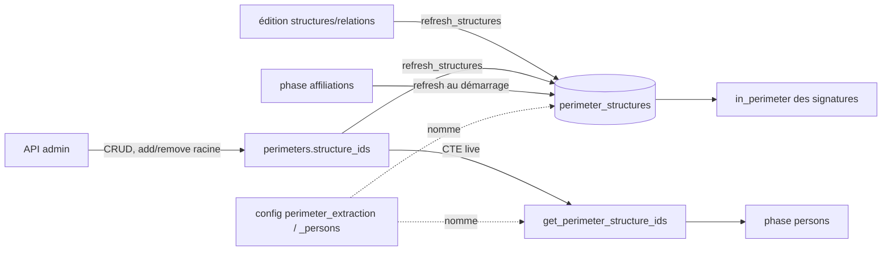

# Périmètres — cycle de vie

*À jour le 2026-07-13.*

L'entité `Perimeter` (`domain/perimeters/perimeter.py`) est un porteur de données mince : `id`, `code` (identifiant naturel), `name`, et `structure_ids` — les structures **racines** du périmètre. Ce n'est pas un agrégat riche, mais un **concept de cadrage** : un périmètre nommé désigne, par expansion récursive de ses racines, l'ensemble des structures « in perimeter » qui scope l'extraction, les affiliations et la création des personnes.

## Tables du cluster

| Table | Rôle | Colonnes clés |
|---|---|---|
| `perimeters` | Le périmètre et ses racines | `code` (unique), `name`, `structure_ids` (`int[]` : structures racines) |
| `perimeter_structures` | Clôture récursive matérialisée | `perimeter_id`, `structure_id` — racines + tous leurs descendants via `est_tutelle_de` |

Les racines vivent dans une colonne tableau (`perimeters.structure_ids`), éditée par `array_append` / `array_remove`. `perimeter_structures` matérialise, pour chaque périmètre, la descente récursive des racines dans `structure_relations` (relation `est_tutelle_de`). Deux clés de `config` nomment des périmètres actifs : `perimeter_extraction` (extraction + affiliations) et `perimeter_persons` (création des personnes).

## Les deux axes

## Écriture — API (curation admin)

Routeur `interfaces/api/routers/admin/perimeters.py`, services `application/services/perimeters/` (`core` + `commands`), adaptateur `PgPerimeterRepository`.

- **CRUD** : `create_perimeter` (code unique), `update_perimeter` (name, structure_ids), `delete_perimeter` — qui refuse la suppression d'un périmètre référencé par la config pipeline (`config_keys_referencing_perimeter`).
- **Racines** : `add_perimeter_structure` / `remove_perimeter_structure` (idempotents, `array_append` / `array_remove` sur `perimeters.structure_ids`).
- Après toute édition des racines (services perimeters) **ou** des structures et de leurs relations (services structures), le command handler rejoue `refresh_structures` pour réaligner `perimeter_structures`.

## Écriture — pipeline

Le pipeline n'édite pas les périmètres (curation admin), mais la phase `affiliations` **rematérialise** `perimeter_structures` en première étape (`refresh_perimeter_structures`, port `PerimeterQueries`) : la clôture est ainsi fraîche avant de servir au cadrage.

## Lecture — pipeline

- **Cadrage `in_perimeter`** : la phase `affiliations` reconnaît comme in-perimeter les structures présentes dans `perimeter_structures` du périmètre d'extraction (jointes via la matview `source_authorship_structures`).
- **Périmètre personnes** : `get_persons_structure_ids` calcule à la volée, par CTE récursive, la clôture du périmètre `perimeter_persons` pour la phase `persons`.

## Lecture — API

Port `application/ports/api/perimeters_queries.py`, adaptateur `PgPerimetersAdminQueries` (co-localisé avec l'adaptateur pipeline dans `infrastructure/queries/perimeter.py` — un module, deux ports par contexte).

- **Listing** (`list_perimeters_with_structures`) : chaque périmètre avec ses structures racines et le décompte après descente récursive.
- Les routeurs structures / laboratoires exposent l'appartenance d'une structure à un périmètre.

## Points d'attention

Dette assumée et décisions d'architecture propres à cet agrégat, gardées explicites.

1. **Double calcul de la clôture récursive.** La descente `est_tutelle_de` des racines est écrite deux fois : la CTE live `get_perimeter_structure_ids` (un périmètre, à la demande) et la matérialisation `refresh_perimeter_structures` (tous les périmètres, en table). Même logique, deux implémentations synchronisées par convention. La CTE live pourrait sans doute lire la table matérialisée au lieu de recalculer — à vérifier qu'aucun appelant live n'exige une clôture plus fraîche que la matérialisation.
2. **Racines en colonne tableau (décision assumée).** `perimeters.structure_ids` est un `int[]` sans clé étrangère sur ses éléments. L'intégrité repose sur la discipline des points d'écriture — édition de périmètre, suppression de structure, ajout/retrait de tutelle — qui nettoient les racines et recalculent la clôture. Une table de jointure serait plus relationnelle, mais overkill à ce stade.

## Invariants métier

- **Clôture d'un périmètre.** `perimeter_structures` = les racines `perimeters.structure_ids` plus tous leurs descendants via `structure_relations.est_tutelle_de`. La règle est portée par la CTE récursive (live et matérialisée), pas par l'entité `Perimeter`.
