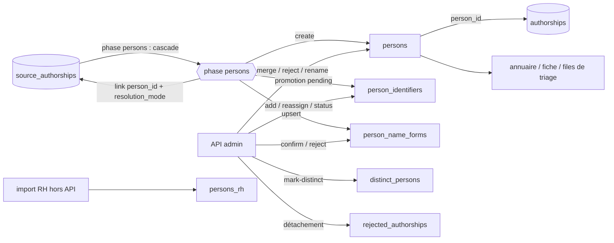

# Personnes — cycle de vie

*À jour le 2026-07-14.*

`Person` est un agrégat à domaine riche (`domain/persons/`) : l'aggregate root `Person`, l'aggregate séparé `PersonIdentifier` (attribution identifiant ↔ personne portant un statut), les value objects d'identifiants (`ORCID`, `IdHAL`, `IdRef`, `HalPersonId`) et de formes de nom (`PersonNameForm`), et les règles pures de rapprochement (`decide_person_match`, `names_compatible`, `same_person_name`). Contrairement à [structures](structures.md), référentiel curé à la main, `Person` est **construit par le pipeline** — la phase `persons` rattache les signatures (`source_authorships`) à des personnes et en crée au besoin — **puis curé par l'admin** (fusion, réattribution d'identifiants, rejet, détachement). Les deux axes écrivent.

## Tables du cluster

| Table | Rôle | Colonnes clés |
|---|---|---|
| `persons` | Le chercheur unifié multi-sources | `id` (surrogate), `last_name` / `first_name` (+ `_normalized`), `rejected` |
| `person_identifiers` | Attribution d'un identifiant externe à une personne, avec statut | `person_id` (FK CASCADE), `id_type`, `id_value`, `source` (`identifier_origin` : `manual` / `auto`), `status` (`identifier_status`), unique `(id_type, id_value)` |
| `person_name_forms` | Index inverse forme de nom → personnes, pour le matching | PK `(name_form, person_id)`, `sources` (text[]), `status` (`identifier_status`) |
| `persons_rh` | Fiche annuaire RH | `person_id` (unique, FK `ON DELETE RESTRICT`), `email`, `role_title`, `department_name`, `structure_id`, dates |
| `distinct_persons` | Paires marquées « pas la même personne » | `(person_id_a, person_id_b)` unique, CHECK `a < b` |
| `rejected_authorships` | Rejet durable d'une paire (publication, personne) | PK `(publication_id, person_id)` |

Le rattachement d'une signature à une personne vit sur `source_authorships.person_id` + `resolution_mode` (enum `identifier` / `name` / `cross_source`), consolidé ensuite dans la table de liaison `authorships` par la phase suivante (cluster voisin).

## Les deux axes

Le pipeline et l'admin écrivent tous deux ; les deux lisent aussi.

## Écriture — pipeline (phase `persons`)

`application/pipeline/persons/phase.py` : une transaction unique, six étapes atomiques. La phase lit les `source_authorships` in-périmètre non liées (avec leurs identifiants extraits de `author_identifying_keys`, le nom normalisé, les rôles, la publication et la position) plus des maps préfetchées ; elle écrit `source_authorships.person_id` + `resolution_mode`, crée des `persons`, promeut les identifiants en `person_identifiers` et upserte `person_name_forms`.

1. **`enforce_confirmed_authorships`** — repose les rattachements épinglés par un humain (`confirmed`), point fixe que les resets suivants respectent.
2. **`arbitrate_identifier_conflicts`** — arbitre par consensus les identifiants qu'une personne porte sans en être propriétaire attribué : le nom-autorité majoritaire (pondéré en signatures) décide le transfert (`PersonIdentifier.transfer_to`, seuls les `pending` sont transférables), puis les signatures identifiant captées repassent à NULL pour re-résolution.
3. **`run_cascade`** — la cascade de rapprochement, deux passes sur un même jeu d'index vivants. La règle pure `decide_person_match` tranche par fiabilité décroissante : `orcid` → `hal_person_id` → `idref` → `single_name` → `cross_source` → `create`. La première passe ne fait que matcher ; la création est **différée** en seconde passe, ce qui laisse une signature à créer rejoindre une ancre cross-source posée plus loin dans la même passe (évite deux personnes pour deux graphies disjointes d'un même auteur selon l'ordre). `allow_person_creation` interdit la création aux rôles non-auteur des thèses.
4. **Détachement cross-source** — les liens `cross_source` ayant perdu leur ancre ferme repassent à NULL.
5. **`populate`** — régénère `person_name_forms` : formes canoniques (`compute_person_name_forms`, source `'persons'`) unies aux formes bibliographiques des signatures liées, par diff INSERT/UPDATE/DELETE. Une forme canonique naît `confirmed`, une forme bibliographique `pending` ; l'UPDATE ne touche que `sources`, jamais le statut ; les verdicts `confirmed` / `rejected` survivent.
6. **`purge`** — re-orpheline les liens `name` dont la forme désigne désormais ≥ 2 personnes, puis supprime les personnes vidées (hors fiche RH → FK CASCADE retire leurs formes).

`add_identifiers_from_authorships` est le promoteur unique des identifiants vers `person_identifiers` (toujours `pending`, `source='auto'`), appelé à chaque match et création ; tolérant aux conflits (loggés, laissés à l'arbitrage frontal du run suivant). Les identifiants promus et les formes régénérées d'un run deviennent les maps lues au run suivant.

## Écriture — API (curation admin)

Routeur `interfaces/api/routers/admin/persons.py` → command handlers `application/services/persons/commands.py` (frontière transactionnelle, `commit` au succès) → briques agnostiques `core.py` → `PgPersonRepository`. Une commande = une transaction.

- **Fusion** (`POST /api/persons/{id}/merge`) : `merge_into` transfère six tables (`source_authorships`, `authorships`, `rejected_authorships`, `person_identifiers`, `persons_rh` si la cible n'en a pas, `person_name_forms` avec union des `sources`) puis supprime la personne source. Gardée par l'invariant `can_merge_with`.
- **Identifiants** : ajout manuel (`source='manual'`, types publics seulement), suppression, changement de statut (`confirm` / `reject`), réattribution (statut ramené à `pending`).
- **Personne** : rejet / dé-rejet (`rejected`, avec recompute de `publications.in_perimeter`), renommage (avec régénération des formes canoniques).
- **Formes de nom** : confirmation / rejet ; un rejet détache aussi les signatures portant cette forme et supprime les authorships devenues orphelines.
- **Détachement d'authorships** (`POST /api/persons/{id}/detach-authorships`) : inscrit le rejet durable dans `rejected_authorships`, détache les signatures, supprime la ligne consolidée, nettoie les formes orphelines.
- **Anti-doublon** : `mark-distinct` inscrit une paire dans `distinct_persons`.
- **ORCID authentifié** : un import dédié pose le statut `authenticated` sous `SET LOCAL app.orcid_authenticated_import = 'on'`, borné à la transaction — seul contexte admis par le trigger.

Aucun endpoint n'écrit `persons_rh` : la fiche RH est alimentée hors API (import), et seulement transférée par la fusion.

## Lecture — pipeline

La cascade lit en bloc, via le port `PersonsMatchingQueries` (`infrastructure/queries/pipeline/persons_matching.py`) : les maps `idref` / `orcid` / `hal_account` → personne (statuts non-`rejected`, nom normalisé joint pour corroborer le match), `name_form` → personnes, les verdicts `(name_form, person_id)` (`confirmed` / `rejected`, formes canoniques incluses), les personnes rejetées par publication (`rejected_authorships`), et l'index d'ancres `(publication, position)`. C'est la boucle producteur/consommateur inter-runs qui porte la convergence.

## Lecture — API

Port `PersonsQueries` (`infrastructure/queries/api/persons/`, modules `list` / `facets` / `detail` / `admin`).

- **Fiche personne** : profil, thèses, adresses, dashboard, sujets — croisant `persons`, `persons_rh`, `person_identifiers`, `source_authorships`, `authorships`, publications et sujets.
- **Annuaire / liste / recherche / facettes / stats** : listes publiques et admin scopables par laboratoire.
- **Files de triage doublons (admin)** : doublons par nom (`names_compatible`), conflits d'identifiant, intrus détachables, formes de nom ambiguës, candidates au partage d'une forme. Toutes excluent les paires de `distinct_persons` ; la file des doublons par nom écarte en plus les paires à double fiche RH.

## Points d'attention

Décisions d'architecture propres à cet agrégat, gardées explicites.

1. **Convergence en plusieurs runs, par resets ciblés.** L'ordre-indépendance ne repose pas sur la transaction mais sur trois resets lus depuis le snapshot (re-null des signatures identifiant après transfert, re-orphelinage des `name` devenus ambigus, recompute intégral des `cross_source`). Un homonyme ou un transfert apparu à un run se résout au suivant : le pipeline `persons` converge en environ deux passes.
2. **Écritures cross-agrégat depuis la phase et la fusion.** La pose de `person_id` est la responsabilité de l'agrégat, mais la phase et `merge_into` touchent aussi `source_authorships`, `authorships` et `rejected_authorships` — tables de clusters voisins, mutées ici pour garder l'opération atomique.
3. **`persons_rh` protège l'information RH.** Fiche 1:1 (`person_id` unique) en `ON DELETE RESTRICT` : une personne porteuse d'une fiche RH ne se supprime pas silencieusement. L'invariant de fusion refuse d'absorber deux fiches RH distinctes ; le même garde-fou est répliqué côté file de doublons pour ne pas proposer une fusion que le service refuserait (duplication assumée).
4. **Statut `authenticated` immuable.** Réservé à l'auto-authentification d'un ORCID par le chercheur, posable par le seul import dédié et jamais dégradable — verrouillé par un trigger Postgres, hors de toute transition applicative.

## Invariants métier

Portés par le domaine (`domain/persons/`), le SQL et le service.

- **Identités.** `persons.id` surrogate ; `person_identifiers` a une identité naturelle unique `(id_type, id_value)` ; `person_name_forms` a pour PK `(name_form, person_id)` ; `distinct_persons` est ordonnée (`a < b`) ; `rejected_authorships` a pour clé `(publication, personne)` ; `persons_rh` est 1:1.
- **Fusion.** Refusée si les deux personnes portent chacune une fiche RH distincte (`can_merge_with`, domaine + `has_distinct_rh`).
- **Identifiant partagé = corruption.** Un identifiant porté par ≥ 2 positions d'auteur d'un même enregistrement source est suffixé `_dubious` (conservé, réversible, mais invisible au matching).
- **ORCID comme signal borné.** L'ORCID ne sert de signal de matching que depuis les sources à dépôt auteur (`crossref`, `openalex`, `hal`) ; les ORCID dérivés (WoS, ScanR) sont enregistrés mais pas matchés.
- **Rejet durable.** Une paire (publication, personne) inscrite dans `rejected_authorships` n'est jamais recréée par le matching, y compris quand l'élimination désambiguïse une forme partagée.
- **Identifiants canoniques.** `ORCID` (format XXXX-XXXX-XXXX-XXXX), `IdRef` (PPN à 9 caractères), `IdHAL` (slug), `HalPersonId` (entier positif) validés et normalisés par leur VO avant écriture.
