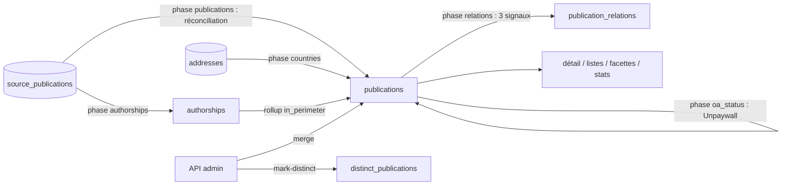

# Publications — cycle de vie

*À jour le 2026-07-14.*

Une `publication` est la référence canonique unifiée d'un document (`domain/publications/`) : l'aggregate root `Publication` et son entité fille `Authorship`, les value objects d'identifiants (DOI, HALId, NNT, PMID, PMCID, ArxivId), la taxonomie `doc_type`, et les règles pures d'agrégation cross-source (`aggregation`), de réconciliation (dédup match/create/merge/split, `reconciliation`), de métadonnées (`best_oa_status`, canonicalisation des titres, `metadata`), de scope et de relations. Une publication est **dérivée, jamais éditée à la main** : la phase `publications` réconcilie les `source_publications` en publications (une par partition `composante ∩ DOI`) et `refresh_from_sources` recalcule l'état canonique depuis l'union des sources. La curation admin se limite à fusionner ou séparer des doublons.

## Tables du cluster

| Table | Rôle | Colonnes clés |
|---|---|---|
| `publications` | La référence canonique | `id` (surrogate), `doi` (identité naturelle, unique sur `lower(doi)`), `doc_type`, `oa_status`, `pub_year`, `journal_id`, `sources[]` (sources contributrices), `in_perimeter` (matérialisé), `unpaywall_checked_at`, `meta` |
| `authorships` | Table de vérité personne ↔ publication | `publication_id` (FK NOT NULL), `person_id`, `author_position`, `roles`, `is_corresponding`, `in_perimeter`, unique `(publication_id, person_id)` |
| `publication_relations` | Arête dirigée entre publications distinctes | `from_publication_id`, `relation_type` (enum), `target_publication_id` **ou** `target_doi` (CHECK : au moins un), `source` |
| `distinct_publications` | Paires marquées « pas la même œuvre » | `(pub_id_a, pub_id_b)` ordonné (`a < b`) |
| `apc_payments` | Frais de publication (APC), import curé | `publication_id` (FK `ON DELETE SET NULL`), `doi`, `amount_eur_ht`, `billing_year`… |
| `publications_detail` | Matview de détail pour l'API | `publication_id` (PK), rafraîchie à chaque `refresh_from_sources` |

En amont : `source_publications` (via `publication_id`, cf. [source_publications](source_publications.md)). `authorships` est le pivot vers les [personnes](persons.md) ; ce bilan la couvre comme table de liaison produite en aval, sa construction relève du bilan authorships.

## Les deux axes

L'écriture est **majoritairement pipeline** (la publication se dérive) ; l'admin ne fait que fusionner / séparer.

## Écriture — pipeline

La phase `publications` matérialise l'agrégat ; `relations`, `oa_status` et `countries` enrichissent ensuite des colonnes.

- **Phase `publications`** (`application/pipeline/publications/`) : `reconcile_components` charge les `source_publications` dirty et leur voisinage 1-hop, calcule un plan pur (`domain/publications/reconciliation.plan_reconciliation`) — partitionnement `composante ∩ DOI`, cannot-link DOI (deux DOI distincts ne fusionnent jamais), ancre = porteur du DOI, attribution gloutonne — puis l'applique : repointage des `source_publications.publication_id`, **création** (semée depuis la plus petite source à année), **fusion** (dissolution : repointe les dépendants `distinct_publications`/`apc_payments` vers le successeur, puis suppression de la publication vidée), **split**. Chaque survivant passe par `refresh_from_sources`.
- **`refresh_from_sources`** (`application/services/publications/core.py`) recalcule l'état canonique (recalcul complet, pas de `COALESCE` incrémental) via `domain/publications/aggregation.py` (premier non-null par `SOURCE_PRIORITY`, OA le plus ouvert, union dédupliquée des listes, arbitrage des sous-types d'article), rejoue la correction `doc_type` journal-dépendante sur le canonique, puis persiste et met à jour `sources[]` et le matview `publications_detail`. **Orpheline** (aucune source) ou **hors scope** (`doc_type` ∈ `OUT_OF_SCOPE_DOC_TYPES`) → suppression (les `source_publications` se détachent par FK `ON DELETE SET NULL`).
- **Phase `relations`** (`application/pipeline/relations/`) reconstruit `publication_relations` à chaque run (purge par `source` puis réécriture), depuis trois signaux : (1) relations déclarées (DataCite `related_identifiers`, Crossref `meta.relation`), (2) clés de confirmation partagées entre DOI distincts, type déduit du couple de `doc_type` (`infer_shared_key_relation`), (3) rapprochement par titre (erratum → article, preprint → version publiée). Directionnalité dépendant → parent ; les arêtes inverses sont dédupliquées (orientation stable par plus petit id, résolution `target_doi` → `target_publication_id`, un type vague `is_related_to` s'efface devant une relation précise déjà déclarée).
- **Phase `oa_status`** (`application/pipeline/oa_status/`) interroge Unpaywall pour les publications à DOI (jamais les `STABLE_OA_STATUSES` déjà vérifiés). Unpaywall fait autorité via `decide_oa_status`, sauf le **plancher archive-ouverte** (une archive HAL détenant le fichier `green` rouvre un `closed`/`unknown`). Écrit `oa_status` et `unpaywall_checked_at`.
- **Phase `countries`** cascade `addresses.countries` → `source_publications.countries` → `publications.countries`. **Phase `authorships`** fait le rollup `publications.in_perimeter`.

## Écriture — API

Deux opérations seulement, dans un router admin (`interfaces/api/routers/admin/publication_duplicates.py`) ; le command handler (`application/services/publications/commands.py`) commite, la dépendance de connexion rollback par défaut (frontière transactionnelle unique).

- **Fusion** (`POST /api/admin/duplicates/merge`) : garde « 1 DOI = 1 publication » (`DistinctDoiError` si deux DOI non-nuls distincts), `merge_into` (repointe `source_publications`, dédup + repointe `authorships`, réordonne `distinct_publications`, supprime la publication source), puis `refresh_from_sources`. Cible = plus petit id ; la direction est sans effet durable (l'union des sources est identique).
- **Marquage distinct** (`POST /api/admin/duplicates/mark-distinct`) : insère une paire dans `distinct_publications` (idempotent).

**Aucune édition de métadonnées canoniques** : le canonique est dérivé, jamais saisi. Les corrections passent par les `source_publications` (phase `metadata_correction`) ; l'APC par import CLI (`interfaces/cli/imports/import_apc.py`), en lecture seule côté API.

## Lecture — pipeline

- **`authorships`** consolide `source_authorships` en `authorships(publication_id, person_id)` et lit les publications pour le rollup de périmètre.
- **`subjects`** ingère les `topics` des `source_publications` d'une publication vers `subjects` / `publication_subjects`, ne retraitant que les publications au contenu changé.
- **`countries`** lit la cascade d'adresses pour recomputer `publications.countries`.

## Lecture — API

- **Détail** (`GET /api/publications/{id}`) : métadonnées canoniques (`publications` ⨝ `publications_detail` ⨝ `journals` ⨝ `publishers`), provenance par source (avec drapeau `is_secondary`), auteurs canoniques et auteurs par source, relations (sortantes + entrantes inversées via `inverse_relation`), sujets, identifiants externes.
- **Listes / facettes / export** : liste paginée et CSV, ~11 facettes (dont labos via le matview `publication_structures`, statut HAL, APC).
- **Stats / pivot** : ventilations sur `publications` (années, OA, doc_type, labo, éditeur, revue), collaborations (`publications.countries`).
- **Candidat de dédoublonnage** (`GET /api/admin/duplicates/next`) : similarité de titre + proximité d'année + DOI convergents, excluant les paires de `distinct_publications` — la lecture qui alimente la fusion manuelle.

## Points d'attention

1. **Aucune surface d'édition des métadonnées canoniques (par design).** Une valeur canonique erronée ne se corrige pas sur la publication : elle se répare en amont (règle `metadata_correction` sur la `source_publication`, ou fusion / séparation de doublons). Il n'y a pas de « quick fix » admin — la publication reste un pur dérivé de ses sources.
2. **`publication_relations` est reconstruit intégralement à chaque run** (purge par signal puis réécriture), sans incrémental. Le type `is_related_to` est un bucket d'attente : une paire à clé partagée dont le couple de `doc_type` ne permet pas encore d'inférer une relation précise.

## Invariants métier

Portés par le domaine (`domain/publications/`), le SQL et le service.

- **1 DOI = 1 publication.** Garde triple : la réconciliation ne fusionne jamais deux DOI distincts (cannot-link), l'index unique `lower(doi)` l'interdit en base, et la fusion manuelle lève `DistinctDoiError`. Une publication sans DOI peut rejoindre une publication avec DOI.
- **Publication dérivée.** Hors fusion / marquage distinct, une publication n'est jamais écrite à la main ; `refresh_from_sources` recalcule tout depuis l'union des `source_publications`.
- **Non-matérialisé = supprimé.** Une publication orpheline (aucune source) ou de `doc_type` hors périmètre (`OUT_OF_SCOPE_DOC_TYPES`) est supprimée ; ses `source_publications` se détachent (`publication_id` nul), sans générer d'authorship ni de personne.
- **Autorité Unpaywall sur l'OA.** Une fois `unpaywall_checked_at` posé, l'agrégation ne ré-écrit plus `oa_status` depuis les sources, sauf le plancher archive-ouverte (dépôt HAL `green`).
- **Identité des authorships.** `(publication_id, person_id)` unique ; la FK `publication_id NOT NULL` verrouille l'entité fille au root.
