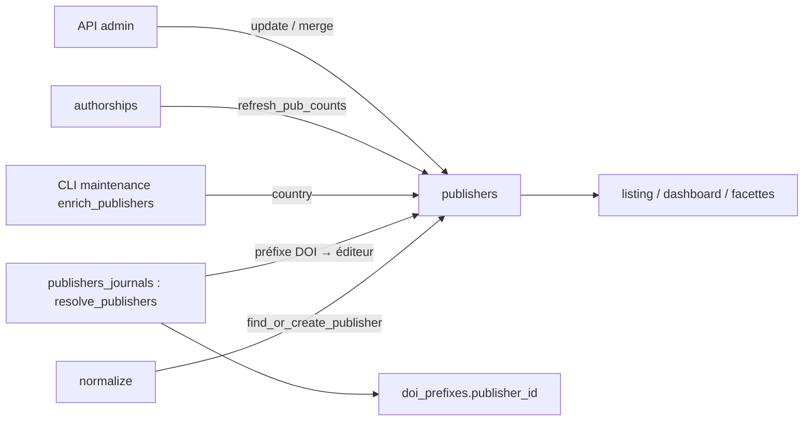

# Éditeurs — cycle de vie

*À jour le 2026-07-14.*

L'aggregate root `Publisher` (`domain/publishers/publisher.py`) représente un éditeur. Entité mince (id, nom, pays, `openalex_id`, `publisher_type`) : comme `Journal`, elle ne porte ni comportement ni invariant riche — matching, fusion et enrichissement vivent dans `application/services/publishers/`. Identité = `id` (surrogate) ; identifiant naturel = `name` via la normalisation de `publisher_name_forms`.

## Tables du cluster

| Table | Rôle | Colonnes clés |
|---|---|---|
| `publishers` | L'éditeur | `name` / `name_normalized`, `country`, `openalex_id` (unique), `publisher_type` (enum SQL), `pub_count` |
| `publisher_name_forms` | Formes de nom → éditeur (match par nom) | `publisher_id` (ON DELETE CASCADE), `form_normalized` (unique **globale**) |
| `doi_prefixes` | Jonction préfixe DOI → éditeur | `publisher_id` (ON DELETE SET NULL), `crossref_member_id`, `datacite_client_symbol`, `publisher_checked_at` |

Trois tables référencent `publishers.id` hors cluster : `journals.publisher_id`, `journal_name_forms.publisher_id`, `apc_payments.publisher_id`.

## Les deux axes

## Écriture — pipeline

**Rattachement (`normalize`)** : chaque normaliseur appelle `find_or_create_publisher` (`application/services/publishers/core.py`) — cascade `openalex_id`, sinon la primitive repo `match_or_create_by_name_form` (forme de nom → éditeur existant ou créé) — puis passe le `publisher_id` à `find_or_create_journal`. Seul OpenAlex fournit un `openalex_id` (via `host_organization`).

**Résolution par préfixe DOI (`publishers_journals` → `resolve_publishers`)** : pour chaque `doi_prefixes` non résolu, route par Registration Agency, interroge le préfixe Crossref/DataCite, persiste les métadonnées, matche ou crée l'éditeur via `match_or_create_by_name_form` (la même primitive repo que l'axe `normalize`), et pose `doi_prefixes.publisher_id`. Une seule tentative (`publisher_checked_at`).

**Enrichissement — hors pipeline (maintenance)** : le CLI `interfaces/cli/maintenance/enrich_publishers.py` renseigne le `country` des éditeurs depuis OpenAlex Publishers. Politique « NULL only » : une valeur saisie à la main est préservée.

## Écriture — API (curation admin)

Routeur `interfaces/api/routers/publishers.py`, command handlers `commands.py`, cœur `core.py`, adaptateur `PgPublisherRepository`.

- **Édition** (`PUT /api/publishers/{id}`) : modification sélective via le contrat `PublisherUpdate` (Pydantic, porté par `PublisherRepository`, même patron que `JournalUpdate`) ; `name_normalized` dérivé de `name` par le repository.
- **Fusion** (`POST /api/publishers/{id}/merge`) : `merge_publishers` bloque sur ISSN divergents ou doublon interne, fusionne d'abord les revues à titre partagé (`merge_journals`), puis `merge_publisher_into` repointe `journals` / `journal_name_forms` / `apc_payments` et recale `pub_count`.

## Lecture — pipeline

**`publishers.pub_count`** : cache à deux étages — `refresh_pub_counts` (`queries/pipeline/pub_counts.py`) recalcule `journals.pub_count` puis `publishers.pub_count = SUM(journals.pub_count)`, en phase `authorships`. Variante scopée `refresh_publisher_pub_count` pour les fusions admin. Le module de requêtes est partagé pipeline/API (pattern « queries mutualisées », le repo y délègue).

## Lecture — API

Port `application/ports/api/publishers_queries.py`, adaptateur `PgPublisherQueries`, routeur `interfaces/api/routers/publishers.py` : listing (filtres + `journal_count` + `pub_count` + préfixes DOI agrégés), facettes (`publisher_type`, `country`), détail, dashboard (types de revues, doc_types / oa_status des publications in-perimeter), sujets.

## Points d'attention

Dette assumée et décisions d'architecture propres à cet agrégat, gardées explicites.

1. **Écritures cross-agrégat de la fusion (décision d'archi assumée).** `merge_publisher_into` repointe `journals` / `journal_name_forms` / `apc_payments` en `text()`, comme `merge_journal_into` : une fusion est intrinsèquement cross-agrégat.

## Invariants métier

- **`name_normalized` dérivé de `name`**, maintenu à chaque écriture (création par le service, édition par le repository, résolution par le pipeline).
- **`pub_count` dérivé** : somme des `journals.pub_count`, recalculée par le pipeline et par les fusions.

`Publisher` est délibérément un agrégat mince, comme `Journal` : ces règles sont portées par les services et le pipeline, pas par le concept — sans matière à un objet de domaine riche.
