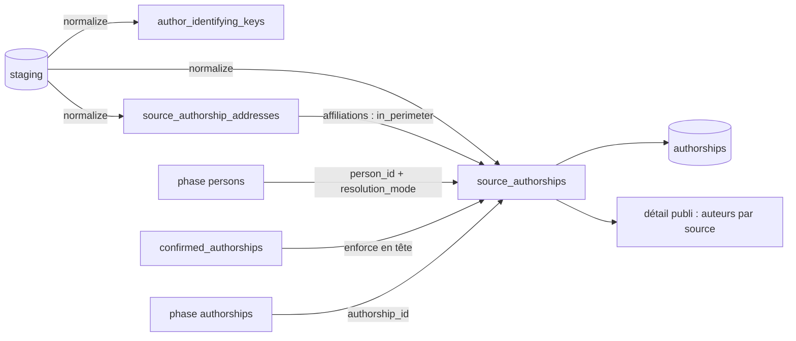

# Source_authorships — cycle de vie

*À jour le 2026-07-14.*

Une `source_authorship` est la signature d'un auteur telle qu'**une** source la porte sur un document : une ligne par `(source_publication × position d'auteur)`. C'est le **pivot** du corpus — elle relie une [source_publication](source_publications.md) à une identité d'auteur (`author_identifying_keys`), reçoit un `person_id` de la cascade [personnes](persons.md), puis un `authorship_id` du build [authorships](authorships.md). Elle n'a pas d'objet de domaine dédié : sa logique vit dans les règles de rôles (`domain/publications/authorship_roles`), l'extraction par source (`domain/sources/*`) et les identifiants (`domain/persons/identifiers`). Son cycle de vie traverse cinq phases du pipeline.

## Tables du cluster

| Table | Rôle | Colonnes clés |
|---|---|---|
| `source_authorships` | Signature d'auteur par source | `source`, `source_publication_id`, `identity_id` (→ `author_identifying_keys`, NOT NULL), `person_id`, `authorship_id`, `author_position`, `roles`, `is_corresponding`, `in_perimeter`, `resolution_mode`, `raw_author_name`, `countries_dirty` |
| `author_identifying_keys` | Identité d'auteur dédupliquée | `author_name_normalized` + `person_identifiers` (JSONB), `key_hash` (généré, unique) |
| `source_authorship_addresses` | Signature ↔ adresse | `source_authorship_id`, `address_id` |
| `source_authorship_structures` | Signature ↔ structure UCA (matview) | dérivée `addresses` → `address_structures` → `perimeter_structures` |
| `confirmed_authorships` | Épinglage humain d'une signature | `(source_authorship_id, person_id)` |

Voisins couverts ailleurs : `source_publications` (le parent, cf. [source_publications](source_publications.md)), `authorships` (l'aval, cf. [authorships](authorships.md)). Le store `rejected_authorships` (grain paire publication ↔ personne) gouverne l'aval mais relève d'[authorships](authorships.md).

## Les deux axes

L'écriture est **exclusivement pipeline**, étalée sur cinq phases ; l'API ne fait que de la curation via les stores.

## Écriture — pipeline

Le cycle de vie d'une signature s'écrit en cinq temps, un par phase :

1. **`normalize`** — naissance. Clear+insert (theses en UPSERT unitaire) de `source`, `source_publication_id`, `author_position`, `is_corresponding`, `roles` (via `map_role` / `merge_roles`), `raw_author_name` et `identity_id`. Ce dernier est résolu par `key_hash` après upsert dédupliqué de `author_identifying_keys` (nom normalisé + identifiants ; GC des identités orphelines en fin de phase). Les adresses sont upsertées et reliées par `source_authorship_addresses`. Les identifiants partagés par ≥2 positions d'un même enregistrement sont suffixés `_dubious` (invisibles au matching).
2. **`affiliations`** — `in_perimeter` recomputé (`recompute_in_perimeter_on_source_authorships`) : vrai si une adresse de la signature résout à une structure du périmètre (`source_authorship_addresses` ⨝ `address_structures`, filtré sur les structures du périmètre confirmées). Rafraîchit la matview `source_authorship_structures`.
3. **`persons`** — la cascade de matching pose `person_id` et `resolution_mode` (`identifier` / `name` / `cross_source`) ; `enforce_confirmed_authorships` repose en tête les `person_id` épinglés (`confirmed_authorships`) ; les resets ordre-indépendants renullent des `person_id` ciblés.
4. **`authorships`** — `authorship_id` posé (liaison de la signature à l'authorship canonique consolidée).
5. **`countries`** — `countries_dirty` pilote le recompute des pays de la signature depuis ses adresses.

## Écriture — API

Aucune écriture directe des colonnes structurelles. La curation admin (côté [personnes](persons.md)) agit via les stores et le `person_id` :

- **Épinglage** (`pin_authorships`) : must-link au grain signature dans `confirmed_authorships`, reposé à chaque run par `enforce_confirmed_authorships`.
- **Détachement** : nulle `person_id` sur **toutes** les signatures de la paire `(publication, personne)` et inscrit la paire dans `rejected_authorships` (« cette personne n'est pas l'auteur » vaut pour toutes ses sources).
- **Fusion de personnes** : `merge_into` repointe le `person_id`.

## Lecture — pipeline

- La cascade `persons` lit les signatures **in-périmètre non liées** (avec leurs identifiants extraits de `author_identifying_keys.person_identifiers`, leur nom normalisé et leurs rôles) pour poser `person_id`.
- Le build `authorships` consolide les couples `(publication_id, person_id)` attestés par les signatures liées et en recompose les attributs.

## Lecture — API

Le détail d'une publication expose les **auteurs par source** : pour chaque source, les signatures de l'import le plus récent (`source_authorships` ⨝ `source_authorship_structures` ⨝ `source_authorship_addresses` ⨝ `addresses`), avec leurs structures et leurs rôles. La fiche personne remonte, elle, aux authorships canoniques.

## Points d'attention

1. **Pivot sans objet de domaine dédié.** La logique d'une signature est éclatée par concern : rôles (`authorship_roles`), extraction par source (`domain/sources/*`), identifiants (`domain/persons/identifiers`). Cohérent (chaque bout appartient à sa source ou à son concept), mais aucune classe ne modélise la signature elle-même — son cycle de vie ne se lit qu'en suivant les phases.
2. **`identity_id` (identité de signature) ⊥ `person_id` (personne).** L'identité de signature — nom normalisé + identifiants, dédupliquée par `key_hash` dans `author_identifying_keys` — est un **fait source**, posé au normalize. Le `person_id` est le résultat du **matching**, posé plus tard. La première sert de clé de prefetch au matching et de facteur de dédup des signatures identiques ; ne pas confondre les deux.

## Invariants métier

Portés par le SQL, le domaine (`domain/publications/authorship_roles`, `domain/persons/identifiers`) et les phases.

- **Identité de signature obligatoire.** `identity_id` NOT NULL : toute signature porte une identité d'auteur, unique sur `(author_name_normalized, person_identifiers)` via `key_hash`.
- **Détachement au grain paire.** Nuller le `person_id` d'une paire `(publication, personne)` vaut pour **toutes** les signatures de la paire, quelle que soit la source.
- **Épinglage ⊥ rejet.** `confirmed_authorships` est un must-link au grain signature (reposé chaque run) ; `rejected_authorships` un cannot-link durable au grain paire (jamais recréé par le build).
- **Identifiant partagé = corruption.** Un identifiant porté par ≥2 positions d'auteur d'un même enregistrement source est suffixé `_dubious` : conservé, mais écarté du matching.
