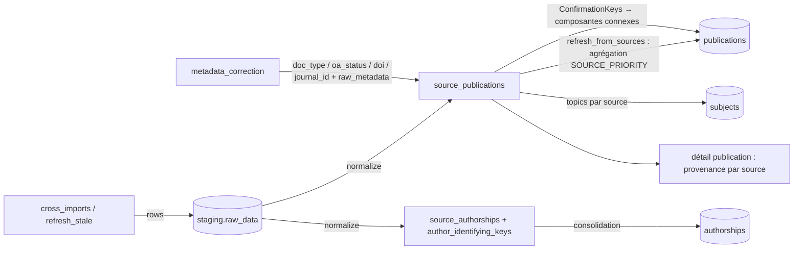

# Source_publications — cycle de vie

*À jour le 2026-07-14.*

Une `source_publication` est l'image d'un document dans **une** source externe (HAL, OpenAlex, WoS, ScanR, theses.fr, CrossRef, DataCite), avant fusion dans la publication canonique. C'est la couche par-source du corpus (`domain/source_publications/`). Elle naît d'un import 1:1 : la phase `normalize` transforme le brut de `staging` en une ligne par `(source, source_id)`. Le domaine porte l'entité `SourcePublication` (lecture seule), les clés de confirmation (`ConfirmationKeys`) qui pilotent la déduplication, les règles de correction de métadonnées, le mapping des `doc_type` et le sidecar de réversibilité `raw_metadata`.

## Tables du cluster

| Table | Rôle | Colonnes clés |
|---|---|---|
| `source_publications` | Image d'un document dans une source | `(source, source_id)` (identité naturelle), `publication_id` (→ canonique, posé par la phase `publications`), `doi`, `doc_type`, `external_ids` (JSONB), `title_normalized`, `raw_metadata` (sidecar correction), `meta` (sidecar source), `keys_dirty` |
| `source_authorships` | Signature d'auteur par source | `source_publication_id`, `identity_id` (→ `author_identifying_keys`), `person_id`, `authorship_id`, `author_position`, `roles`, `in_perimeter`, `resolution_mode` |
| `author_identifying_keys` | Identité d'auteur dédupliquée | `author_name_normalized` + `person_identifiers` (JSONB), `key_hash` (généré, unique) |
| `source_authorship_addresses` | Signature ↔ adresse | `source_authorship_id`, `address_id` |
| `source_authorship_structures` | Signature ↔ structure UCA (matview) | dérivée `addresses` → `address_structures` → `perimeter_structures` |

En amont : `staging.raw_data` (le brut moissonné, porteur de `raw_hash`). En aval : `publications` (via `publication_id`). `source_authorships` est le pivot vers les agrégats [personnes](persons.md) et authorships ; ce bilan le couvre comme satellite écrit par `normalize`, sa consolidation en `authorships` relève du bilan authorships.

## Les deux axes

L'écriture est **exclusivement pipeline** ; la lecture nourrit le canonique, la dédup et l'API.

## Écriture — pipeline

Le producteur de la couche est unique : la phase `normalize`. Un seul autre mutateur de ses colonnes typées : `metadata_correction`.

- **`normalize`** (`application/pipeline/normalize/`) transforme chaque ligne `staging` (`processed=FALSE`) en un UPSERT `ON CONFLICT (source, source_id)`. Les sources sont traitées par `SOURCE_PRIORITY` (la plus fiable d'abord, les suivantes ne clobbent pas via les `COALESCE`). Colonnes communes (identité, titre, `title_normalized`, `doc_type`, `doi`, `external_ids`, `journal_id`, `oa_status`, `language`, `container_title`) plus des extras par source (`abstract`, `keywords`, `topics`, `biblio`, `urls`, `hal_collections`, `embargo_until`, `cited_by_count`, `is_retracted`, `meta`). Au ré-UPSERT : `publication_id` jamais clobbé, `external_ids` mergé, `doi` préservé, `doc_type` préférant le neuf. La normalisation d'identifiants (`clean_doi`, `normalize_nnt`…) et le calcul de `title_normalized` se font à l'étape de parsing / adapter, pas en SQL.
- **Satellites de `normalize`** : `source_authorships` en clear+insert (theses en UPSERT unitaire), `author_identifying_keys` en upsert dédupliqué (identité factorisée nom + identifiants, GC des orphelines en fin de phase), `addresses` en upsert (pays propagés sans écrasement), pivot `source_authorship_addresses`. Le matview `source_authorship_structures` est produit ailleurs (phase `affiliations`).
- **`metadata_correction`** (`application/pipeline/metadata_correction/`) : trois sous-étapes, chacune dans sa transaction, dans l'ordre `journal_by_doi` → unaire → cluster. Mute les colonnes typées (`journal_id`, `doc_type`, `oa_status`, `external_ids`, `doi`) et stashe le brut d'origine dans `raw_metadata` sous des clés disjointes. Idempotente et auto-cicatrisante : chaque passe repart du brut reconstruit (`hydrate_raw_view`). Chaque mutation pose `keys_dirty=true` pour re-déclencher la réconciliation.
- **`cross_imports` / `refresh_stale`** s'exécutent **avant** `normalize` et n'écrivent pas la couche source : ils alimentent `staging` (nouvelles lignes cross-source, rafraîchissement des documents stale), que `normalize` consomme au même run. L'idempotence tient à `raw_hash` — colonne de `staging`, pas de `source_publications` : un hash inchangé laisse la ligne `processed`, un hash changé la repasse en `processed=FALSE` et `normalize` met à jour la **même** ligne `source_publications`.

## Écriture — API

**Aucune.** Les images source sont une trace inviolable des sources : l'entité `SourcePublication` est frozen et lecture seule, jamais persistée via l'objet. La correction de métadonnées est une règle de pipeline (`metadata_correction`), pas une édition manuelle ; la curation admin porte sur le canonique (publication, journals), pas sur les images par-source.

## Lecture — pipeline

- **Agrégation canonique** — `refresh_from_sources` (`application/services/publications/core.py`) lit **toutes** les `source_publications` d'une publication (recalcul complet, pas de `COALESCE` incrémental) et délègue l'arbitrage à `domain/publications/aggregation.py`. Champ par champ : scalaires en premier non-null par `SOURCE_PRIORITY` ; `doc_type` avec préférence au sous-type d'article précis d'une source moins prioritaire sur le `journal-article` générique CrossRef ; `oa_status` = statut le plus ouvert (`best_oa_status`, garde Unpaywall) ; listes en union dédupliquée. Les valeurs lues sont **déjà corrigées** (colonnes nues). Une correction journal-dépendante est rejouée sur le canonique quand `doc_type` et `journal_id` sont arbitrés depuis deux sources différentes.
- **Déduplication** — `project_confirmation_keys` projette chaque `source_publication` dirty en tokens `(type, valeur)` ; `connected_components` relie les images partageant un token ; le primitif unifié `plan_reconciliation` (`domain/publications/reconciliation.py`) tranche match / create / merge / split et repointe les `publication_id`. L'univers de voisinage a un miroir SQL (`publications_reconciliation.py`) qui ré-encode les mêmes clés.
- **Autres consommateurs** : `subjects` lit les `topics` par source (préserve l'attribution) ; `authorships` consolide `source_authorships` en table de vérité (`author_position` de la source prioritaire, `is_corresponding`/`in_perimeter` en `bool_or`, `roles` en union) ; la cascade `persons` lit les `source_authorships` in-périmètre.

## Lecture — API

Le détail d'une publication expose la **provenance par source** : la liste des `source_publications` (avec un drapeau `is_secondary` pour les formes convergées), les auteurs de l'import le plus récent par source, et les identifiants externes agrégés depuis `external_ids`. Aucune page ne liste les images source pour elles-mêmes : elles apparaissent comme la traçabilité d'une publication canonique.

## Points d'attention

**Le miroir SQL de la réconciliation duplique les types de clés.** L'univers de voisinage 1-hop (`publications_reconciliation`) ré-encode en branches `UNION` les mêmes types de clés que `keys.py` (DOI, NNT, PMID, HAL ID, token `metadata_block`) : duplication par nécessité — le voisinage se calcule côté base, et `keys.py` reste l'unique définition Python des clés. Le seuil de longueur minimale de titre, lui, est importé du domaine.

La taxonomie `doc_type` est répartie proprement : vocabulaire canonique (enum, `ARTICLE_SUBTYPES`, familles) dans `domain/publications/doc_types.py`, mapping des nomenclatures sources dans `domain/source_publications/doc_types.py`. Le `CASE` de ventilation du pivot est rendu côté infrastructure.

## Invariants métier

Portés par le domaine (`domain/source_publications/`), le SQL et les phases.

- **Identités.** `source_publications` a pour identité naturelle `(source, source_id)` (`id` surrogate) ; `author_identifying_keys` est unique sur `(author_name_normalized, person_identifiers)` via `key_hash`. Un ré-import met à jour la même ligne.
- **Trace inviolable des sources.** Une `source_publication` n'est jamais éditée à la main : seul le pipeline l'écrit (`normalize` puis `metadata_correction`). L'entité de domaine est frozen, lecture seule.
- **Réversibilité des corrections.** Toute correction stashe la valeur source d'origine dans `raw_metadata` ; `effective_metadata` repart toujours du brut reconstruit — idempotente, auto-cicatrisante.
- **Clés de confirmation.** `keys.py` est l'unique définition Python des clés de déduplication ; le `doc_type` dans le token impose l'égalité de type, sous garde de longueur minimale de titre.
- **Non-matérialisé = détaché.** Une œuvre canonique orpheline, hors périmètre, ou de `doc_type` hors scope (`OUT_OF_SCOPE_DOC_TYPES`) n'a pas de ligne `publications` ; ses `source_publications` subsistent, détachées (`publication_id` nul), sans générer d'authorship ni de personne.
