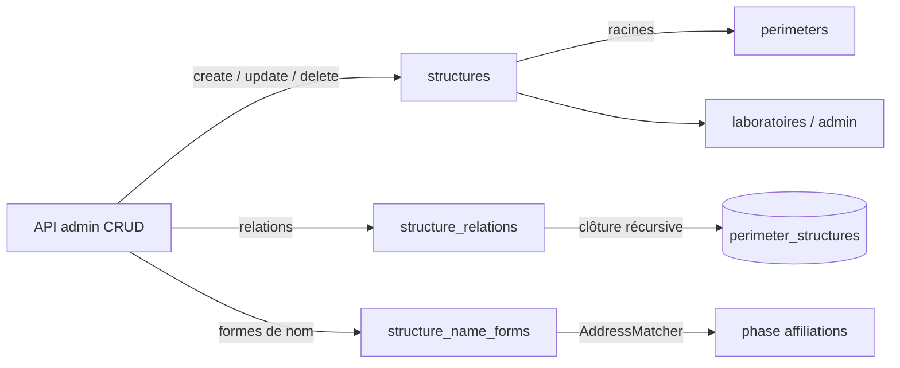

# Structures — cycle de vie

*À jour le 2026-07-14.*

`Structure` est un agrégat à objet de domaine riche (`domain/structures/`) : l'aggregate root `Structure` (id, code, name, type, `RorId`, `HalCollection`, `api_ids`, formes de nom), les VOs `RorId` / `HalCollection` / `StructureNameForm`, et les règles de graphe (`check_can_create_relation`). C'est un **référentiel curé à la main** : les structures sont créées et éditées par l'admin, jamais par le pipeline, qui ne fait que les **lire** (matching d'adresses, clôture de périmètre).

## Tables du cluster

| Table | Rôle | Colonnes clés |
|---|---|---|
| `structures` | La structure | `code` (unique, identifiant naturel), `name`, `acronym`, `structure_type` (enum), `ror_id`, `rnsr_id`, `hal_collection`, `api_ids` (JSONB) |
| `structure_relations` | Hiérarchie parent → enfant | `parent_id`, `child_id`, `relation_type` (`est_tutelle_de`, `est_partenaire_de`), unique `(parent, child, type)`, CHECK `parent <> child` |
| `structure_name_forms` | Formes de nom pour le matching d'adresses | `structure_id`, `form_text` (normalisé), `is_word_boundary`, `is_excluding`, `requires_context_of` (int[]), CHECK `char_length > 6 OR is_word_boundary` |

Le périmètre (`perimeters`, `perimeter_structures`) est un cluster voisin dont les racines sont des `structures` : son cycle de vie propre est décrit dans [perimetres.md](perimetres.md).

## Les deux axes

L'écriture est purement admin ; la lecture se partage entre pipeline et API.

## Écriture — API (curation admin)

Routeur `interfaces/api/routers/admin/structures.py`, command handlers `application/services/structures/commands.py`, cœur `core.py`, adaptateur `PgStructureRepository`. **Seul chemin d'écriture** du cluster.

- **Structures** (`POST` / `PUT` / `DELETE /api/structures/{id}`) : `create_structure` / `update_structure` / `delete_structure`. Le service normalise `ror_id` (VO `RorId`), mappe les champs UI → colonnes, et le repo valide `api_ids` contre le modèle JSONB `StructureApiIds`. La suppression cascade en base sur `authorship_structures` et `source_authorship_structures` (FK `ON DELETE CASCADE`).
- **Relations** (`POST /api/structure-relations`, `DELETE /…/{id}`) : `create_relation` prefetche les ancêtres du parent (`repo.get_ancestor_ids`, `WITH RECURSIVE`) et délègue au domaine `check_can_create_relation` (refus auto-référence / cycle) ; idempotent (`already_exists` si la relation existe). 
- **Formes de nom** (`POST` / `PUT` / `DELETE /api/name-forms`) : `create_name_form` / `update_name_form` normalisent `form_text` (`normalize_text`) et forcent `is_word_boundary` sur les formes courtes.

Les commandes de relation (création / suppression) et la suppression d'une structure rafraîchissent la clôture `perimeter_structures` via le `PerimeterRepository` ; la suppression retire en plus la structure des racines de tout périmètre (`remove_structure_from_all_perimeters`). Créer ou éditer les attributs d'une structure n'y touche pas (cf. perimetres.md). Chaque opération émet un événement d'audit.

## Écriture — pipeline

**Aucune.** Le pipeline ne crée ni ne modifie de structure : le cluster est un référentiel d'entrée, alimenté à la main.

## Lecture — pipeline

- **Matching d'adresses** (phase `affiliations`) : `infrastructure/queries/pipeline/address_resolution.py` charge les `structure_name_forms` dans un `AddressMatcher` (Aho-Corasick) qui balaie le `normalized_text` des adresses. Les options de la forme pilotent le match : `is_word_boundary` (frontière de mot exigée), `is_excluding` (la forme provoque un rejet), `requires_context_of` (le match ne vaut que si les structures citées matchent aussi la même adresse).
- **Clôture de périmètre** : `structure_relations` (`est_tutelle_de`) fournit la descente récursive qui matérialise `perimeter_structures` à partir des racines `perimeters.structure_ids` — le mécanisme qui, in fine, pilote `source_authorships.in_perimeter` (cf. perimetres.md).

## Lecture — API

- **Admin** : port `application/ports/api/structures_queries.py`, adaptateur `PgStructuresQueries`. Listing (filtre type + recherche accent-insensible sur nom/acronyme/code, tri canonique par type), détail (`{structure, parents, children, forms}`), lecture d'une forme de nom.
- **Laboratoires** (page publique) : lecture des structures `labo` du périmètre, avec leurs tutelles — `infrastructure/queries/api/laboratories.py`, filtrée via `get_perimeter_structure_ids`. Types affichés configurables (`laboratories_display_types`).

## Points d'attention

Dette assumée et décisions d'architecture propres à cet agrégat, gardées explicites.

1. **Écritures cross-agrégat vers le périmètre (décision d'archi assumée).** Les commandes de relation et la suppression de structure rematérialisent `perimeter_structures` via le `PerimeterRepository` injecté dans le command handler ; la couche service reste, elle, agnostique du périmètre.
2. **Hydratation stricte des VOs.** `find_by_id` parse `ror_id` / `hal_collection` en VO strict : une valeur non canonique en base fait lever `ValidationError` à l'hydratation. Délibéré — un échec signale une corruption à investiguer, pas à masquer.

## Invariants métier

Portés par le domaine (`domain/structures/`), le SQL et le service.

- **Identité.** `code` unique (identifiant naturel) ; `id` surrogate.
- **Graphe acyclique.** Une relation `parent → child` est refusée en auto-référence (CHECK DB + domaine) ou si elle referme un cycle (`check_can_create_relation` sur les ancêtres prefetchés).
- **Forme courte ⇒ frontière de mot.** Une forme de ≤ 6 caractères (texte normalisé) exige `is_word_boundary`, pour éviter les faux positifs en sous-chaîne (« ica » dans « africa »). Verrouillé par une CHECK et forcé par le service.
- **Identifiants canoniques.** `ror_id` (forme courte 9-char, alphabet ROR) et `hal_collection` (`[A-Z0-9][A-Z0-9_-]*`) normalisés et validés par leur VO à l'écriture comme à l'hydratation ; `api_ids` validé contre le modèle JSONB `StructureApiIds`.
- **Formes de nom normalisées.** `form_text` passe par `normalize_text` avant insertion, comme les textes matchés.
