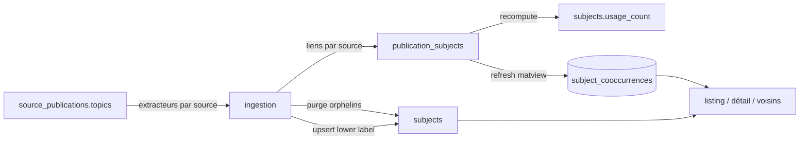

# Sujets — cycle de vie

*À jour le 2026-07-14.*

Le sujet n'a **pas d'objet de domaine** : il vit comme libellé normalisé et lignes SQL. La seule règle côté `domain/` est `normalize_label` (`domain/normalize.py`) — trim + collapse d'espaces, sans toucher casse ni accents. Le mot « agrégat » désigne ici le cluster de tables qu'un repository possède, sans racine d'entité. Les invariants (dédup sur `lower(label)`, attribution par source, caches dérivés) sont portés par le SQL et la phase pipeline.

## Tables du cluster

| Table | Rôle | Colonnes clés |
|---|---|---|
| `subjects` | Le sujet (libellé canonique) | `label` (forme du premier insert), `lower(label)` unique, `language`, `usage_count`, `created_at` |
| `publication_subjects` | Lien publication ↔ sujet, par source | PK `(publication_id, subject_id, source)`, `rejected` (curation), `created_at` |
| `subject_cooccurrences` (matview) | Paires de sujets co-présents sur une publication | `subject_a_id < subject_b_id`, `count` (publications distinctes), seuil `>= 2`, `NOT rejected` des deux côtés |

Unicité d'un sujet : index unique sur `lower(label)` (deux libellés ne différant que par la casse convergent, la première forme est conservée). Un même sujet annoté par deux sources donne **deux** lignes `publication_subjects` (la PK inclut `source`).

## Les deux axes

## Écriture — pipeline

Une seule phase écrit le cluster : `subjects` (`application/pipeline/subjects/`), après `authorships`. Deux sous-étapes indissociables, chacune dans sa transaction.

**Ingestion** (`ingestion.py` → `subjects` + `publication_subjects`) : incrémentale et publication-centrée. Sélectionne les publications dont le contenu canonique a changé depuis la dernière ingestion de leurs liens — `publications.updated_at > max(publication_subjects.created_at)` par publication, ou jamais ingérées — efface leurs liens **non rejetés**, puis ré-ingère par `source_publication` : l'extracteur de chaque source (`extractors.py`) réduit le champ `topics` à une liste de libellés, un `SubjectCache` mutualise les UPSERTs d'un même `lower(label)` (y compris entre sources), et les liens sont insérés en bulk avec leur `source`. Purge finale des sujets sans aucun lien. `--rebuild-subjects` repasse tout le stock.

**Extracteurs par source** (`extractors.py`, `SUBJECT_EXTRACTORS`) : hal (domaines CCSD), openalex (4 niveaux domain/field/subfield/topic à plat, `en`), wos (`subjects`+`headings`, `en`), scanr (domaines), theses (discipline + RAMEAU, `fr`). Seuls les concepts issus des **ontologies sources** (`topics`) alimentent `subjects` ; les mots-clés libres (`keywords`, dont CrossRef qui n'a que ça) restent sur `source_publications` et s'affichent via `publications_detail.keywords`, hors du cluster.

**Co-occurrences** (`cooccurrences.py` → `subjects.usage_count` + matview) : recalcule `usage_count` (publications distinctes par sujet, hors `rejected`) puis `REFRESH MATERIALIZED VIEW subject_cooccurrences`. Idempotent : ne dépend que de l'état courant de `publication_subjects`.

## Écriture — API

**Aucune.** Les sujets ne sont ni créés ni édités par l'API — le pipeline en est la seule autorité d'écriture. La colonne `publication_subjects.rejected` provisionne une curation (elle est respectée partout : exclue de `usage_count` et des co-occurrences, préservée par le `clear` de ré-ingestion, empêche la purge du sujet), mais **aucun endpoint ne la pose** aujourd'hui.

## Lecture — pipeline

**Ingestion** lit `source_publications(id, publication_id, source, topics)` des publications à ré-ingérer — jamais `publications_detail`, pour conserver l'attribution `publication_subjects.source`. **Co-occurrences** lit `publication_subjects` (hors `rejected`) pour l'usage et le refresh de la matview. Aucun filtre périmètre : `authorships` a purgé en amont les publications orphelines, donc `publication_subjects` ne porte que du périmètre et les deux caches en héritent.

## Lecture — API

Port `application/ports/api/subjects_queries.py`, adaptateur `PgSubjectsAdminQueries` (même module `infrastructure/queries/subjects.py` que les fonctions pipeline — pattern « queries mutualisées, ports par contexte »).

- **Listing** (`GET /api/subjects`) : liste paginée, tri `usage_count` décroissant, recherche `unaccent(label) ILIKE`, filtre `usage_count >= min_count`.
- **Détail + voisins** (`GET /api/subjects/{id}`) : le sujet + ses voisins par co-occurrence (top N via `subject_cooccurrences`, symétrisée par `UNION ALL` sur les deux colonnes).

Les sujets alimentent aussi les « top sujets » d'autres pages (dashboards éditeur et laboratoire, détail publication), via des lectures de `publication_subjects` portées par leurs propres query services.

## Points d'attention

Dette assumée et décisions d'architecture propres à cet agrégat, gardées explicites.

1. **Incrémental sans colonne d'état.** Le signal « à ré-ingérer » se dérive de `publications.updated_at > max(publication_subjects.created_at)` : pas de flag `dirty` dédié, la référence est le `created_at` des liens eux-mêmes. Économe mais subtil — la justesse dépend du bump conditionnel de `updated_at` par `refresh_from_sources`.
2. **`rejected` provisionné, non câblé.** Le flag de curation est respecté par tout le pipeline mais sans chemin d'écriture API : une intention de fonctionnalité en attente, pas un mécanisme actif.

## Invariants métier

Règles maintenues par le SQL et la phase, ni par une contrainte riche ni par un objet de domaine.

- **Identité d'un sujet.** Dédup sur `lower(label)` (index unique) ; `subjects.label` garde la forme du premier insert ; `language` retient le premier non-null (`COALESCE` au `ON CONFLICT`).
- **Attribution par source.** `publication_subjects.source` dit quelle source a fourni chaque lien ; un même sujet issu de deux sources donne deux lignes. L'ingestion efface et reconstruit les liens **non rejetés** d'une publication modifiée, source comprise.
- **Périmètre de vocabulaire.** Seuls les `topics` d'ontologie deviennent des sujets ; les mots-clés libres restent hors cluster.
- **Caches dérivés.** `usage_count` et `subject_cooccurrences` se recalculent intégralement à chaque run depuis `publication_subjects` (hors `rejected`), sans état incrémental.
- **Orphelins.** Un sujet sans aucun lien (tous statuts) est purgé ; un sujet ne portant que des liens rejetés survit (curation préservée).
