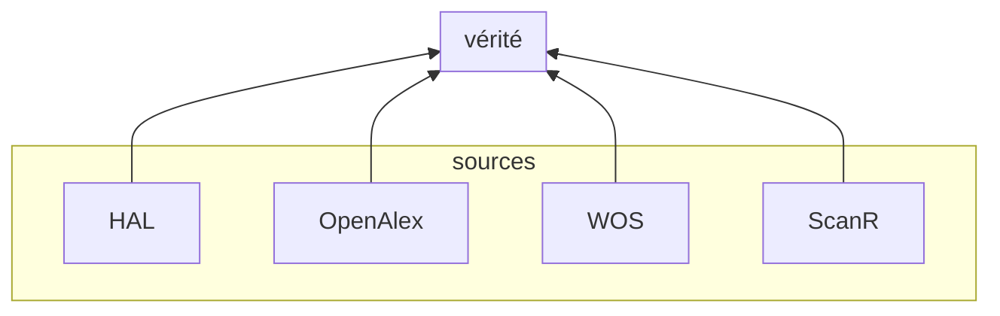
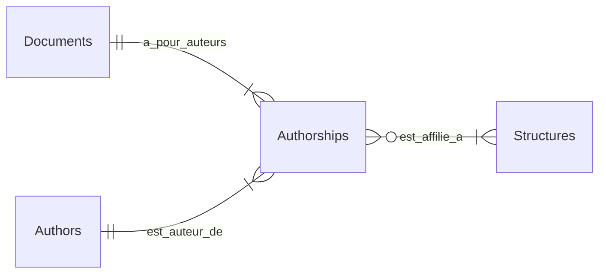
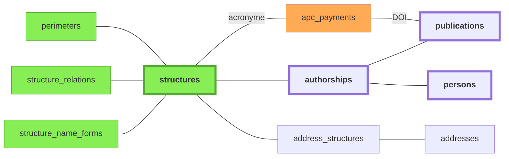
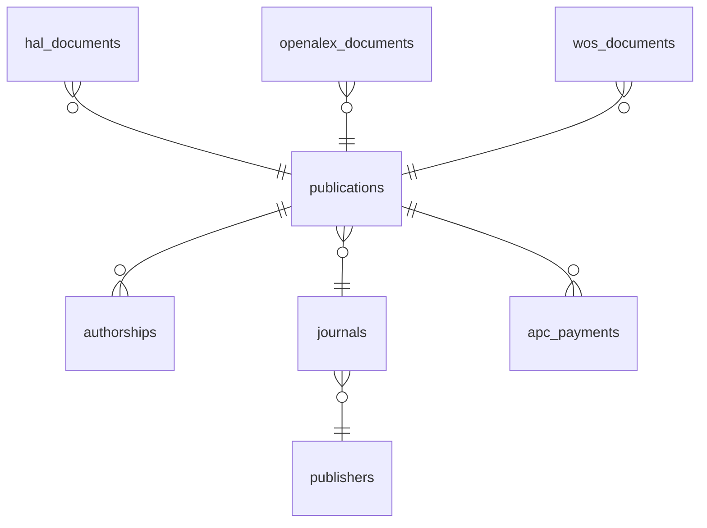
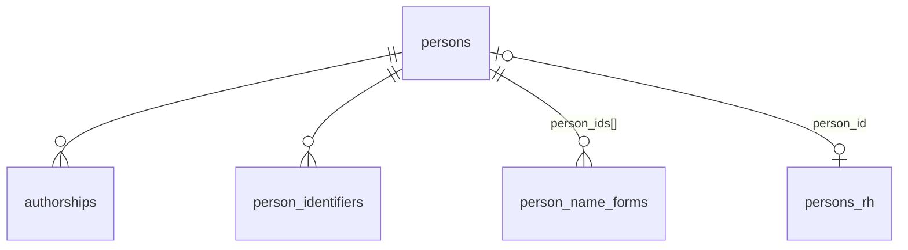

# Architecture des données — Bibliométrie UCA

## Principes de conception

Le schéma repose sur une distinction entre des tables "sources" (séparées par source: HAL, OpenAlex, WoS) et des tables "canoniques" (= vérité).



### Entités principales et relations

Chaque source s'organise selon le même schéma en quatre tables: `documents`, `authors`, `authorships`, `structures`. Une `authorship` représente la contribution d'**un** auteur à **une** publication. C'est elle qui porte l'information d'affiliation (`structure_ids`).



### Tables sources

Chaque source possède ses propres tables pour les entités clés, et ses propres identifiants internes pour toutes les entités.

| Entité     | HAL                | OpenAlex                | WoS                | ScanR         |
|------------|--------------------|-------------------------|--------------------|----------------|
| Documents  | `hal_documents`    | `openalex_documents`    | `wos_documents`    | `scanr_documents` |
| Auteurs    | `hal_authors`      | `openalex_authors`      | `wos_authors`      | `scanr_authors`      |
| Authorship | `hal_authorships`  | `openalex_authorships`  | `wos_authorships`  | `scanr_authorships`  |
| Structures | `hal_structures`   | `openalex_institutions` | `wos_organizations`                  | —   |


<!--
 STAGING (brut API)                SOURCE (normalisé)                     VÉRITÉ
 ──────────────────               ─────────────────────                  ────────

 staging_hal ──────────→ hal_documents ──────────────────────────┐
                         hal_authors ─────────────────────┐      ├──→ publications
                         hal_authorships                  │      │
                         hal_structures ──────────┐       ├──→ persons ←── person_identifiers
                                                  │       │      │         person_name_forms
                                                  ├──→ structures │
                                                  │       │      ├──→ authorships
 staging_openalex ─────→ openalex_documents ──────────────┘      │
                         openalex_authors ────────────┘          │
                         openalex_authorships ───────────────────┤
                                                                 │
 staging_wos ──────────→ wos_documents ──────────────────────────┘
                         wos_authors ────────────────────┘
                         wos_authorships ────────────────┘
```

-->


Tous les identifiants primaires sont des `SERIAL`. Les identifiants naturels, qu'ils soient internes à une source (halId, openalex_id, hal_person_id, hal_struct_id, etc.) ou universels (DOI, ORCID, ROR) sont en colonnes `UNIQUE` mais ne servent jamais de PK. Cela évite les problèmes quand un identifiant naturel est absent.

Les tables sources sont toutes peuplées lors de la [phase 3](pipeline#normalize) du pipeline (`normalize`).

### Tables “canoniques”

Les tables canoniques obéissent au même schéma et sont peuplées progressivement au cours du [pipeline](pipeline#tables-canoniques) de traitement.


| Entité     |  Vérité        |
|------------|----------------|
| Documents  | `publications` |
| Auteurs    | `persons`      |
| Authorship | `authorships`  |
| Structures | `structures`   |


## Zones fonctionnelles et propriétaires de données

Chaque table a un **service propriétaire** qui est le seul autorisé à y écrire
(INSERT/UPDATE/DELETE). Les autres composants lisent via SELECT mais passent par
le service pour écrire.

### Référentiel Publications — `services/publications.py`

| Table | Propriétaire | Violations actuelles |
|-------|-------------|---------------------|
| `publications` | `services/publications.py` | addresses.py (batch pays — toléré) |
| `distinct_publications` | API admin | — |
| `apc_payments` | import APC | — |

### Référentiel Bibliographique — `services/journals.py`

| Table | Propriétaire | Violations actuelles |
|-------|-------------|---------------------|
| `journals` | `services/journals.py` | — |
| `publishers` | `services/journals.py` | — |

### Référentiel Personnes — `services/persons.py`

| Table | Propriétaire | Violations actuelles |
|-------|-------------|---------------------|
| `persons` | `services/persons.py` | import_persons (HR — toléré) |
| `persons_rh` | import RH | — |
| `person_identifiers` | `services/persons.py` | — |
| `person_name_forms` | `services/persons.py` | populate_person_name_forms (recalcul bulk — toléré) |

### Structures — pas de service (maintenu manuellement)

| Table | Propriétaire |
|-------|-------------|
| `structures`, `structure_relations`, `structure_name_forms` | admin / SQL |
| `countries` | référentiel statique |

### Sources bibliographiques — scripts de normalisation

| Table | Propriétaire |
|-------|-------------|
| `staging_hal` | extract_hal |
| `hal_documents`, `hal_authors`, `hal_authorships` | normalize_hal |
| `staging_openalex` | extract_openalex |
| `openalex_documents`, `openalex_authors`, `openalex_authorships` | normalize_openalex |
| `staging_wos` | extract_wos |
| `wos_documents`, `wos_authors`, `wos_authorships` | normalize_wos |

Note : `person_id` sur les `*_authorships` est écrit par `services/persons.py`
(rattachement), pas par les normalizers.

### Authorships canoniques

| Table | Propriétaire | Violations actuelles |
|-------|-------------|---------------------|
| `authorships` | `services/authorships.py` + `build_authorships.py` (batch) | — |

### Adresses

| Table | Propriétaire |
|-------|-------------|
| `addresses`, `address_structures` | populate_addresses, resolve_addresses |
| `openalex_authorship_addresses` | populate_addresses (source OA) |
| `wos_authorship_addresses` | populate_addresses (source WoS) |


## Détail des tables

### Tables canoniques

#### Domaine fonctionnel `structures`

Référentiel institutionnel maintenu manuellement. Contient l'UCA, ses laboratoires, les tutelles (CNRS, INRAE...), composantes (INP, VetAgro Sup...), CHU, etc.

- `code` : identifiant court stable (`uca`, `cnrs`, `lpc`, `ip`)
- `type` : `universite`, `onr`, `chu`, `ecole`, `labo`, `equipe`, `site`, `autre`
- `ror_id`, `rnsr_id` : identifiants externes (optionnels)
- `hal_collection` : collection HAL associée (labos uniquement)



Légende:
- **vert**: tables peuplées manuellement;
- **orange**: imports CSV;
- **violet**: tables peuplées automatiquement par le pipeline à partir des imports API.

Tables associées :
- `perimeters` : un périmètre est un ensemble de structures incluant récursivement leurs sous-structures. Actuellement deux périmètres sont définis: **UCA strict** et **UCA large** (UCA + CHU + INP). Impacte:
    - Les authorships sources dont le champ `structure_ids` sera peuplé par le pipeline, et qui serviront à générer les `personnes`. Une *authorship* hors périmètre UCA strict n'est pas génératrice d'entités personnes.
    - (à terme: les appels API devront être déduits du périmètre. Pour l'instant les critères de requête sont écrits en dur dans la config.) <!--TODO: mapper structures aux identifiants de chaque source, supprimer les identifiants hardcoded dans la config des appels API et les déduire du périmètre UCA -->
- `structure_relations` : définit les relations entre structures. Deux relations existent: **tutelle** (asymétrique), **partenariat** (symétrique, non transitif). La relation "partenariat" est purement informative (elle réplique l'information présente dans ROR), la relation "tutelle" a une conséquence sur les structures incluses dans un périmètre donné.
- `structure_name_forms` : formes de noms pour la détection automatique des structures dans les adresses. Le champ `requires_context_of` (= liste d'id structures) permet de rendre une forme de nom *conditionnellement* valide. Exemple: *LMV* reconnaît le labo *Magmas et Volcans* seulement si `uca` ou `site_clermont` reconnus dans l'adresse. Sinon: probablement *Laboratoire de mathématiques de Versailles*. Cette table est utilisée dans la phase `addresses` du pipeline pour peupler la table de liaison `adress_structures`.
- `address_structures`: table de liaison. Les adresses proviennent des authorships sources (phase 4 `addresses` du pipeline). Les structures identifiées sont propagées aux authorships sources.
- `apc_payments`: données provenant d'un import CSV, voir [doc sources](sources#donnees-apc).


#### Domaine fonctionnel  `publications`

Référentiel dédupliqué. Hiérarchie de déduplication :
1. **DOI identique** (case-insensitive) → même publication
2. **Lien explicite** source→source (ex: OpenAlex cite HAL comme primary_location)
3. **Métadonnées** : titre normalisé + année + même journal

Contrainte unique : `lower(doi)` WHERE `doi IS NOT NULL`.

Table associée:
- `distinct_publications`: Paires de publications marquées comme **distinctes malgré un titre identique** (faux positifs de déduplication). Contrainte : `pub_id_a < pub_id_b`.
- `publishers` 
- `journals`
- `apc_payments`: Données de paiements d'APC (Article Processing Charges) importées depuis les exports DPCG. Liées à `publications`, `journals` et `publishers` par FK optionnelles.



#### `persons`

Référentiel des individus. Une ligne = une personne physique. Alimenté par le script `create_persons_from_source_authorships.py` (création automatique depuis les authorships) et complété par les exports RH (données dans la table satellite `persons_rh`).

Tables associées :
- `persons_rh`: Table satellite liée à `persons` (FK `person_id`, ON DELETE CASCADE). Contient les données issues des exports RH : `department_name`, `role_title`, `structure_id`, `start_date`, `end_date`.
- `person_identifiers`: Identifiants persistants : ORCID, idHAL, IdRef, etc. Chaque ligne associe un identifiant (`id_type` + `id_value`) à une personne (`person_id`). Le champ `source` trace la provenance (`hr`, `hal`, `openalex`, `manual`, `auto` TODO: revoir enum).
- `person_name_forms`: Formes de noms normalisées, utilisées pour le matching lors de la création de personnes. Chaque forme pointe vers un tableau de `person_ids`. Les authorships sources portent la même forme dans `author_name_normalized`, ce qui permet un matching direct sans recalcul.




#### `authorships`

Table de vérité reliant personnes, publications et structures. Construite par
`build_authorships.py` à partir des authorships source.

- `person_id` : peut être NULL si la personne n'est pas encore identifiée
- `structure_id` : structure UCA (NULL si non UCA ou non résolu)
- `is_uca` : TRUE si l'auteur est affilié UCA sur cette publication
- `author_position` : position dans la liste d'auteurs
- `is_corresponding` : auteur correspondant
- `source_hal`, `source_openalex`, `source_wos`, `source_manual` : booléens traçant
  quelles sources ont contribué à cet authorship
- `excluded` : lien erroné (homonyme, etc.)


### Tables source — HAL

#### `staging_hal`

Import brut de l'API HAL. `raw_data` (JSONB) contient la réponse API complète.
`collection` est la collection d'origine de la requête. `processed` passe à TRUE
après normalisation.

#### `hal_structures`

Référentiel des structures HAL, peuplé depuis l'API `ref/structure`.

- `hal_struct_id` : identifiant numérique HAL (UNIQUE, pas PK)
- `parent_ids` : hiérarchie (tableau d'entiers → autres hal_structures)
- `structure_id` (FK → `structures`) : mapping vers le référentiel

#### `hal_authors`

Un enregistrement = un identifiant auteur dans HAL.

- `hal_person_id` : numérique HAL (de `authFullNameId_fs`), UNIQUE mais nullable
- `idhal` : identifiant volontaire lié à un compte HAL (donnée source)
- `orcid` : ORCID observé dans HAL (donnée source)
- `is_reliable` : FALSE si cet identifiant recouvre plusieurs personnes réelles
- `person_id` : FK vers `persons` — dual-write depuis `hal_authorships.person_id`
  uniquement pour les comptes HAL (avec `hal_person_id`)

#### `hal_documents`

- `halid` : identifiant HAL (UNIQUE)
- `collections` : **tableau** de collections HAL contenant ce document
- `publication_id` : FK vers la publication canonique

#### `hal_authorships`

Relation document × auteur dans HAL.

- `hal_struct_ids` : tableau des hal_struct_id affiliés
- `structure_ids` : tableau des `structures.id` UCA résolues
- `is_uca` : TRUE si `structure_ids` est non vide
- `person_id` : FK vers `persons` — **source de vérité** pour le lien personne


### Tables source — OpenAlex

#### `openalex_institutions`

Pendant de `hal_structures`. `ror_id` permet l'alignement avec `structures.ror_id`.

#### `openalex_authors`

Un enregistrement = un auteur OpenAlex. `is_reliable` important car OpenAlex
fusionne parfois des homonymes.

#### `openalex_documents`

Même logique que `hal_documents`. Pas de champ `collections`.

#### `openalex_authorships`

- `raw_author_name` : nom brut de l'auteur sur cette publication
- `raw_affiliation` : affiliation brute
- `openalex_institution_ids` : institutions OpenAlex détectées
- `person_id` : FK vers `persons` — **source de vérité** pour le lien personne


### Tables source — Web of Science

#### `staging_wos`

Import brut depuis l'API Web of Science (ou fichiers Excel/CSV en fallback).

#### `wos_authors`

- `full_name`, `last_name`, `first_name` : noms
- `daisng_id` : identifiant WoS Distinct Author
- `orcid`, `researcher_id` : identifiants externes (données source)
- `is_reliable` : fiabilité de l'entité

#### `wos_documents`

- `ut` : identifiant WoS (UNIQUE)
- `doi`, `title`, `pub_year`, `doc_type`
- `publication_id` : FK vers la publication canonique

#### `wos_authorships`

- `author_position`, `is_corresponding`
- `raw_affiliation` : affiliation brute
- `is_uca`, `structure_ids`, `countries`
- `person_id` : FK vers `persons` — **source de vérité** pour le lien personne


### Adresses d'affiliation

Tables **source-agnostiques** pour les adresses et leur résolution en structures.

#### `addresses`

Chaque adresse brute unique rencontrée. `review_status` : `pending`, `confirmed`,
`rejected`.

#### `address_structures`

Lien adresse → structure détectée, avec traçabilité (`matched_form_id`).

#### Tables de liaison

- `openalex_authorship_addresses` : lie `openalex_authorships.id` → `addresses.id`
- `wos_authorship_addresses` : lie `wos_authorships.id` → `addresses.id`


### Vue `publication_sources`

Vue (pas table) qui consolide les liens publication → source en combinant les FK
`publication_id` de `hal_documents`, `openalex_documents` et `wos_documents`.
