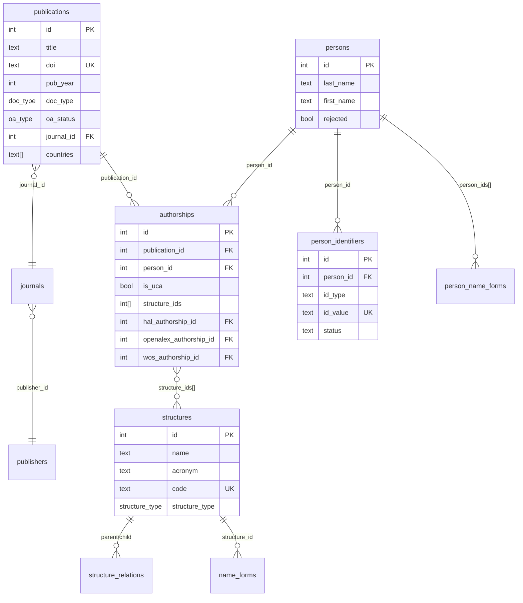

# Architecture des données — Bibliométrie UCA

## Vue d'ensemble

Le système centralise la production scientifique de l'Université Clermont Auvergne en intégrant plusieurs [sources de données](sources) (HAL, OpenAlex, Web of Science).

Principe fondamental : les données source sont strictement séparées et ne s'écrasent jamais. Chaque source a ses propres tables ; les entités canoniques (publications, personnes, structures, [authorships](glossaire#authorship)) sont construites par mapping à partir des sources.

```
 STAGING (brut API)                SOURCE (normalisé)                     VÉRITÉ
 ──────────────────               ─────────────────────                  ────────

 staging_hal ──────────→ hal_documents ──────────────────────────┐
                         hal_authors ─────────────────────┐      ├──→ publications
                         hal_authorships                  │      │
                         hal_structures ──────────┐       ├──→ persons ←── person_identifiers
                                                  │       │      │         person_name_forms
                                                  ├──→ structures │
                                                  │       │      ├──→ authorships
 staging_openalex ─────→ openalex_documents ──────────────┘      │
                         openalex_authors ────────────┘          │
                         openalex_authorships ───────────────────┤
                                                                 │
 staging_wos ──────────→ wos_documents ──────────────────────────┘
                         wos_authors ────────────────────┘
                         wos_authorships ────────────────┘
```

### Diagramme entité-relation (tables canoniques)




## Principes de conception

### 1. Séparation stricte des sources

Chaque source possède ses propres tables pour les entités clés :

| Entité     | HAL                | OpenAlex                | WoS                | Vérité         |
|------------|--------------------|-------------------------|--------------------|----------------|
| Documents  | `hal_documents`    | `openalex_documents`    | `wos_documents`    | `publications` |
| Auteurs    | `hal_authors`      | `openalex_authors`      | `wos_authors`      | `persons`      |
| Structures | `hal_structures`   | `openalex_institutions` | —                  | `structures`   |
| Authorship | `hal_authorships`  | `openalex_authorships`  | `wos_authorships`  | `authorships`  |

### 2. person_id sur les authorships sources

Le `person_id` (lien vers la personne canonique) est porté par les **authorships
sources**, pas par les auteurs sources :

- `hal_authorships.person_id` : source de vérité pour HAL. Dual-write sur
  `hal_authors.person_id` uniquement pour les comptes HAL (avec `hal_person_id`).
- `openalex_authorships.person_id` : source de vérité pour OpenAlex.
  Les entités auteur OpenAlex ne sont pas fiables (fusions erronées fréquentes).
- `wos_authorships.person_id` : source de vérité pour WoS.
  Les entités auteur WoS sont algorithmiques et non fiables.

### 3. Clés internes systématiques

Tous les identifiants primaires sont des `SERIAL`. Les identifiants naturels
(DOI, halId, openalex_id, hal_person_id, hal_struct_id) sont en colonnes `UNIQUE`
mais ne servent jamais de PK. Cela évite les problèmes quand un identifiant naturel
est absent.

### 4. Mappings many-to-one

Les liens source → vérité sont toujours many-to-one :

- Plusieurs `hal_structures` → une `structure` (phases d'un même labo)
- Plusieurs `hal_authors` → une `person` (variantes de nom d'un même chercheur)
- Plusieurs `hal_documents` / `openalex_documents` / `wos_documents` → une `publication` (déduplication)

### 5. Identifiants certifiants

ORCID et idHAL certifient l'unicité d'une personne. Ils sont dans
`person_identifiers` (many-to-one vers `persons`) :

- **Un identifiant donné → une seule personne** (UNIQUE sur `id_type, id_value`)
- **Une personne → potentiellement plusieurs identifiants** (comptes multiples)
- **Statut** : `pending`, `confirmed`, `rejected` — permet validation manuelle

Si deux authorships-source partagent le même ORCID ou idHAL, ils correspondent à la
même personne. C'est le chaînon principal de la déduplication inter-sources.


## Zones fonctionnelles et propriétaires de données

Chaque table a un **service propriétaire** qui est le seul autorisé à y écrire
(INSERT/UPDATE/DELETE). Les autres composants lisent via SELECT mais passent par
le service pour écrire.

### Référentiel Publications — `services/publications.py`

| Table | Propriétaire | Violations actuelles |
|-------|-------------|---------------------|
| `publications` | `services/publications.py` | addresses.py (batch pays — toléré) |
| `distinct_publications` | API admin | — |
| `apc_payments` | import APC | — |

### Référentiel Bibliographique — `services/journals.py`

| Table | Propriétaire | Violations actuelles |
|-------|-------------|---------------------|
| `journals` | `services/journals.py` | — |
| `publishers` | `services/journals.py` | — |

### Référentiel Personnes — `services/persons.py`

| Table | Propriétaire | Violations actuelles |
|-------|-------------|---------------------|
| `persons` | `services/persons.py` | import_persons (HR — toléré) |
| `persons_rh` | import RH | — |
| `person_identifiers` | `services/persons.py` | — |
| `person_name_forms` | `services/persons.py` | populate_person_name_forms (recalcul bulk — toléré) |

### Structures — pas de service (maintenu manuellement)

| Table | Propriétaire |
|-------|-------------|
| `structures`, `structure_relations`, `name_forms` | admin / SQL |
| `countries` | référentiel statique |

### Sources bibliographiques — scripts de normalisation

| Table | Propriétaire |
|-------|-------------|
| `staging_hal` | extract_hal |
| `hal_documents`, `hal_authors`, `hal_authorships` | normalize_hal |
| `staging_openalex` | extract_openalex |
| `openalex_documents`, `openalex_authors`, `openalex_authorships` | normalize_openalex |
| `staging_wos` | extract_wos |
| `wos_documents`, `wos_authors`, `wos_authorships` | normalize_wos |

Note : `person_id` sur les `*_authorships` est écrit par `services/persons.py`
(rattachement), pas par les normalizers.

### Authorships canoniques

| Table | Propriétaire | Violations actuelles |
|-------|-------------|---------------------|
| `authorships` | `services/authorships.py` + `build_authorships.py` (batch) | — |

### Adresses

| Table | Propriétaire |
|-------|-------------|
| `addresses`, `address_structures` | populate_addresses, resolve_addresses |
| `openalex_authorship_addresses` | populate_addresses (source OA) |
| `wos_authorship_addresses` | populate_addresses (source WoS) |


## Tables de vérité

### `structures`

Référentiel institutionnel maintenu manuellement. Contient l'UCA, ses laboratoires,
les tutelles (CNRS, INRAE...), composantes (INP, VetAgro Sup...), CHU, etc.

- `code` : identifiant court stable (`uca`, `cnrs`, `lpc`, `ip`)
- `type` : `universite`, `onr`, `chu`, `ecole`, `labo`, `equipe`, `site`, `autre`
- `ror_id`, `rnsr_id` : identifiants externes (optionnels)
- `hal_collection` : collection HAL associée (labos uniquement)

Tables associées :
- `structure_relations` : hiérarchie (tutelles, partenariats)
- `name_forms` : formes de noms pour la détection automatique dans les affiliations

### `persons`

Référentiel des individus. Une ligne = une personne physique. Alimenté par les
exports RH (données dans la table satellite `persons_rh`) et par le script
`create_persons_from_source_authorships.py` (création automatique depuis les
authorships en 6 passes). Ne contient aucun identifiant bibliométrique directement —
ceux-ci sont dans `person_identifiers`.

### `persons_rh`

Table satellite liée à `persons` (FK `person_id`, ON DELETE CASCADE). Contient les
données issues des exports RH : `department_name`, `role_title`, `structure_id`,
`start_date`, `end_date`. Une personne sans entrée dans `persons_rh` n'a pas de
données RH (créée automatiquement depuis les authorships).

### `person_identifiers`

Identifiants certifiants : ORCID, idHAL, IdRef, etc. Chaque ligne associe
un identifiant (`id_type` + `id_value`) à une personne (`person_id`). Le champ
`source` trace la provenance (`hr`, `hal`, `openalex`, `manual`, `auto`).

### `person_name_forms`

Formes de noms normalisées, utilisées pour le matching lors de la création de
personnes. Chaque forme pointe vers un tableau de `person_ids`.

- `name_form` : forme normalisée (UNIQUE), calculée par `normalize_name_form()` SQL
- `person_ids` : tableau d'entiers — les personnes associées à cette forme
- `sources` : tableau de textes (`hal`, `openalex`, `wos`, `persons`, `manual`)

La normalisation (`normalize_name_form()`) produit : minuscules, sans accents,
tout ce qui n'est pas lettre/chiffre remplacé par des espaces. Exemple :
"Nédélec, J.-M." → `nedelec j m`.

Les authorships sources portent la même forme dans `author_name_normalized`,
ce qui permet un matching direct sans recalcul.

Pour la source `persons`, les formes sont calculées par `compute_person_name_forms()`
qui génère les variantes : "prénom nom", "nom prénom", "initiales nom", "nom initiales".

Une forme avec `person_ids` de longueur > 1 est **ambiguë** (homonymes).

### `publications`

Référentiel dédupliqué. Hiérarchie de déduplication :
1. **DOI identique** (case-insensitive) → même publication
2. **Lien explicite** source→source (ex: OpenAlex cite HAL comme primary_location)
3. **Heuristique** : titre normalisé + année + même journal

Contrainte unique : `lower(doi)` WHERE `doi IS NOT NULL`.

### `distinct_publications`

Paires de publications marquées comme **distinctes malgré un titre similaire**
(faux positifs de déduplication). Contrainte : `pub_id_a < pub_id_b`.

### `authorships`

Table de vérité reliant personnes, publications et structures. Construite par
`build_authorships.py` à partir des authorships source.

- `person_id` : peut être NULL si la personne n'est pas encore identifiée
- `structure_id` : structure UCA (NULL si non UCA ou non résolu)
- `is_uca` : TRUE si l'auteur est affilié UCA sur cette publication
- `author_position` : position dans la liste d'auteurs
- `is_corresponding` : auteur correspondant
- `source_hal`, `source_openalex`, `source_wos`, `source_manual` : booléens traçant
  quelles sources ont contribué à cet authorship
- `excluded` : lien erroné (homonyme, etc.)

### `publishers` / `journals`

Référentiel bibliographique. Non dupliqué par source — une seule entrée par journal,
alignée par ISSN-L ou openalex_id.

### `apc_payments`

Données de paiement d'APC (Article Processing Charges) importées depuis les exports
DPCG. Liées à `publications`, `journals` et `publishers` par FK optionnelles.


## Tables source — HAL

### `staging_hal`

Import brut de l'API HAL. `raw_data` (JSONB) contient la réponse API complète.
`collection` est la collection d'origine de la requête. `processed` passe à TRUE
après normalisation.

### `hal_structures`

Référentiel des structures HAL, peuplé depuis l'API `ref/structure`.

- `hal_struct_id` : identifiant numérique HAL (UNIQUE, pas PK)
- `parent_ids` : hiérarchie (tableau d'entiers → autres hal_structures)
- `structure_id` (FK → `structures`) : mapping vers le référentiel

### `hal_authors`

Un enregistrement = un identifiant auteur dans HAL.

- `hal_person_id` : numérique HAL (de `authFullNameId_fs`), UNIQUE mais nullable
- `idhal` : identifiant volontaire lié à un compte HAL (donnée source)
- `orcid` : ORCID observé dans HAL (donnée source)
- `is_reliable` : FALSE si cet identifiant recouvre plusieurs personnes réelles
- `person_id` : FK vers `persons` — dual-write depuis `hal_authorships.person_id`
  uniquement pour les comptes HAL (avec `hal_person_id`)

### `hal_documents`

- `halid` : identifiant HAL (UNIQUE)
- `collections` : **tableau** de collections HAL contenant ce document
- `publication_id` : FK vers la publication canonique

### `hal_authorships`

Relation document × auteur dans HAL.

- `hal_struct_ids` : tableau des hal_struct_id affiliés
- `structure_ids` : tableau des `structures.id` UCA résolues
- `is_uca` : TRUE si `structure_ids` est non vide
- `person_id` : FK vers `persons` — **source de vérité** pour le lien personne


## Tables source — OpenAlex

### `openalex_institutions`

Pendant de `hal_structures`. `ror_id` permet l'alignement avec `structures.ror_id`.

### `openalex_authors`

Un enregistrement = un auteur OpenAlex. `is_reliable` important car OpenAlex
fusionne parfois des homonymes.

### `openalex_documents`

Même logique que `hal_documents`. Pas de champ `collections`.

### `openalex_authorships`

- `raw_author_name` : nom brut de l'auteur sur cette publication
- `raw_affiliation` : affiliation brute
- `openalex_institution_ids` : institutions OpenAlex détectées
- `person_id` : FK vers `persons` — **source de vérité** pour le lien personne


## Tables source — Web of Science

### `staging_wos`

Import brut depuis l'API Web of Science (ou fichiers Excel/CSV en fallback).

### `wos_authors`

- `full_name`, `last_name`, `first_name` : noms
- `daisng_id` : identifiant WoS Distinct Author
- `orcid`, `researcher_id` : identifiants externes (données source)
- `is_reliable` : fiabilité de l'entité

### `wos_documents`

- `ut` : identifiant WoS (UNIQUE)
- `doi`, `title`, `pub_year`, `doc_type`
- `publication_id` : FK vers la publication canonique

### `wos_authorships`

- `author_position`, `is_corresponding`
- `raw_affiliation` : affiliation brute
- `is_uca`, `structure_ids`, `countries`
- `person_id` : FK vers `persons` — **source de vérité** pour le lien personne


## Adresses d'affiliation

Tables **source-agnostiques** pour les adresses et leur résolution en structures.

### `addresses`

Chaque adresse brute unique rencontrée. `review_status` : `pending`, `confirmed`,
`rejected`.

### `address_structures`

Lien adresse → structure détectée, avec traçabilité (`matched_form_id`).

### Tables de liaison

- `openalex_authorship_addresses` : lie `openalex_authorships.id` → `addresses.id`
- `wos_authorship_addresses` : lie `wos_authorships.id` → `addresses.id`


## Vue `publication_sources`

Vue (pas table) qui consolide les liens publication → source en combinant les FK
`publication_id` de `hal_documents`, `openalex_documents` et `wos_documents`.


## Inventaire des tables

### Vérité (13)
`structures`, `structure_relations`, `name_forms`, `persons`, `persons_rh`,
`person_identifiers`, `person_name_forms`, `publishers`, `journals`,
`publications`, `distinct_publications`, `authorships`, `apc_payments`

### Source HAL (5)
`staging_hal`, `hal_structures`, `hal_authors`, `hal_documents`, `hal_authorships`

### Source OpenAlex (5)
`staging_openalex`, `openalex_institutions`, `openalex_authors`,
`openalex_documents`, `openalex_authorships`

### Source WoS (5)
`staging_wos`, `wos_authors`, `wos_documents`, `wos_authorships`

### Adresses (4)
`addresses`, `address_structures`, `openalex_authorship_addresses`,
`wos_authorship_addresses`

### Référentiel (1)
`countries`

### Vues (1)
`publication_sources`
