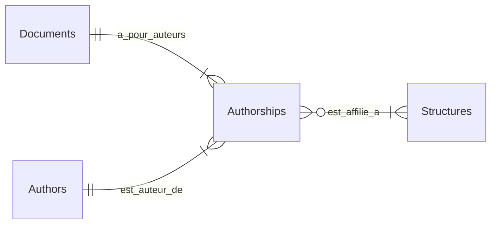
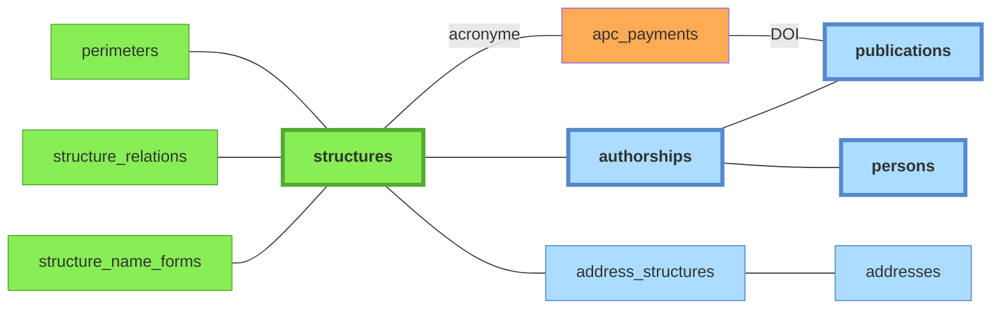
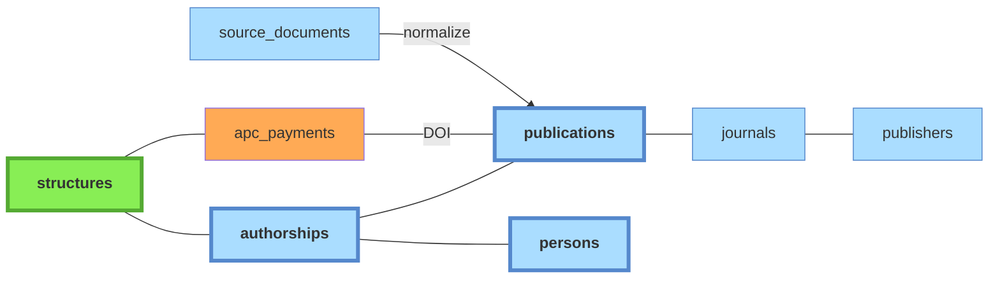
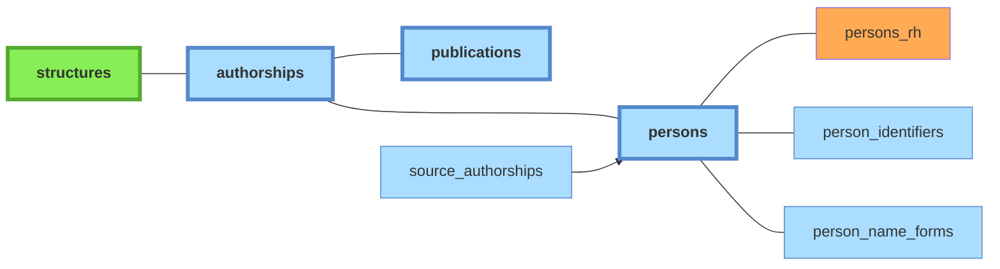

# Architecture des données — Bibliométrie UCA

## Principes de conception

Le schéma repose sur une distinction entre des tables "sources" et des tables "canoniques" (= vérité). Les tables sources contiennent les *records* non dédupliqués exportés depuis les API. Les tables canoniques contiennent les référentiels **publications** et **personnes** dédupliqués et mappés depuis les sources, ainsi que le référentiel **structures** (endogène).

### Entités principales et relations

Les tables sources s'organisent selon un schéma en quatre tables: `source_documents`, `source_authors`, `source_authorships`, `source_structures`. Une `authorship` représente la contribution d'**un** auteur à **une** publication. C'est elle qui porte l'information d'affiliation (`structure_ids`).

Les tables sources sont toutes peuplées lors de la [phase 3](pipeline#normalize) du pipeline (`normalize`).

### Tables “canoniques”

Les tables canoniques obéissent au même schéma et sont peuplées progressivement au cours du [pipeline](pipeline#tables-canoniques) de traitement.

| Entité     |  Vérité        |
|------------|----------------|
| Documents  | `publications` |
| Auteurs    | `persons`      |
| Authorship | `authorships`  |
| Structures | `structures`   |

## Zones fonctionnelles et propriétaires de données

Chaque table a un **service propriétaire** qui est le seul autorisé à y écrire
(INSERT/UPDATE/DELETE). Les autres composants lisent via SELECT mais passent par
le service pour écrire.

### Référentiel Publications — `services/publications.py`

| Table | Propriétaire | Violations actuelles |
|-------|-------------|---------------------|
| `publications` | `services/publications.py` | addresses.py (batch pays — toléré) |
| `distinct_publications` | API admin | — |
| `apc_payments` | import APC | — |

### Référentiel Bibliographique — `services/journals.py`

| Table | Propriétaire | Violations actuelles |
|-------|-------------|---------------------|
| `journals` | `services/journals.py` | — |
| `publishers` | `services/journals.py` | — |

### Référentiel Personnes — `services/persons.py`

| Table | Propriétaire | Violations actuelles |
|-------|-------------|---------------------|
| `persons` | `services/persons.py` | import_persons (HR — toléré) |
| `persons_rh` | import RH | — |
| `person_identifiers` | `services/persons.py` | — |
| `person_name_forms` | `services/persons.py` | populate_person_name_forms (recalcul bulk — toléré) |

### Structures — pas de service (maintenu manuellement)

| Table | Propriétaire |
|-------|-------------|
| `structures`, `structure_relations`, `structure_name_forms` | admin / SQL |
| `countries` | référentiel statique |

### Sources bibliographiques — scripts de normalisation

| Table | Propriétaire |
|-------|-------------|
| `staging_hal` | extract_hal |
| `hal_documents`, `hal_authors`, `hal_authorships` | normalize_hal |
| `staging_openalex` | extract_openalex |
| `openalex_documents`, `openalex_authors`, `openalex_authorships` | normalize_openalex |
| `staging_wos` | extract_wos |
| `wos_documents`, `wos_authors`, `wos_authorships` | normalize_wos |

Note : `person_id` sur les `*_authorships` est écrit par `services/persons.py`
(rattachement), pas par les normalizers.

### Authorships canoniques

| Table | Propriétaire | Violations actuelles |
|-------|-------------|---------------------|
| `authorships` | `services/authorships.py` + `build_authorships.py` (batch) | — |

### Adresses

| Table | Propriétaire |
|-------|-------------|
| `addresses`, `address_structures` | populate_addresses, resolve_addresses |
| `openalex_authorship_addresses` | populate_addresses (source OA) |
| `wos_authorship_addresses` | populate_addresses (source WoS) |

## Détail des tables

### Tables canoniques

#### Domaine fonctionnel `structures`

Référentiel institutionnel maintenu manuellement. Contient l'UCA, ses laboratoires, les tutelles (CNRS, INRAE...), composantes (INP, VetAgro Sup...), CHU, etc.

- `code` : identifiant court stable (`uca`, `cnrs`, `lpc`, `ip`)
- `type` : `universite`, `onr`, `chu`, `ecole`, `labo`, `equipe`, `site`, `autre`
- `ror_id`, `rnsr_id` : identifiants externes (optionnels)
- `hal_collection` : collection HAL associée (labos uniquement)

Légende:
- **vert**: tables peuplées manuellement;
- **orange**: imports CSV;
- **bleu**: tables peuplées automatiquement par le pipeline à partir des imports API.

Tables associées :
- `perimeters` : un périmètre est un ensemble de structures, incluant récursivement les sous-structures. Actuellement deux périmètres sont définis: **UCA strict** et **UCA large** (UCA + CHU + INP). Impacte:
    - Les authorships sources dont le champ `structure_ids` sera peuplé par le pipeline ([phase 5](pipeline#affiliations) du pipeline), et qui serviront à générer les `personnes` ([phase 7](pipeline#creation-personnes)). Une *authorship* hors périmètre UCA strict n'est pas génératrice d'entités personnes.
    - (à terme: les appels API devront être déduits du périmètre. Pour l'instant les critères de requête sont écrits en dur dans la config.) <!--TODO: mapper structures aux identifiants de chaque source, supprimer les identifiants hardcoded dans la config des appels API et les déduire du périmètre UCA -->
- `structure_relations` : définit les relations entre structures. Deux relations existent: **tutelle** (asymétrique), **partenariat** (symétrique, non transitif). La relation "partenariat" est purement informative (elle réplique l'information présente dans le [référentiel ROR](glossaire#ror)); la relation "tutelle" a une conséquence sur les **structures incluses dans un périmètre** donné.
- `structure_name_forms` : formes de noms pour la détection automatique des structures dans les adresses liées aux publications. Le champ `requires_context_of` (= liste d'id structures) permet de rendre une forme de nom *conditionnellement* valide. Exemple: *LMV* reconnaît le labo *Magmas et Volcans* seulement si `uca` ou `site_clermont` reconnus dans l'adresse. Sinon: probablement *Laboratoire de mathématiques de Versailles*. Cette table est utilisée dans la phase `addresses` du [pipeline](pipeline#addresses) pour peupler la table de liaison `adress_structures`.
- `address_structures`: table de liaison. Les adresses proviennent des authorships sources (phase 4 `addresses` du pipeline). Les structures identifiées sont ensuite propagées aux authorships sources.
- `apc_payments`: données provenant d'un import CSV, voir [doc sources](sources#donnees-apc).

La page [**admin/structures**](guide-utilisateur#admin-structures) permet de gérer le CRUD des structures ainsi que leurs relations et formes de noms.

La page [**admin/config**](guide-utilisateur#admin-config) permet de gérer la définition des périmètres et quel périmètre est pris en compte à différentes étapes du *pipeline*.

#### Domaine fonctionnel  `publications`

Référentiel dédupliqué. Hiérarchie de déduplication :
1. **DOI identique** (case-insensitive) → même publication
2. **Lien explicite** source→source (ex: OpenAlex cite HAL comme primary_location)
3. **Métadonnées** : titre normalisé + année + même journal

Tables associées:
- `journals`: référentiel des revues
- `publishers` : référentiel des éditeurs
- `apc_payments`
- `distinct_publications` (non représenté ci-dessus): Paires de publications marquées comme **distinctes malgré un titre identique**, évite de les re-suggérer dans l'interface de dédoublonnage `admin/duplicates`.

#### Domaine fonctionnel `persons`

Référentiel des individus. Une ligne = une personne physique. Alimenté par le script `create_persons_from_source_authorships.py` (création automatique depuis les authorships) et complété par les exports RH (données dans la table satellite `persons_rh`).

Tables associées :
- `persons_rh`: Table satellite liée à `persons` (FK `person_id`, ON DELETE RESTRICT). Contient les données issues des exports RH : cf [doc sources](sources#donnees-rh).
- `person_identifiers`: Identifiants persistants : ORCID, idHAL, IdRef, etc. Chaque ligne associe un identifiant (`id_type` + `id_value`) à une personne (`person_id`). Le champ `source` trace la provenance (`hr`, `hal`, `openalex`, `manual`, `auto` TODO: revoir enum). La relation *many-to-one* permet de gérer les quelques cas d'ORCID multiples confirmés, et les nombreux cas d'identifiants (vrais ou erronés) en attente de vérification moissonnés dans les sources. 
- `person_name_forms`: Formes de noms normalisées, utilisées pour le matching lors de la création de personnes. Chaque forme pointe vers un tableau de `person_ids`. Lorsqu'une authorship source est reliée à une personne, la forme de nom est ajoutée (si absente) aux name_forms de cette personne.

#### `authorships`

Table de laison recensant les contributions individuelles aux publications. Chaque entrée référence **1 personne**, **1 publication**, *n* structures. Construite par `build_authorships.py` à partir des *authorships* sources.

- `person_id` : peut être NULL si la personne n'est pas encore identifiée
- `structure_id` : structure UCA (NULL si non UCA ou non résolu)
- `in_perimeter` : TRUE si l'auteur est affilié UCA sur cette publication
- `author_position` : position dans la liste d'auteurs
- `is_corresponding` : auteur correspondant
- `source_hal`, `source_openalex`, `source_wos`, `source_manual` : booléens traçant   quelles sources ont contribué à cet authorship; (TODO: remplacer par champ liste pour éviter d'ajouter une colonne chaque fois que j'ajoute une source)
- `excluded` : lien erroné (homonyme, etc.)

### Tables source

A réécrire entièrement

