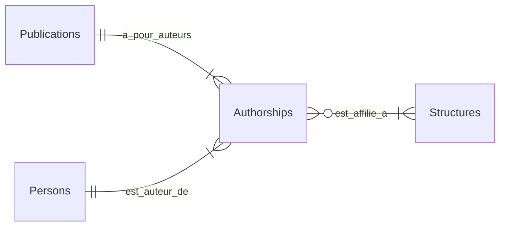
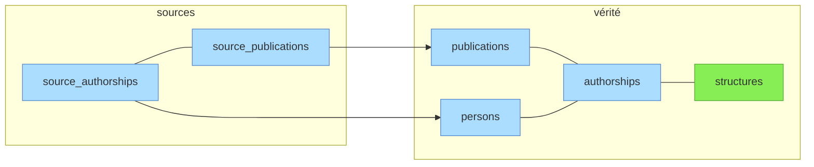
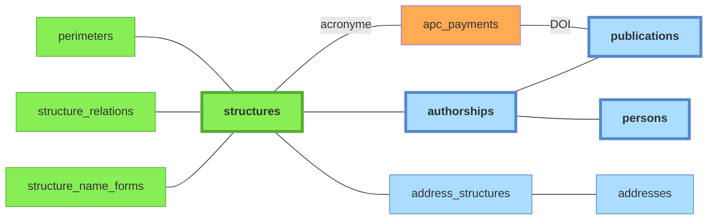
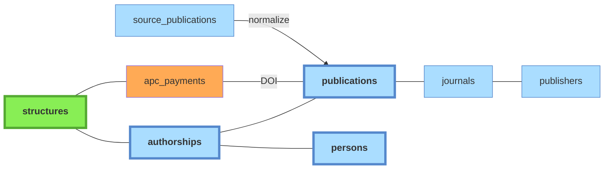
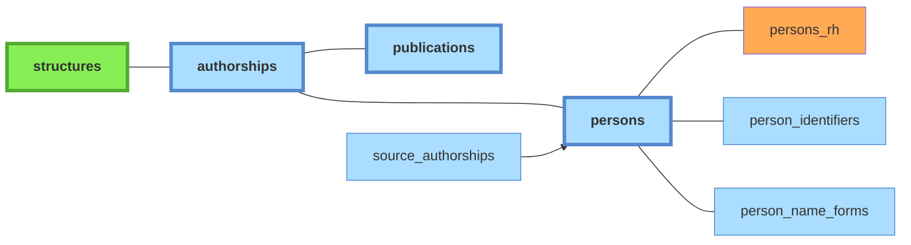

# Schéma de données — Bibliométrie UCA

*Document à jour au 2026-05-11.*

### Entités principales et relations

Les trois principales entités métier sont matérialisées dans trois tables: `publications`, `persons`, `structures`.
Une quatrième table `authorships` matérialise la relation entre les trois. Une `authorship` représente la contribution d'**un** auteur à **une** publication. Elle porte différents attributs (rôle auteur, auteur correspondant ou non, position auteur pour les publications multi-auteurs) et l'information d'affiliation à **une ou plusieurs** structures (`structure_ids`).

## Séparation sources / vérité

Le schéma repose sur la séparation stricte entre tables "canoniques" (= vérité) et tables "sources".

- Les tables sources contiennent les *records* non dédupliqués, normalisés à partir des payloads json des API tierces.
- Les tables canoniques contiennent les référentiels **publications** et **personnes** dédupliqués et mappés depuis les sources (de manière automatisée, avec possibilité de curation manuelle), ainsi que le référentiel **structures** (endogène, renseigné manuellement).

Légende:
- **vert**: table peuplée manuellement;
- **bleu**: tables peuplées automatiquement par le pipeline à partir des imports API.

> **Pourquoi pas de symétrie sources/vérité ?** — Les `source_publications` ont une relation  *many-to-one* avec les `publications` canoniques. Une publication présente dans 3 sources = 1 ligne `publications` et 3 lignes `source_publications`.
>
> Les entités "personnes" et "structures" présentes dans les sources ne peuvent pas être mappées de la même manière aux entités "personnes" et "structures" canoniques, pour deux raisons:
> - fiabilité variable des affiliations selon les sources (soit pauvres (WOS: UCA identifiée mais pas toujours les labos), soit fantaisistes (OpenAlex: l'algo d'affiliation produit beaucoup de bruit));
> - entités "personnes" algorithmiques, peu fiables: soit saucissonnées à l'extrême, soit confondant des homonymes (WOS, OpenAlex), voire entités hétérogènes au sein d'une même source (HAL: personnes fiables avec `personId` *vs* auteurs réduits à une name_form quand ils n'ont pas pu être matchés à un compte HAL) (cf [documentation sources](sources)).
>
> Il a donc été décidé de ne pas conserver de tables `source_persons` et `source_structures`. Les informations servant au matching des personnes et des structures sont regroupées dans `source_authorships`:
>
> - pour les personnes: formes de nom brute et normalisée + identifiants présents dans la source (ORCID, idhal, idref, selon source);
> - pour les structures: adresses (= *raw affiliation strings*).
>
> Le matching avec les structures et personnes canoniques est effectué dans les phases "affiliations" et "personnes" du pipeline (pour le détail de la logique, cf [doc pipeline](pipeline)).

## Détail des tables

### Tables canoniques

#### Domaine fonctionnel `structures`

Référentiel institutionnel maintenu manuellement. Contient l'UCA, ses laboratoires, les co-tutelles (CNRS, INRAE...), d'autres établissements partenaires (INP, VetAgro Sup, le CHU), etc.

- `code` : identifiant court stable (`uca`, `cnrs`, `lpc`, `ip`)
- `structure_type` : `universite`, `onr`, `chu`, `ecole`, `labo`, `equipe`, `site`, `autre`
- `ror_id` : identifiant ROR
- `rnsr_id` : identifiant RNSR
- `hal_collection` : collection HAL associée
- `api_ids` : identifiants dans les sources API (OpenAlex, etc.)

Légende:
- **vert**: tables peuplées manuellement;
- **orange**: imports CSV;
- **bleu**: tables peuplées automatiquement par le pipeline à partir des imports API.

Tables associées :
- `perimeters` : un périmètre est un ensemble de structures, incluant récursivement les sous-structures. Actuellement deux périmètres sont définis: **UCA** et **UCA élargi** (UCA + CHU + INP). Impacte:
    - les critères d'affiliation utilisés en paramètre des requêtes API;
    - les authorships sources dont les affiliations résolues (table de jointure `source_authorship_structures`) seront peuplées par la phase `affiliations` du pipeline, et qui serviront à générer des `publications` et des `personnes` dans les tables canoniques.

- `structure_relations` : définit les relations entre structures. Deux relations existent: **tutelle** (asymétrique), **partenariat** (symétrique, non transitif). La relation "partenariat" est purement informative (elle réplique l'information présente dans le [référentiel ROR](glossaire#ror)); la relation "tutelle" a une conséquence sur les **structures incluses dans un périmètre** donné.
- `structure_name_forms` : formes de noms pour la détection automatique des structures dans les adresses liées aux publications. Le champ `requires_context_of` (= liste d'id structures) permet de rendre une forme de nom *conditionnellement* valide. Exemple: `LMV` reconnaît le labo *Magmas et Volcans* seulement si `uca` ou `site_clermont` reconnus dans l'adresse. Sinon: probablement *Laboratoire de mathématiques de Versailles*. Cette table est utilisée dans la phase `affiliations` du [pipeline](pipeline.md) pour peupler la table de liaison `address_structures`.
- `address_structures`: table de liaison. Les adresses proviennent des authorships sources (peuplées via `source_authorship_addresses` lors de la phase `normalize`, exploitées lors de la phase `affiliations`). Les structures identifiées sont ensuite propagées aux authorships sources.
- `apc_payments`: données provenant d'un import CSV, voir [doc sources](sources#donnees-apc).

La page [**admin/structures**](guide-utilisateur#admin-structures) permet de gérer le CRUD des structures ainsi que leurs relations et formes de noms.

La page [**admin/config**](guide-utilisateur#admin-config) permet de gérer le CRUD des périmètres et quel périmètre est pris en compte à différentes étapes du *pipeline*.

#### Domaine fonctionnel  `publications`

Référentiel dédupliqué. Hiérarchie de déduplication :
1. **DOI identique** (case-insensitive) → même publication (sauf cas particuliers)
2. **NNT identique** (pour les thèses)
3. **hal-id identique** (OpenAlex ou ScanR citant HAL comme source)
4. **Métadonnées** : rien en place pour l'instant, algorithme à mettre en place <!--TODO: algo de déduplication par identité de métadonnées-->
5. Interface de dédoublonnage manuel `admin/duplicates` <!--TODO: améliorer l'interface de déduplication; à terme, autoriser un user à signaler un doublon-->

Tables associées:
- `journals`: référentiel des revues
- `publishers` : référentiel des éditeurs
- `apc_payments`
- `distinct_publications` (non représenté ci-dessus): Paires de publications marquées comme **distinctes malgré un titre identique**, évite de les re-suggérer dans l'interface de dédoublonnage `admin/duplicates`.

#### Domaine fonctionnel `persons`

Référentiel des individus. Une ligne = une personne physique. Alimenté par le script `create_persons_from_source_authorships.py` (création automatique depuis les authorships) et complété par les exports RH (données dans la table satellite `persons_rh`).

Tables associées :
- `persons_rh`: Table satellite liée à `persons` (FK `person_id`, ON DELETE RESTRICT). Contient les données issues des exports RH : cf [doc sources](sources#donnees-rh).
- `person_identifiers`: Identifiants persistants : ORCID, idHAL, IdRef, etc. Chaque ligne associe un identifiant (`id_type` + `id_value`) à une personne (`person_id`). Le champ `source` trace la provenance (`hal`, `openalex`, `scanr`, `theses`, `manual`, `auto`). La relation *many-to-one* permet de gérer les quelques cas d'ORCID multiples confirmés, et les nombreux cas d'identifiants (corrects ou erronés) en attente de vérification moissonnés dans les sources.
- `person_name_forms`: Formes de noms normalisées, utilisées pour le matching lors de la création de personnes. Une colonne JSONB `persons` au format `{ "<person_id>": ["<source1>", ...], ... }` couple chaque personne aux sources où la forme a été observée. Lorsqu'une authorship source est reliée à une personne, la forme de nom est ajoutée (si absente) aux name_forms de cette personne avec la source correspondante.

#### `authorships`

Table de liaison recensant les contributions individuelles aux publications. Chaque entrée référence **1 personne**, **1 publication**, *n* structures (via la table de jointure `authorship_structures`). Construite par `application/pipeline/authorships/build_authorships.py` à partir des *authorships* sources.

- `person_id`
- `in_perimeter` : TRUE si l'auteur est affilié UCA sur cette publication
- `author_position` : position dans la liste d'auteurs
- `is_corresponding` : auteur correspondant
- `roles` (text[]) : rôles (auteur, directeur, rapporteur — pour theses.fr)
- `excluded` : authorship rejetée manuellement

La table de jointure `authorship_structures (authorship_id, structure_id)` porte les affiliations résolues — FK `ON DELETE CASCADE` des deux côtés, PK composite.

**Cohérence avec les sources** : la table est **dérivée** des `source_authorships` — `in_perimeter`, les liens via `authorship_structures`, `is_corresponding`, `author_position`, `roles` sont des consolidations (union ou priorité par source) des authorships sources. Le build (`application/pipeline/authorships/build_authorships.py`) est idempotent en mode incrémental ; le mode pipeline `full` exécute en plus une purge complète + rebuild from scratch (TRUNCATE + reset des FK), pour garantir la convergence absolue à intervalle mensuel. Le champ `excluded`, lui, est métier natif (rejet manuel via l'admin) et survit au rebuild — le build ne le touche pas.

**Évolution envisagée — vue matérialisée** : la table `authorships` étant strictement dérivée (sauf `excluded`), elle pourrait être remplacée par une `MATERIALIZED VIEW` dont la définition SQL serait la source unique de la consolidation. Avantages : plus de code de build à maintenir, single source of truth conceptuel. Inconvénients : (1) `excluded` ne peut pas vivre sur une VMV → table à part `excluded_authorships(publication_id, person_id)` ; (2) la FK `source_authorships.authorship_id` ne peut pas pointer vers une VMV — il faudrait soit la supprimer (jointures via `(publication_id, person_id)` dans les requêtes), soit garder la table mais l'alimenter via la VMV. Chantier à explorer si le code de `build_authorships` devient un point de friction (logique de priorité, propagation, idempotence). Pas urgent au volume actuel.

### Tables source

Toutes les sources partagent les mêmes tables, discriminées par la colonne `source` (enum `source_type` : hal, openalex, wos, scanr, theses, crossref).

- **`source_publications`** : un enregistrement par document par source. Relié à `publications` via `publication_id` (peut être NULL si pas encore rattaché). Contient les métadonnées (doc_type non mappé, oa_status, abstract, keywords, topics, biblio, meta). Le champ `hal_collections` (text[]) est spécifique à HAL.
- **`source_authorships`** : contribution d'un auteur source à un document source. Porte `person_id` (rattachement à une personne canonique), `authorship_id` (FK vers l'authorship canonique), `in_perimeter`, `source_structures` (ARRAY[TEXT] des IDs natifs des structures côté source : numérique HAL, `I****` OpenAlex, noms d'institutions WoS, etc.), `raw_author_name`, `author_name_normalized`, `person_identifiers` (JSONB : `orcid`, `idhal`, `idref`, `hal_person_id`, `researcher_id`), `countries` (ARRAY[CHAR(2)]), `roles`, `excluded`. Les affiliations canoniques résolues sont reliées via la table de jointure `source_authorship_structures (source_authorship_id, structure_id)` (FK ON DELETE CASCADE des deux côtés, PK composite). Les affiliations textuelles brutes sont reliées via `source_authorship_addresses` → `addresses.raw_text`.
- **`source_authorship_addresses`** : table de liaison `source_authorships ↔ addresses`. Permet aux normalizers de partager une même chaîne d'adresse normalisée (`addresses.raw_text` → `addresses.normalized_text`) entre plusieurs authorships, et alimente la résolution structure ↔ adresse de la phase `affiliations`.

## Autres tables, à documenter

<!--TODO: rédiger des sections dédiées pour les tables ci-dessous.-->

- `audit_log` — journal des opérations admin destructives.
- `distinct_persons` — paires de personnes marquées comme distinctes
  (symétrique de `distinct_publications`).
- `staging` — table d'ingestion par source. Cycle de vie en 3 états explicites :

  | État | `processed` | `not_found` | `raw_data` | Inséré par |
  |---|---|---|---|---|
  | **À traiter** | FALSE | FALSE | plein (payload source) | extracteurs sources |
  | **Normalisée** | TRUE | FALSE | `{}` (vidé) | normalizers après traitement |
  | **Non trouvée** | TRUE | TRUE | `{}` (jamais peuplé) | `fetch_missing_hal_id` (hal-id 404), `crossref/fetch_missing_doi` (DOI 404 sur source native) |

  Transitions valides :
  - `[INSERT extracteur]` → **À traiter** → (`normalize`) → **Normalisée**
  - `[INSERT fetch_missing_*]` → **Non trouvée** (état terminal direct, pas re-tenté)

  `raw_data` vidé après normalisation pour libérer l'espace TOAST
  (le payload brut sera ré-introduit hors DB par le chantier
  [`DATA_raw-data-store.md`](chantiers/DATA_raw-data-store.md)).
  `last_seen_at` est mis à jour à chaque ré-extraction d'un même doc.

  CHECK SQL `staging_not_found_implies_processed` (migration 0015) :
  `NOT not_found OR processed`. Verrouille la transition impossible
  "non trouvée à re-traiter". Les autres invariants (corrélation
  `processed` ↔ `raw_data` vidé) ne sont pas verrouillés en SQL —
  laissés en discipline pour ne pas bloquer les évolutions futures.

  Évolutions prévues dans
  [`DATA_cycle-vie-staging.md`](chantiers/DATA_cycle-vie-staging.md) :
  backoff `not_found_at` / `next_retry` (4e nuance "non trouvée
  temporaire" pour les cross-imports DOI sur sources non natives),
  détection des publications disparues, re-fetch périodique.
- `subjects`, `publication_subjects`, `subject_cooccurrences` —
  référentiel des sujets/mots-clés et leurs co-occurrences (alimenté
  par les phases `subjects` et `cooccurrences` du pipeline).
- `journal_name_forms`, `publisher_name_forms` — formes de noms
  normalisées pour le matching journaux et éditeurs (parallèle à
  `person_name_forms` et `structure_name_forms`).
- `country_name_forms` — formes de noms pour le matching des pays
  dans les adresses (parallèle à `countries`).

## Évolutions prévues à court terme

Chantiers `DATA_*` actuellement ouverts dans
[`docs/chantiers/`](chantiers/) :

- **[`DATA_raw-data-store.md`](chantiers/DATA_raw-data-store.md)**
  — stockage des payloads bruts API hors BDD (store externe type
  filesystem ou S3), pour permettre la re-normalisation sans
  re-moissonnage et alléger la BDD (notamment les
  `source_authorships` hors périmètre).

## TODO: à réécrire - Zones fonctionnelles et propriétaires de données

<!--TODO: vérifier ce qu'il en est actuellement concernant les services propriétaires-->

Chaque table a un **service propriétaire** qui est le seul autorisé à y écrire
(INSERT/UPDATE/DELETE). Les autres composants lisent via SELECT mais passent par
le service pour écrire.

### Staging — scripts d'extraction

| Table | Propriétaire |
|-------|-------------|
| `staging` | extracteurs (`infrastructure/sources/*/extract_*.py`, cross-imports) |

Table unique pour toutes les sources. Colonnes notables : `source` (enum), `source_id`, `raw_data` (JSONB, vidé après normalisation), `hal_collections` (text[], HAL uniquement), `not_found` (documents disparus).

### Sources bibliographiques — scripts de normalisation

| Table | Propriétaire |
|-------|-------------|
| `source_publications` | `application/pipeline/normalize/normalize_*.py` |
| `source_authorships` | `application/pipeline/normalize/normalize_*.py` |
| `source_authorship_addresses` | `application/pipeline/normalize/normalize_*.py` (via `infrastructure.addresses.PgAddressLinker`) |

Note : `person_id` sur `source_authorships` est écrit par `application/persons.py` et `application/authorships/assign_orphans.py` (rattachement), pas par les normalizers. `in_perimeter` et `structure_ids` sont écrits par `application/pipeline/affiliations/populate_affiliations.py`.

### Référentiel Publications — `application/publications.py`

| Table | Propriétaire | Notes |
|-------|-------------|-------|
| `publications` | `application/publications.py` | `refresh_from_sources()` recalcule les métadonnées depuis les source_publications |
| `distinct_publications` | `application/publications.py` (endpoint admin) | paires marquées distinctes malgré titre identique |
| `apc_payments` | import APC (CSV) | — |
| `journals` | `application/journals.py` | — |
| `journal_name_forms` | `application/journals.py` | formes de noms normalisées pour le matching |
| `publishers` | `application/publishers.py` | — |
| `publisher_name_forms` | `application/publishers.py` | formes de noms normalisées pour le matching |

### Référentiel Personnes — `application/persons.py`

| Table | Propriétaire | Notes |
|-------|-------------|-------|
| `persons` | `application/persons.py` | import RH écrit aussi (toléré) |
| `persons_rh` | import RH (CSV — `interfaces/cli/imports/import_persons.py`) | table satellite |
| `person_identifiers` | `application/persons.py` | ORCID, idHAL, IdRef |
| `person_name_forms` | `application/persons.py` | recalcul bulk par `interfaces/cli/pipeline/populate_person_name_forms.py` |
| `distinct_persons` | `application/persons.py` (endpoint admin) | paires marquées distinctes |

### Authorships canoniques — `application/authorships/`

| Table | Propriétaire | Notes |
|-------|-------------|-------|
| `authorships` | `application/pipeline/authorships/build_authorships.py` + `application/authorships/core.py` + `application/authorships/assign_orphans.py` | dédupliqué (person_id, publication_id), consolide in_perimeter et structure_ids depuis les sources |

### Structures et configuration — `application/structures.py`, `application/config.py`

| Table | Propriétaire |
|-------|-------------|
| `structures` | `application/structures.py` (admin / API) |
| `structure_relations` | `application/structures.py` (admin / API) |
| `structure_name_forms` | `application/structures.py` (admin / API) |
| `perimeters` | `application/config.py` (admin / API) |
| `config` | `application/config.py` (admin / API) |
| `countries`, `country_name_forms` | référentiel statique (seed) |

### Adresses — scripts du pipeline

| Table | Propriétaire |
|-------|-------------|
| `addresses` | `application/pipeline/affiliations/resolve_addresses.py` (création), `application/addresses_*.py` (édition admin) |
| `address_structures` | `application/pipeline/affiliations/resolve_addresses.py` + `application/addresses_structures.py` (confirmation manuelle) |
| `source_authorship_addresses` | écrites par les normalizers (cf. zone sources) |

### Sujets — pipeline subjects

| Table | Propriétaire |
|-------|-------------|
| `subjects` | `application/pipeline/subjects/run.py` |
| `publication_subjects` | `application/pipeline/subjects/run.py` |
| `subject_cooccurrences` | `application/pipeline/cooccurrences/run.py` |

### Audit — événements d'admin

| Table | Propriétaire |
|-------|-------------|
| `audit_log` | écrit par tous les services applicatifs via `application/audit.py:emit_event` |
