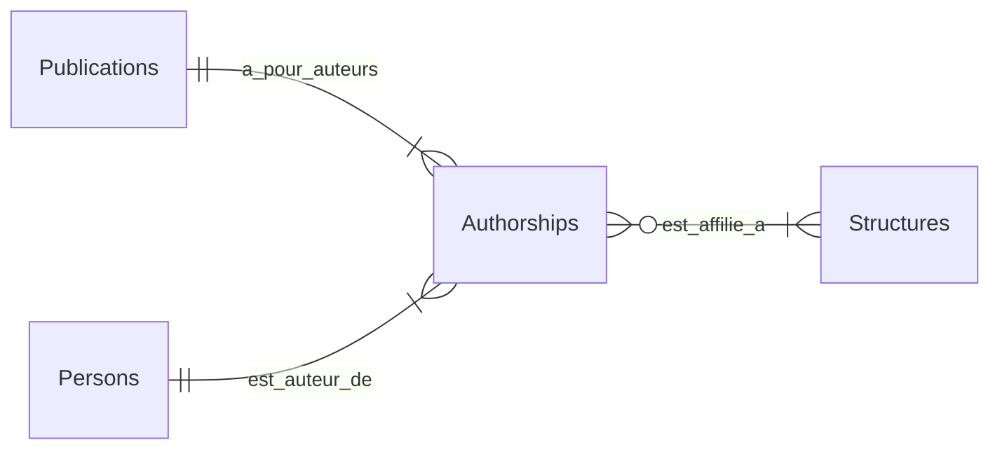
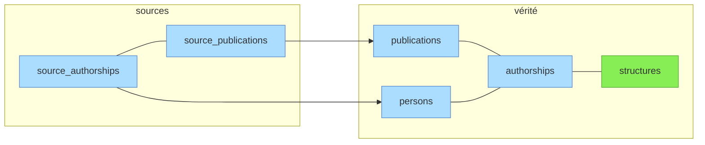

# Vue d'ensemble

*Document à jour au 2026-05-11.*

## Entités principales et relations

Les trois principales entités métier sont matérialisées dans trois tables: `publications`, `persons`, `structures`.

Une quatrième table `authorships` matérialise la relation entre les trois. Une `authorship` représente la contribution d'**un** auteur à **une** publication. Elle porte différents attributs (rôle auteur, auteur correspondant ou non, position auteur pour les publications multi-auteurs) et l'information d'affiliation à **une ou plusieurs** structures (`structure_ids`).

## Séparation sources / vérité

Le schéma repose sur la séparation stricte entre tables "canoniques" (= vérité) et tables "sources".

- Les tables sources contiennent les *records* non dédupliqués, normalisés à partir des payloads json des API tierces.
- Les tables canoniques contiennent les référentiels **publications** et **personnes** dédupliqués obtenus par matching/création depuis les sources (de manière automatisée, avec possibilité de curation manuelle), ainsi que le référentiel **structures** (endogène, renseigné manuellement).

Légende:
- **vert** : table peuplée manuellement
- **bleu** : tables peuplées automatiquement par le pipeline à partir des imports API

> **Pourquoi pas de symétrie sources/vérité ?** — Les `source_publications` ont une relation *many-to-one* avec les `publications` canoniques. Une publication présente dans 3 sources = 1 ligne `publications` et 3 lignes `source_publications`.
>
> Les entités "personnes" et "structures" présentes dans les sources ne peuvent pas être mappées de la même manière aux entités "personnes" et "structures" canoniques, pour deux raisons:
>
> - fiabilité variable des affiliations selon les sources (soit pauvres (WOS: UCA identifiée mais pas toujours les labos), soit erratiques (OpenAlex: l'algo d'affiliation produit beaucoup de faux rattachements));
> - entités "personnes" algorithmiques, peu fiables: soit saucissonnées à l'extrême, soit confondant des homonymes (WOS, OpenAlex), voire entités hétérogènes au sein d'une même source (HAL: personnes fiables avec `personId` *vs* auteurs réduits à une name_form quand ils n'ont pas pu être matchés à un compte HAL) (cf [documentation sources](../sources/01-vue-d-ensemble.md)).
>
> Il a donc été décidé de ne pas conserver de tables `source_persons` et `source_structures`. Les informations servant au matching des personnes et des structures sont regroupées dans `source_authorships`:
>
> - pour les personnes: formes de nom brute et normalisée + identifiants présents dans la source (ORCID, idhal, idref, selon source);
> - pour les structures: adresses (= *raw affiliation strings*).
>
> Le matching avec les structures et personnes canoniques est effectué dans les phases "affiliations" et "personnes" du pipeline (pour le détail de la logique, cf [doc pipeline](../pipeline/01-vue-d-ensemble.md)).

## Suite

Détail par domaine fonctionnel :

- [Structures](02-structures.md) — référentiel institutionnel + adresses + périmètres
- [Publications](03-publications.md) — référentiel dédupliqué + journals + publishers + APC + sujets
- [Personnes](04-personnes.md) — référentiel dédupliqué + identifiants + name forms + données RH
- [Authorships et sources](05-authorships-et-sources.md) — table de liaison + tables source + staging
