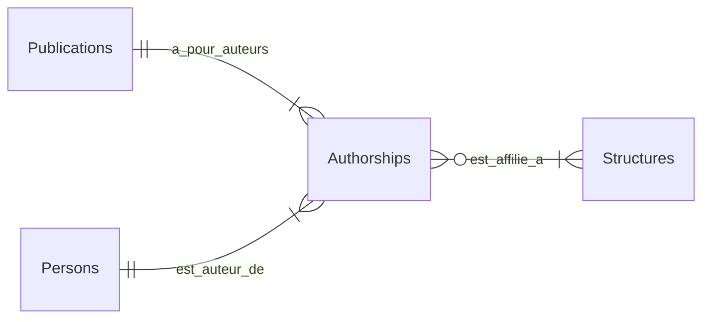
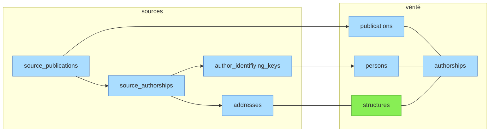

# Vue d'ensemble

*À jour le 2026-06-30.*

## Entités principales et relations

Les trois principales entités métier sont matérialisées dans trois tables: `publications`, `persons`, `structures`.

Une quatrième table `authorships` matérialise la relation entre les trois. Une `authorship` représente la contribution d'**un** auteur à **une** publication. Elle porte différents attributs:
- rôle (surtout pertinent pour les thèses: `rapporteur`, `president_jury`, etc.),
- auteur [correspondant](../glossaire.md#auteur-correspondant) ou non,
- position auteur (= ordre dans la liste, pour les publications multi-auteurs),
- et l'information d'[affiliation](../glossaire.md#affiliation) à **une ou plusieurs** structures.

## Séparation sources / vérité

Le schéma repose sur la séparation stricte entre tables "canoniques" (= vérité) et tables "sources".

- Les tables sources contiennent les *records* non dédupliqués, normalisés à partir des payloads json des API tierces.
- Les tables canoniques contiennent les référentiels **publications** et **personnes** dédupliqués obtenus par matching/création depuis les sources, ainsi que le référentiel **structures** (préexistant).

Légende:
- **vert** : table peuplée manuellement
- **bleu** : tables peuplées automatiquement par le pipeline à partir des imports API

> **Pourquoi pas de symétrie dans le nommage des tables source *vs* vérité**
>
> Les `source_publications` ont une relation *many-to-one* avec les `publications` canoniques. Une publication présente dans 3 sources = 3 lignes `source_publications` et 1 ligne `publications`.
>
> Les sources contiennent généralement des entités "personnes" et "structures" dotées d'identifiants internes. Tenter d'établir une correspondance entre ces entités et les entités "personnes" et "structures" canoniques serait infructueux pour deux raisons:
>
> - fiabilité variable des affiliations selon les sources:
>   - soit pauvres (WoS: affiliations résolues au niveau établissement mais pas toujours au niveau laboratoire),
>   - soit erratiques (OpenAlex: l'algorithme de résolution des affiliations produit beaucoup de fausses identifications de structures);
> - entités "personnes" peu fiables:
>   - identifiants multiples pour la même personne (WoS, OpenAlex),
>   - confusion d'homonymes dans le même identifiant (OpenAlex souvent),
>   - entités hétérogènes au sein d'une même source (HAL: des personnes fiables avec `personId` coexistent avec des auteurs réduits à une chaîne de caractères quand ils n'ont pas pu être matchés à un compte HAL) (cf [documentation sources](../sources/01-vue-d-ensemble.md#entités-auteurs)).
>
> Il a donc été décidé de ne pas conserver de tables `source_persons` et `source_structures`. Les informations servant au matching des personnes et des structures sont extraites des `source_authorships`:
>
> - pour les personnes (table `author_identifying_keys`): nom normalisé + PIDs éventuellement présents dans la source (ORCID, idhal, idref, selon source);
> - pour les structures (table `addresses`): [signatures institutionnelles](../glossaire.md#adresse) (= *raw affiliation strings*).
>
> La résolution des structures et des personnes  s'effectue au cours des phases ["affiliations"](../pipeline/04-affiliations.md) et ["persons"](../pipeline/09-persons.md) du pipeline.

## Suite

Détail par domaine fonctionnel :

- [Structures](02-structures.md) — référentiel institutionnel + adresses + périmètres
- [Publications](03-publications.md) — référentiel dédupliqué + journals + publishers + APC + sujets
- [Personnes](04-personnes.md) — référentiel dédupliqué + identifiants + name forms + données RH
- [Authorships et sources](05-authorships-et-sources.md) — table de liaison + tables source + staging
- [Données dérivées](06-donnees-derivees.md) — vues matérialisées, tables et colonnes dérivées, et leur fraîcheur (incrémental ou recalcul complet)
- [Index des tables](07-index-des-tables.md) — vue macro du schéma et catalogue complet des tables et vues matérialisées
