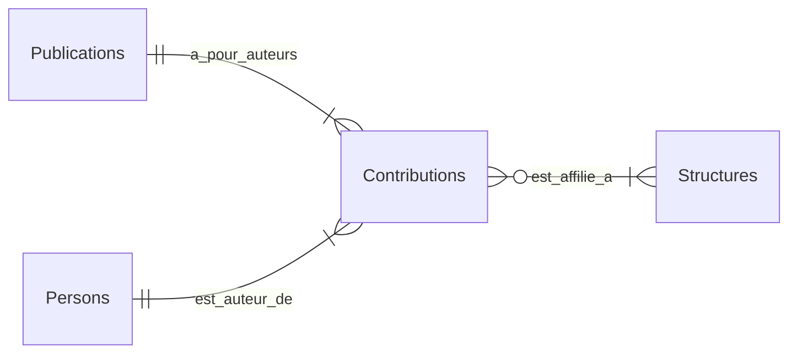
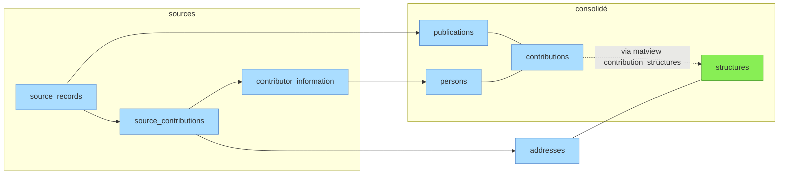

# Vue d'ensemble

*À jour le 2026-10-25.*

## Entités principales et relations

Les trois principales entités métier sont matérialisées dans trois tables: `publications`, `persons`, `structures`.

Une quatrième table `contributions` matérialise la relation entre les trois. Une `contribution` représente la contribution d'**un** auteur à **une** publication. Ses attributs :
- rôle (généralement `auteur`, sauf pour les thèses: `rapporteur`, `president_jury`, etc.),
- auteur [correspondant](../glossaire.md#auteur-correspondant) ou non,
- position auteur (= ordre dans la liste, pour les publications multi-auteurs),
- et l'information d'[affiliation](../glossaire.md#affiliation) à **une ou plusieurs** structures.

```mermaid
erDiagram
    direction LR
    Publications ||--|{ Contributions : a_pour_auteurs
    Persons ||--|{ Contributions : est_auteur_de
    Contributions }o--|{ Structures : est_affilie_a
```

## Séparation sources / vue consolidée

Le modèle repose sur la séparation stricte entre les tables **sources** et le **référentiel** que le pipeline en consolide.

- Les tables sources contiennent les enregistrements sources et leurs contributions sources, non dédupliqués, normalisés à partir des payloads des API tierces.
- Le référentiel contient les **publications** et les **personnes**, obtenues des sources par résolution d'entités, ainsi que les **structures**, saisies manuellement.

| Niveau | Notion | Table | Ce que c'est |
|---|---|---|---|
| source | enregistrement source | `source_records` | Une publication telle qu'une source la décrit (HAL, OpenAlex, Crossref…). |
| source | contribution source | `source_contributions` | Un contributeur sur un enregistrement source, avec ses rôles et ses adresses. |
| source | informations du contributeur | `contributor_information` | Le nom et les identifiants qu'une source donne pour un contributeur, partagés par ses contributions sources. |
| consolidé | publication | `publications` | Une publication du référentiel, construite à partir de ses enregistrements sources. Couvre aussi les jeux de données, les logiciels et les thèses. |
| consolidé | contribution | `contributions` | Les contributions sources d'un même auteur dans une publication, et la personne de cet auteur. |

Légende:
- **vert** : table peuplée manuellement
- **bleu** : tables peuplées automatiquement par le pipeline

```mermaid
flowchart LR
    subgraph sources
        source_records-->source_contributions
        source_contributions-->contributor_information
    end
    subgraph consolidé
        publications---contributions
        persons---contributions
        contributions-.->|via matview contribution_structures|structures

    end
    source_contributions-->addresses
    source_records--->publications
    contributor_information--->persons
    addresses---structures

    classDef manuel  fill:#8e5,stroke:#5a3
    classDef auto fill:#adf,stroke:#58c
    class structures manuel;
    class source_contributions,source_records,publications,contributions,persons,addresses,contributor_information auto
```

## Schémas PostgreSQL

Les tables se répartissent en un schéma par domaine. Le `search_path` de la base liste ces schémas : les requêtes nomment les tables sans leur schéma. Les types énumérés, les extensions et `alembic_version` sont dans `public`.

- [`sources`](02-sources.md) — tables sources et staging
- [`publications`](03-publications.md) — référentiel consolidé, contributions, sujets
- [`publishing`](07-publishing.md) — publications en série, monographies, éditeurs, plateformes, APC
- [`persons`](05-persons.md) — référentiel consolidé, identifiants, name forms, données RH, décisions humaines sur les contributions sources
- [`structures`](06-structures.md) — référentiel institutionnel, périmètres, adresses
- [`ref` et `ops`](08-ref-et-ops.md) — référentiels externes (pays, langues, ROR) et exploitation (configuration, journaux)

Pages transverses :

- [Données dérivées](09-donnees-derivees.md) — vues matérialisées, tables et colonnes dérivées, et leur fraîcheur (incrémental ou recalcul complet)
- [Index des tables](10-index-des-tables.md) — vue macro du modèle et catalogue complet des tables et vues
