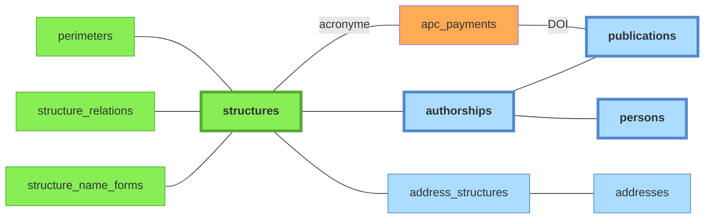

# Structures

*À jour le 2026-06-30.*

Référentiel de structures maintenu manuellement.

Colonnes notables de `structures` :

- `code` : identifiant court stable (`uca`, `cnrs`, `lpc`, `ip`)
- `structure_type` : `universite`, `onr`, `chu`, `ecole`, `labo`, `equipe`, `site`, `autre`
- `ror_id` : identifiant [ROR](../glossaire.md#ror)
- `rnsr_id` : identifiant RNSR
- `hal_collection` : collection HAL associée
- `api_ids` : identifiants dans les sources API (OpenAlex, etc.)

Légende :
- **vert** : tables peuplées manuellement
- **orange** : imports CSV
- **bleu** : tables peuplées automatiquement par le pipeline à partir des imports API

## Tables associées

- **`perimeters`** : un périmètre est un ensemble de structures, incluant récursivement les sous-structures. Actuellement deux périmètres sont définis : **UCA** et **UCA élargi** (UCA + CHU + INP). Impacte :
  - les critères d'affiliation utilisés en paramètre des requêtes API ;
  - les authorships sources dont les affiliations résolues (matview `source_authorship_structures`) sont rafraîchies par la phase `affiliations` du pipeline, et qui deviennent candidates au matching `publications` et `personnes`.
- **`perimeter_structures`** : appartenance au périmètre **matérialisée** — pour chaque périmètre, la liste des structures incluses après clôture récursive des tutelles. Rematérialisée en début de phase `affiliations` (`refresh_perimeter_structures`) ; sert de base de jointure aux résolutions d'affiliation et aux vues matérialisées `*_structures` (cf. [données dérivées](06-donnees-derivees.md)).
- **`structure_relations`** : définit les relations entre structures. Deux relations existent : **tutelle** (asymétrique), **partenariat** (symétrique, non transitif). La relation "partenariat" est purement informative (elle réplique l'information présente dans le [référentiel ROR](../glossaire.md#ror)) ; la relation "tutelle" a une conséquence sur les **structures incluses ou non dans un périmètre** donné.
- **`structure_name_forms`** : formes de noms pour la détection automatique des structures dans les adresses liées aux publications. Le champ `requires_context_of` (= liste d'id structures) permet de rendre une forme de nom *conditionnellement* valide. Cette table est utilisée dans la phase `affiliations` du [pipeline](../pipeline/04-affiliations.md) pour peupler la table de liaison `address_structures`.
- **`address_structures`** : table de liaison. Les adresses proviennent des authorships sources (peuplées via `source_authorship_addresses` lors de la phase `normalize`, exploitées lors de la phase `affiliations`). Les structures identifiées sont ensuite propagées aux authorships sources.
- **`apc_payments`** : données de paiement d'APC, reliées aux publications concernées, provenant d'un import CSV, voir [doc sources](../sources/10-imports-manuels.md#données-apc).

## Pages admin associées

- [**admin/structures**](../guide-utilisateur/02-pages-admin.md#structures) : CRUD des structures + relations + formes de noms.
- [**admin/config**](../guide-utilisateur/02-pages-admin.md#configuration) : CRUD des périmètres et choix du périmètre actif aux différentes étapes du pipeline.

## Services propriétaires

**Autorité** : *pipeline* (recalculée à chaque run), *admin* (saisie via l'interface admin, préservée — le pipeline ne l'écrase jamais), *mixte* (selon la colonne), *import* (chargement externe), *référence* (seed).

| Table | Autorité | Écrit par |
|---|---|---|
| `structures` | admin | `application/services/structures/core.py` |
| `structure_relations` | admin | `application/services/structures/core.py` |
| `structure_name_forms` | admin | `application/services/structures/core.py` |
| `perimeters` | admin | `application/services/config/core.py` |
| `config` | admin | `application/services/config/core.py` |
| `perimeter_structures` | pipeline | rematérialisée par la phase `affiliations` (`refresh_perimeter_structures`) |
| `addresses` | mixte | créées par le pipeline (`resolve_addresses.py`) ; colonne `country` éditable en admin (`addresses/commands.py`) |
| `address_structures` | mixte | liens posés par le pipeline (`resolve_addresses.py`) ; colonne `is_confirmed` posée en admin (`addresses/commands.py`) |
| `apc_payments` | import | `interfaces/cli/imports/import_apc.py`, `import_openapc.py` |
| `countries`, `place_name_forms` | référence | `seed.sql` |
