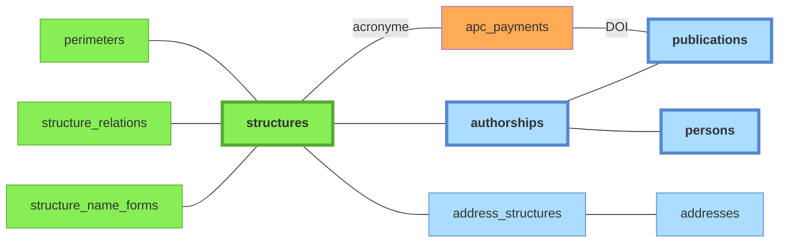

# Structures

Référentiel institutionnel maintenu manuellement. Contient l'UCA, ses laboratoires, les co-tutelles (CNRS, INRAE…), d'autres établissements partenaires (INP, VetAgro Sup, le CHU), etc.

Colonnes notables de `structures` :

- `code` : identifiant court stable (`uca`, `cnrs`, `lpc`, `ip`)
- `structure_type` : `universite`, `onr`, `chu`, `ecole`, `labo`, `equipe`, `site`, `autre`
- `ror_id` : identifiant [ROR](../glossaire.md#ror)
- `rnsr_id` : identifiant RNSR
- `hal_collection` : collection HAL associée
- `api_ids` : identifiants dans les sources API (OpenAlex, etc.)

Légende :
- **vert** : tables peuplées manuellement
- **orange** : imports CSV
- **bleu** : tables peuplées automatiquement par le pipeline à partir des imports API

## Tables associées

- **`perimeters`** : un périmètre est un ensemble de structures, incluant récursivement les sous-structures. Actuellement deux périmètres sont définis : **UCA** et **UCA élargi** (UCA + CHU + INP). Impacte :
  - les critères d'affiliation utilisés en paramètre des requêtes API ;
  - les authorships sources dont les affiliations résolues (table de jointure `source_authorship_structures`) sont peuplées par la phase `affiliations` du pipeline, et qui sont candidates au matching `publications` et `personnes`.
- **`structure_relations`** : définit les relations entre structures. Deux relations existent : **tutelle** (asymétrique), **partenariat** (symétrique, non transitif). La relation "partenariat" est purement informative (elle réplique l'information présente dans le [référentiel ROR](../glossaire.md#ror)) ; la relation "tutelle" a une conséquence sur les **structures incluses dans un périmètre** donné.
- **`structure_name_forms`** : formes de noms pour la détection automatique des structures dans les adresses liées aux publications. Le champ `requires_context_of` (= liste d'id structures) permet de rendre une forme de nom *conditionnellement* valide. Exemple : `LMV` reconnaît le labo *Magmas et Volcans* seulement si `uca` ou `site_clermont` reconnus dans l'adresse. Sinon : probablement *Laboratoire de mathématiques de Versailles*. Cette table est utilisée dans la phase `affiliations` du [pipeline](../pipeline/01-vue-d-ensemble.md) pour peupler la table de liaison `address_structures`.
- **`address_structures`** : table de liaison. Les adresses proviennent des authorships sources (peuplées via `source_authorship_addresses` lors de la phase `normalize`, exploitées lors de la phase `affiliations`). Les structures identifiées sont ensuite propagées aux authorships sources.
- **`apc_payments`** : données provenant d'un import CSV, voir [doc sources](../sources/10-imports-manuels.md#donnees-apc).

## Pages admin associées

- [**admin/structures**](../guide-utilisateur/02-pages-admin.md#admin-structures) : CRUD des structures + relations + formes de noms.
- [**admin/config**](../guide-utilisateur/02-pages-admin.md#admin-config) : CRUD des périmètres et choix du périmètre actif aux différentes étapes du pipeline.

## Services propriétaires

| Table | Propriétaire |
|---|---|
| `structures` | `application/structures.py` (admin / API) |
| `structure_relations` | `application/structures.py` (admin / API) |
| `structure_name_forms` | `application/structures.py` (admin / API) |
| `perimeters` | `application/config.py` (admin / API) |
| `config` | `application/config.py` (admin / API) |
| `addresses` | `application/pipeline/affiliations/resolve_addresses.py` (création), `application/addresses_*.py` (édition admin) |
| `address_structures` | `application/pipeline/affiliations/resolve_addresses.py` + `application/addresses_structures.py` (confirmation manuelle) |
| `apc_payments` | import APC (CSV) |
| `countries`, `country_name_forms` | référentiel statique (seed) |
