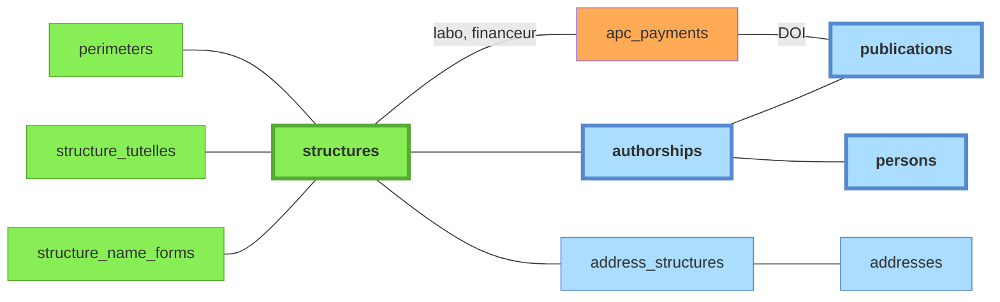

# Structures

*À jour le 2026-09-05.*

Référentiel de structures maintenu manuellement.

Colonnes notables de `structures` :

- `code` : identifiant court stable (`uca`, `cnrs`, `lpc`, `ip`)
- `structure_type` : `universite`, `onr`, `chu`, `ecole`, `labo`, `equipe`, `site`, `admin`, `autre`
- `ror_id` : identifiant [ROR](../glossaire.md#ror)
- `rnsr_id` : identifiant RNSR
- `hal_collection` : collection HAL associée
- `api_ids` : identifiants dans les sources API (OpenAlex, etc.)

```mermaid
flowchart LR
    structure_name_forms --- structures
    structure_tutelles --- structures
    perimeters---structures
    structures --- authorships
    authorships --- publications
    authorships --- persons
    structures ---|labo, financeur| apc_payments
    apc_payments ---|DOI| publications
    structures --- address_structures
    address_structures --- addresses

    classDef manuel  fill:#8e5,stroke:#5a3
    class structures,structure_name_forms,perimeters,structure_tutelles manuel;
    classDef csv fill:#fa5
    class apc_payments csv
    classDef auto fill:#adf,stroke:#58c
    class address_structures,addresses,authorships,persons,publications auto
    classDef main stroke-width:4px,font-weight:bold
    class structures,publications,persons,authorships main
```

Légende :
- **vert** : tables peuplées manuellement
- **orange** : imports CSV
- **bleu** : tables peuplées automatiquement par le pipeline à partir des imports API

## Tables associées

- **`perimeters`** : un périmètre est un ensemble de structures, incluant récursivement les sous-structures. Les périmètres se saisissent en admin, et le pipeline lit dans `config` celui qui vaut à chaque étape. Un périmètre décide :
  - des critères d'affiliation utilisés en paramètre des requêtes API lors du moissonnage ;
  - des `source_authorships` qui fournissent les candidats au matching `publications` et `persons`.
- **`perimeter_structures`** : appartenance au périmètre, matérialisée par clôture récursive des tutelles. Cf. [données dérivées](06-donnees-derivees.md).
- **`structure_tutelles`** : rattachement hiérarchique d'une structure à une autre. C'est la seule relation entre structures que le modèle porte, et sa clôture récursive décide des **structures incluses ou non dans un périmètre**. Le graphe reste sans cycle : une structure ne peut se rattacher à elle-même ni à l'un de ses descendants.
- **`structure_name_forms`** : formes de noms pour la détection automatique des structures dans les adresses liées aux publications. Le champ `requires_context_of` (= liste d'id structures) permet de rendre une forme de nom *conditionnellement* valide. Cette table est utilisée dans la phase `affiliations` du [pipeline](../pipeline/04-affiliations.md) pour peupler la table de liaison `address_structures`.
- **`address_structures`** : table de liaison. Les adresses proviennent des authorships sources (peuplées via `source_authorship_addresses` lors de la phase `normalize`, exploitées lors de la phase `affiliations`). Les structures identifiées sont ensuite propagées aux authorships sources.
- **`apc_payments`** : données de paiement d'APC, reliées aux publications concernées, provenant d'un import CSV, voir [doc sources](../sources/10-imports-manuels.md#données-apc). Deux colonnes les rattachent aux structures : `lab_structure_id` pour le laboratoire, `budget_structure_id` pour le financeur — c'est ce dernier qui décide du classement « interne » d'un paiement. Aucun script du dépôt ne les renseigne : les imports ne chargent que du texte, et les rattachements viennent de chargements conduits hors du dépôt. Sur une base reconstruite depuis le seed, elles restent vides et les filtres APC par structure ne rendent rien.

## Pages admin associées

- [**admin/structures**](../guide-utilisateur/02-pages-admin.md#structures) : CRUD des structures, de leurs tutelles et de leurs formes de nom.
- [**admin/config**](../guide-utilisateur/02-pages-admin.md#configuration) : CRUD des périmètres et choix du périmètre actif aux différentes étapes du pipeline.

## Propriété des tables

| Table | Auteur | Écrit par |
|---|---|---|
| `structures` | admin | `application/services/structures/core.py` |
| `structure_tutelles` | admin | `application/services/structures/core.py` |
| `structure_name_forms` | admin | `application/services/structures/core.py` |
| `perimeters` | admin | `application/services/perimeters/core.py` |
| `config` | admin | `application/services/config/commands.py` |
| `perimeter_structures` | pipeline | `refresh_perimeter_structures`, jamais saisie |
| `addresses` | mixte | créées par le pipeline (`resolve_addresses.py`) ; colonne `countries` éditable en admin (`addresses/commands.py`) |
| `address_structures` | mixte | liens posés par le pipeline (`resolve_addresses.py`) ; colonne `is_confirmed` posée en admin (`addresses/commands.py`) |
| `apc_payments` | import CSV | `interfaces/cli/imports/import_apc.py`, `import_openapc.py` |
| `countries`, `place_name_forms` | seed | `seed.sql` |
