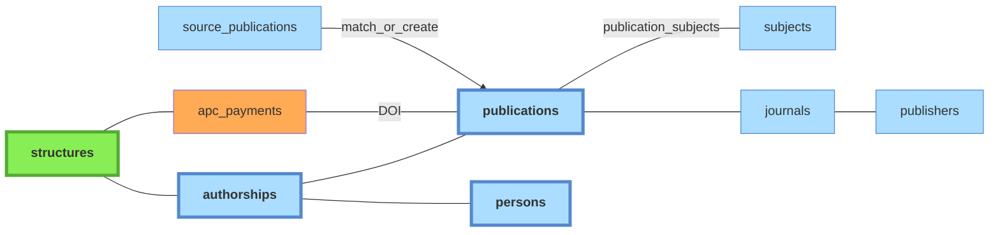

# Publications

*À jour le 2026-06-30.*

Référentiel dédupliqué des productions de recherche. Cf [doc pipeline](../pipeline/07-publications.md) pour la logique de déduplication.

Légende :
- **vert** : tables peuplées manuellement
- **orange** : imports CSV
- **bleu** : tables peuplées automatiquement par le pipeline à partir des imports API

## Tables associées

- **`journals`** : référentiel des revues.
- **`journal_name_forms`** : formes de noms normalisées pour le matching journaux (parallèle à `person_name_forms` et `structure_name_forms`).
- **`publishers`** : référentiel des éditeurs.
- **`publisher_name_forms`** : formes de noms normalisées pour le matching éditeurs.
- **`apc_payments`** : données issues d'un import CSV (cf. [doc sources](../sources/10-imports-manuels.md#données-apc)).
- **`distinct_publications`** : paires de publications marquées comme **distinctes malgré un titre identique**, évite de les re-suggérer dans l'interface de dédoublonnage `admin/duplicates`.
- **`publications_detail`** : satellite 1:1 de `publications` portant les métadonnées volumineuses (`abstract`, `keywords`, `topics`, `biblio`), séparées de la table principale pour la garder légère en lecture.
- **`publication_relations`** : relations sémantiques entre publications distinctes mais apparentées (preprint ↔ version publiée, supplément ↔ article, erratum ↔ article corrigé…). Peuplée par la phase `relations`.
- **`doi_prefixes`** : cache préfixe DOI → agence d'enregistrement (Crossref / DataCite) et éditeur, alimenté par les phases `resolve_ra` et `publishers_journals`.

## Sujets / mots-clés

Trois tables alimentées par les phases `subjects` et `cooccurrences` du pipeline :

- **`subjects`** : référentiel des sujets/mots-clés indexés.
- **`publication_subjects`** : table de liaison publication ↔ sujet (avec score / source).
- **`subject_cooccurrences`** : matrice de co-occurrences entre sujets, alimentée à partir de `publication_subjects`.

## Services propriétaires

**Autorité** : *pipeline* (recalculée à chaque run), *admin* (saisie via l'interface admin, préservée — le pipeline ne l'écrase jamais), *mixte* (selon la colonne), *import* (chargement externe), *référence* (seed).

| Table | Autorité | Écrit par |
|---|---|---|
| `publications` | pipeline | `application/publications/core.py` (`refresh_from_sources` recalcule depuis les sources) |
| `publications_detail` | pipeline | `application/publications/core.py` |
| `publication_relations` | pipeline | phase `relations` |
| `subjects`, `publication_subjects` | pipeline | `application/pipeline/subjects/run.py` |
| `subject_cooccurrences` | pipeline | `application/pipeline/cooccurrences/run.py` (matview) |
| `doi_prefixes` | pipeline | phases `resolve_ra` et `publishers_journals` |
| `journals`, `journal_name_forms` | mixte | créés et enrichis par le pipeline ; édités et fusionnés en admin (`application/journals/commands.py`) |
| `publishers`, `publisher_name_forms` | mixte | créés et enrichis par le pipeline ; édités et fusionnés en admin (`application/publishers/commands.py`) |
| `distinct_publications` | admin | `application/publications/commands.py` |
| `apc_payments` | import | `interfaces/cli/imports/import_apc.py`, `import_openapc.py` |

La propriété n'est pas verrouillée (convention, pas de contrat import-linter ni de GRANT). Deux écritures transverses la franchissent : la **fusion de journaux** re-pointe `journal_id` sur `publications` et `source_publications` ; la **propagation des pays** écrit les colonnes `countries[]` sur `source_authorships`, `source_publications` et `publications`.
