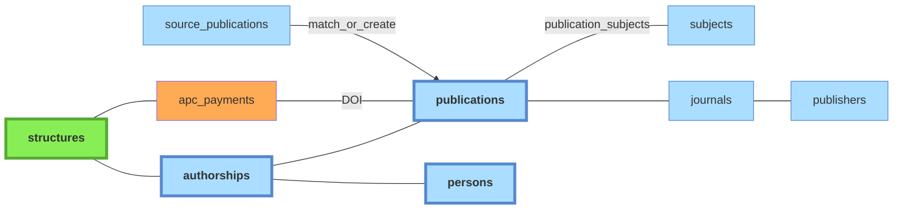

# Publications

Référentiel dédupliqué des productions de recherche. Cf [doc pipeline](../pipeline/07-publications.md) pour la logique de déduplication.

Légende :
- **vert** : tables peuplées manuellement
- **orange** : imports CSV
- **bleu** : tables peuplées automatiquement par le pipeline à partir des imports API

## Tables associées

- **`journals`** : référentiel des revues.
- **`journal_name_forms`** : formes de noms normalisées pour le matching journaux (parallèle à `person_name_forms` et `structure_name_forms`).
- **`publishers`** : référentiel des éditeurs.
- **`publisher_name_forms`** : formes de noms normalisées pour le matching éditeurs.
- **`apc_payments`** : données issues d'un import CSV (cf. [doc sources](../sources/10-imports-manuels.md#donnees-apc)).
- **`distinct_publications`** : paires de publications marquées comme **distinctes malgré un titre identique**, évite de les re-suggérer dans l'interface de dédoublonnage `admin/duplicates`.

## Sujets / mots-clés

Trois tables alimentées par les phases `subjects` et `cooccurrences` du pipeline :

- **`subjects`** : référentiel des sujets/mots-clés indexés.
- **`publication_subjects`** : table de liaison publication ↔ sujet (avec score / source).
- **`subject_cooccurrences`** : matrice de co-occurrences entre sujets, alimentée à partir de `publication_subjects`.

## Services propriétaires

| Table | Propriétaire | Notes |
|---|---|---|
| `publications` | `application/publications.py` | `refresh_from_sources()` recalcule les métadonnées depuis les `source_publications` |
| `distinct_publications` | `application/publications.py` (endpoint admin) | paires marquées distinctes malgré titre identique |
| `journals` | `application/journals.py` | — |
| `journal_name_forms` | `application/journals.py` | formes de noms normalisées pour le matching |
| `publishers` | `application/publishers.py` | — |
| `publisher_name_forms` | `application/publishers.py` | formes de noms normalisées pour le matching |
| `subjects`, `publication_subjects` | `application/pipeline/subjects/run.py` | — |
| `subject_cooccurrences` | `application/pipeline/cooccurrences/run.py` | recalcul global après ingestion subjects |
| `apc_payments` | import APC (CSV) | — |

La propriété n'est pas enforcée (convention, pas de contrat import-linter ni de GRANT). Deux écritures transverses la franchissent sans owner dédié : la **fusion de journaux** (`journal_repository`) re-pointe `journal_id` sur `publications` et `source_publications` ; la **propagation des pays** (`infrastructure/queries/pipeline/countries.py`, `address_repository`) écrit les colonnes `countries[]` sur `source_authorships`, `source_publications` et `publications`.
