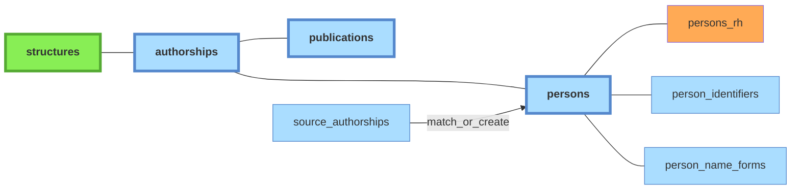

# Personnes

Référentiel des individus. Une ligne = une personne physique. Alimenté par le script `create_persons_from_source_authorships.py` (création automatique depuis les authorships) et complété par les exports RH (données dans la table satellite `persons_rh`).

**Périmètre** : `persons` couvre les personnes ayant cosigné au moins une publication UCA — pas un référentiel mondial des co-auteurs. Miroir conceptuel de `structures` (limitées au périmètre UCA / co-tutelles / partenaires). Conséquence : les co-auteurs externes des publications UCA n'ont pas de `person_id` ; leurs signatures restent uniquement dans `source_authorships`.

## Tables associées

- **`persons_rh`** : table satellite liée à `persons` (FK `person_id`, ON DELETE RESTRICT). Contient les données issues des exports RH : cf [doc sources](../sources/imports-manuels#donnees-rh).
- **`person_identifiers`** : identifiants persistants — [ORCID](../glossaire/orcid), [idHAL](../glossaire/idhal), [IdRef](../glossaire/idref), etc. Chaque ligne associe un identifiant (`id_type` + `id_value`) à une personne (`person_id`). Le champ `source` trace la provenance (`hal`, `openalex`, `scanr`, `theses`, `manual`, `auto`). La relation *many-to-one* permet de gérer les quelques cas d'ORCID multiples confirmés, et les nombreux cas d'identifiants (corrects ou erronés) en attente de vérification moissonnés dans les sources.
- **`person_name_forms`** : formes de noms normalisées, utilisées pour le matching lors de la création de personnes.
- **`distinct_persons`** : paires de personnes marquées comme **distinctes malgré une forme de nom commune** — symétrique de `distinct_publications`, évite de les re-suggérer dans l'interface de dédoublonnage `admin/person-duplicates`.

## Services propriétaires

| Table | Propriétaire | Notes |
|---|---|---|
| `persons` | `application/persons.py` | import RH écrit aussi (toléré) |
| `persons_rh` | import RH (CSV — `interfaces/cli/imports/import_persons.py`) | table satellite |
| `person_identifiers` | `application/persons.py` | ORCID, idHAL, IdRef |
| `person_name_forms` | `application/persons.py` | recalcul bulk par `interfaces/cli/pipeline/populate_person_name_forms.py` |
| `distinct_persons` | `application/persons.py` (endpoint admin) | paires marquées distinctes |
