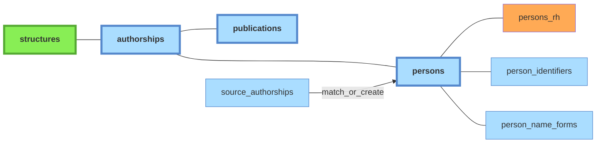

# Personnes

*À jour le 2026-06-30.*

Référentiel des individus.

**Périmètre** : `persons` couvre les personnes ayant cosigné au moins une publication UCA — pas un référentiel mondial des co-auteurs. Conséquence : les co-auteurs externes des publications UCA n'ont pas de `person_id` ; leurs signatures restent uniquement dans `source_authorships`.

Légende :
- **vert** : tables peuplées manuellement
- **orange** : imports CSV
- **bleu** : tables peuplées automatiquement par le pipeline à partir des imports API

## Tables associées

- **`persons_rh`** : table satellite liée à `persons` (FK `person_id`, ON DELETE RESTRICT). Contient les données issues des exports RH : cf [doc sources](../sources/10-imports-manuels.md#extraction-rh).
- **`person_identifiers`** : identifiants persistants — [ORCID](../glossaire.md#orcid), [idHAL](../glossaire.md#idhal), [IdRef](../glossaire.md#idref), etc. Chaque ligne associe un identifiant (`id_type` + `id_value`) à une personne (`person_id`). Le champ `source` trace la provenance (`hal`, `openalex`, `scanr`, `theses`, `manual`, `auto`). La relation *many-to-one* permet de gérer les quelques cas d'ORCID multiples confirmés, et les nombreux cas d'identifiants (corrects ou erronés) en attente de vérification moissonnés dans les sources.
- **`person_name_forms`** : formes de noms normalisées, utilisées pour le matching lors de la création de personnes.
- **`distinct_persons`** : paires de personnes marquées comme **distinctes malgré une forme de nom commune** — symétrique de `distinct_publications`, évite de les re-suggérer dans l'interface de dédoublonnage `admin/person-duplicates`.

## Services propriétaires

**Autorité** : *pipeline* (recalculée à chaque run), *admin* (saisie via l'interface admin, préservée — le pipeline ne l'écrase jamais), *mixte* (selon la colonne), *import* (chargement externe), *référence* (seed).

| Table | Autorité | Écrit par |
|---|---|---|
| `persons` | mixte | créées par le pipeline (`create_persons_from_source_authorships.py`) ou par l'import RH (`import_persons.py`) ; fusions, renommage et rejet en admin (`application/services/persons/commands.py`) |
| `person_identifiers` | mixte | moissonnés par le pipeline ; ajout manuel et statut en admin (`application/services/persons/commands.py`) |
| `person_name_forms` | mixte | peuplées par le pipeline (`populate_person_name_forms.py`) ; statut en admin |
| `distinct_persons` | admin | `application/services/persons/commands.py` |
| `persons_rh` | import | `interfaces/cli/imports/import_persons.py` |
