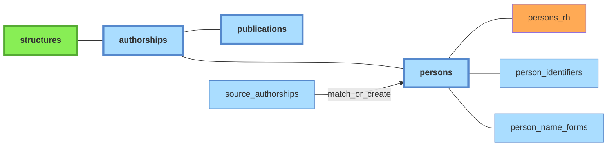

# Personnes

*À jour le 2026-09-05.*

Référentiel des individus.

**Périmètre** : `persons` couvre les personnes ayant cosigné au moins une publication avec une signature UCA. Conséquence : les co-auteurs externes des publications UCA n'ont pas de `person_id`.

```mermaid
flowchart LR
    structures --- authorships
    authorships --- publications
    authorships ---- persons
    source_authorships-->|match_or_create|persons
    persons---persons_rh
    persons---person_identifiers
    persons---person_name_forms

    classDef manuel  fill:#8e5,stroke:#5a3
    class structures manuel;
    classDef csv fill:#fa5
    class persons_rh csv
    classDef auto fill:#adf,stroke:#58c
    class source_authorships,publications,person_identifiers,person_name_forms,authorships,persons auto
    classDef main stroke-width:4px,font-weight:bold
    class structures,publications,persons,authorships main
```

Légende :
- **vert** : tables peuplées manuellement
- **orange** : imports CSV
- **bleu** : tables peuplées automatiquement par le pipeline à partir des imports API

## Tables associées

- **`persons_rh`** : table satellite liée à `persons` (FK `person_id`, ON DELETE RESTRICT). Contient les données issues des exports RH : cf [doc sources](../sources/10-imports-manuels.md#extraction-rh).
- **`person_identifiers`** : identifiants persistants — [ORCID](../glossaire.md#orcid), [idHAL](../glossaire.md#idhal), [IdRef](../glossaire.md#idref), etc. Chaque ligne associe un identifiant (`id_type` + `id_value`) à une personne (`person_id`). Le champ `source` dit d'où vient l'attribution — `manual` pour une décision humaine, `auto` pour une résolution du pipeline — et `status` où elle en est : `pending`, `confirmed`, `rejected` ou `authenticated`. La relation *many-to-one* permet de gérer les quelques cas d'ORCID multiples confirmés, et les nombreux cas d'identifiants (corrects ou erronés) en attente de vérification moissonnés dans les sources.
- **`person_name_forms`** : formes de noms normalisées, servant à reconnaître une personne existante lors de la création.
- **`distinct_persons`** : paires de personnes marquées comme **distinctes malgré une forme de nom commune** — symétrique de `distinct_publications`, évite de les re-suggérer dans l'interface de dédoublonnage `admin/person-duplicates`.

## Propriété des tables

| Table | Auteur | Écrit par |
|---|---|---|
| `persons` | mixte | créées par le pipeline (phase persons, `application/pipeline/persons/cascade.py`) ou par l'import RH (`import_persons.py`) ; fusions, renommage et rejet en admin (`application/services/persons/commands.py`) |
| `person_identifiers` | mixte | moissonnés par le pipeline ; ajout manuel et statut en admin (`application/services/persons/commands.py`) |
| `person_name_forms` | mixte | peuplées par le pipeline (`populate_person_name_forms.py`) ; statut en admin |
| `distinct_persons` | admin | `application/services/persons/commands.py` |
| `persons_rh` | import CSV | `interfaces/cli/imports/import_persons.py` |
