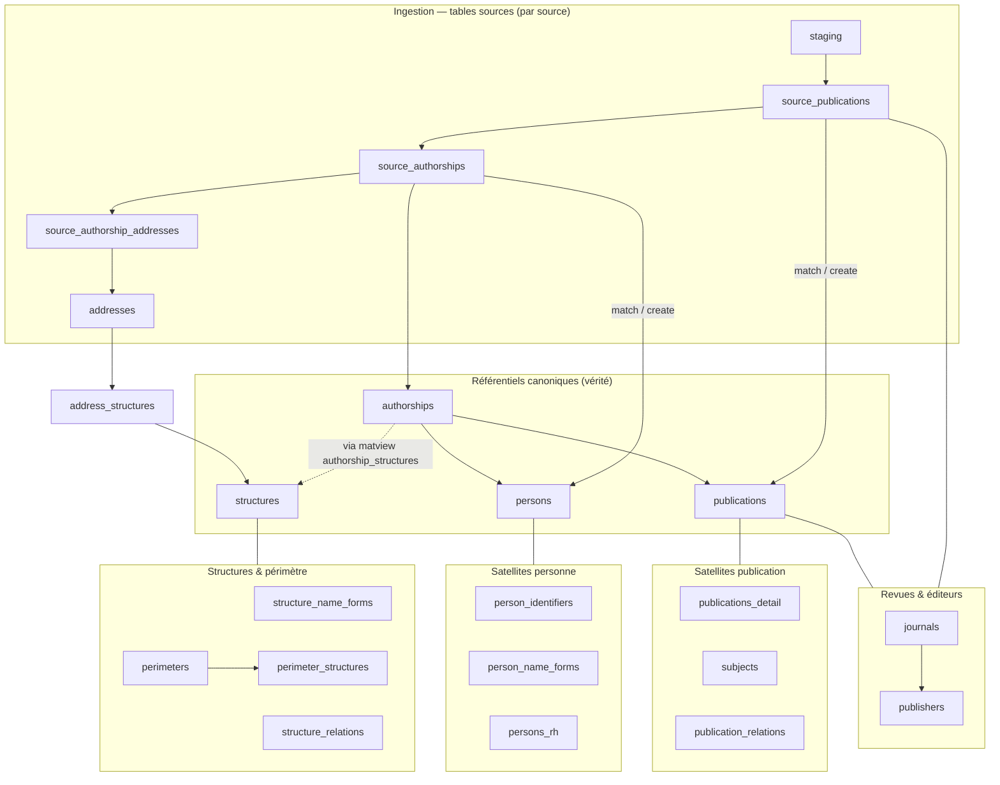

# Index des tables

*À jour le 2026-06-30.*

Cette page donne deux entrées dans le schéma : une **vue macro** (les tables porteuses et leurs liens, niveau intermédiaire entre le schéma conceptuel sources/vérité et le détail de chaque page) puis un **index alphabétique** de toutes les tables et vues matérialisées, avec une courte description et un renvoi vers la page qui documente chacune.

## Vue macro

Vue globale du schéma : l'ingestion par source en haut, les référentiels canoniques au centre, et les satellites rattachés à leur entité-pivot. Sont omis ici : la curation (`distinct_*`, `rejected_authorships`), les caches et référentiels statiques (`doi_prefixes`, `doi_lookups`, `countries`, `place_name_forms`) et les tables techniques — tous présents dans l'index ci-dessous.

`authorships` est la clé de voûte : elle relie les trois entités canoniques — `publications` et `persons` par lien direct, `structures` via la vue matérialisée `authorship_structures` (trait pointillé). Les référentiels `journals` et `publishers` sont partagés en amont : les `source_publications` les portent dès la normalisation (ils sont enrichis avant le rattachement des publications), et les `publications` canoniques les portent à leur tour.

## Index alphabétique

Les vues matérialisées sont signalées comme telles ; les tables purement techniques (hors modèle de données fonctionnel) n'ont pas de page dédiée.

| Objet | Description | Voir |
|---|---|---|
| `address_structures` | liaison adresse ↔ structure (avec confirmation) | [Structures](02-structures.md) |
| `addresses` | adresses normalisées issues des signatures | [Structures](02-structures.md) |
| `apc_payments` | frais de publication (import CSV) | [Structures](02-structures.md) |
| `audit_log` | journal des événements (actions admin, fusions) — technique | — |
| `authorship_structures` | *vue matérialisée* : structures d'un authorship canonique | [Données dérivées](06-donnees-derivees.md) |
| `authorships` | table de vérité personne × publication | [Authorships et sources](05-authorships-et-sources.md) |
| `config` | configuration (périmètres actifs, clés API…) | [Structures](02-structures.md) |
| `countries` | référentiel des pays | [Structures](02-structures.md) |
| `distinct_persons` | paires marquées distinctes malgré un nom commun | [Personnes](04-personnes.md) |
| `distinct_publications` | paires marquées distinctes malgré un titre identique | [Publications](03-publications.md) |
| `doi_lookups` | backoff des miss de cross-import par DOI | [Authorships et sources](05-authorships-et-sources.md) |
| `doi_prefixes` | cache préfixe DOI → agence + éditeur | [Publications](03-publications.md) |
| `journal_name_forms` | formes de noms pour le matching des revues | [Publications](03-publications.md) |
| `journals` | référentiel des revues | [Publications](03-publications.md) |
| `perimeter_structures` | appartenance au périmètre, recalculée par le pipeline | [Structures](02-structures.md) |
| `perimeters` | définition des périmètres | [Structures](02-structures.md) |
| `person_identifier_keys` | *vue matérialisée* : substrat de la file admin « conflits d'identifiant » | [Données dérivées](06-donnees-derivees.md) |
| `person_identifiers` | identifiants persistants (ORCID, idHAL, IdRef) | [Personnes](04-personnes.md) |
| `person_name_forms` | formes de noms pour le matching des personnes | [Personnes](04-personnes.md) |
| `persons` | référentiel des personnes (périmètre UCA) | [Personnes](04-personnes.md) |
| `persons_rh` | satellite des données RH (import CSV) | [Personnes](04-personnes.md) |
| `pipeline_phase_executions` | historique d'exécution des phases — technique | — |
| `place_name_forms` | formes de noms pour la détection des pays | [Structures](02-structures.md) |
| `publication_relations` | relations sémantiques entre publications | [Publications](03-publications.md) |
| `publication_structures` | *vue matérialisée* : structures d'une publication | [Données dérivées](06-donnees-derivees.md) |
| `publication_subjects` | liaison publication ↔ sujet | [Publications](03-publications.md) |
| `publications` | référentiel dédupliqué des productions | [Publications](03-publications.md) |
| `publications_detail` | satellite 1:1 (abstract, keywords, topics, biblio) | [Publications](03-publications.md) |
| `publisher_name_forms` | formes de noms pour le matching des éditeurs | [Publications](03-publications.md) |
| `publishers` | référentiel des éditeurs | [Publications](03-publications.md) |
| `rejected_authorships` | rejets manuels de paires personne × publication | [Authorships et sources](05-authorships-et-sources.md) |
| `source_authorship_addresses` | liaison authorship source ↔ adresse | [Authorships et sources](05-authorships-et-sources.md) |
| `source_authorship_structures` | *vue matérialisée* : affiliations résolues d'un authorship source | [Données dérivées](06-donnees-derivees.md) |
| `source_authorships` | contribution d'un auteur source à un document source | [Authorships et sources](05-authorships-et-sources.md) |
| `source_publications` | un enregistrement par document par source | [Authorships et sources](05-authorships-et-sources.md) |
| `staging` | ingestion brute par source (cycle de vie en 3 états) | [Authorships et sources](05-authorships-et-sources.md) |
| `structure_name_forms` | formes de noms pour la détection des structures | [Structures](02-structures.md) |
| `structure_relations` | relations entre structures (tutelle, partenariat) | [Structures](02-structures.md) |
| `structures` | référentiel institutionnel | [Structures](02-structures.md) |
| `subject_cooccurrences` | *vue matérialisée* : paires de sujets co-présents | [Données dérivées](06-donnees-derivees.md) |
| `subjects` | référentiel des sujets / mots-clés | [Publications](03-publications.md) |
