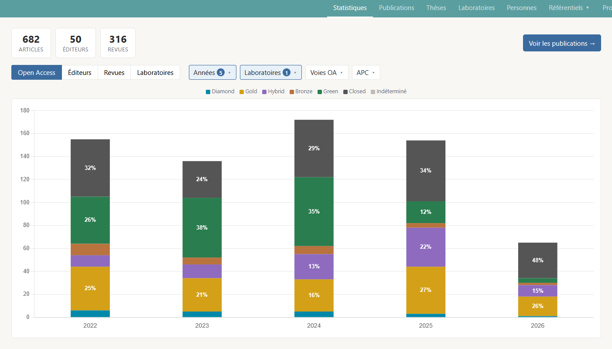
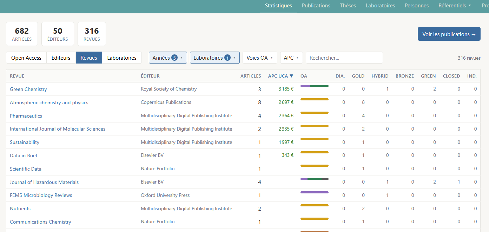
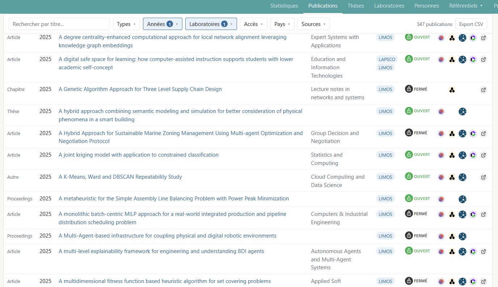
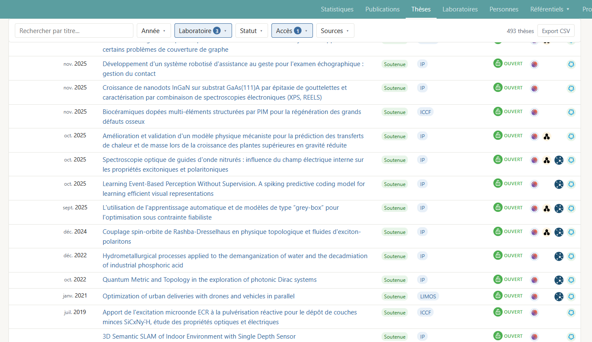
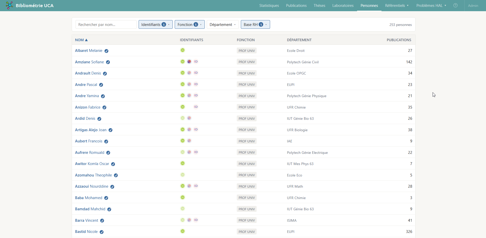
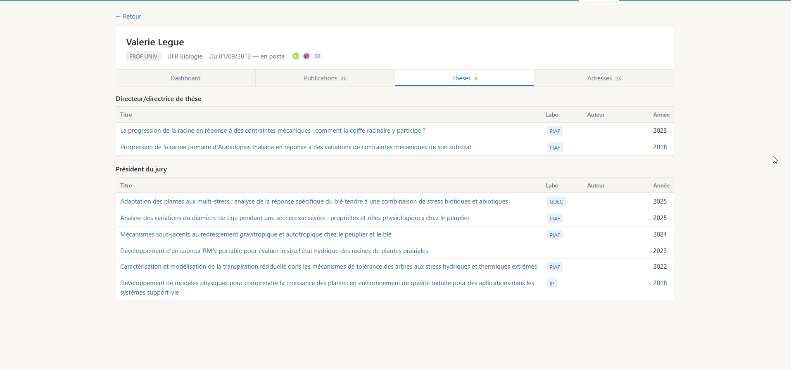
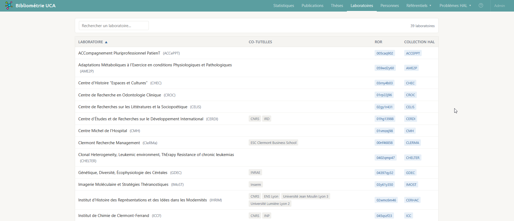
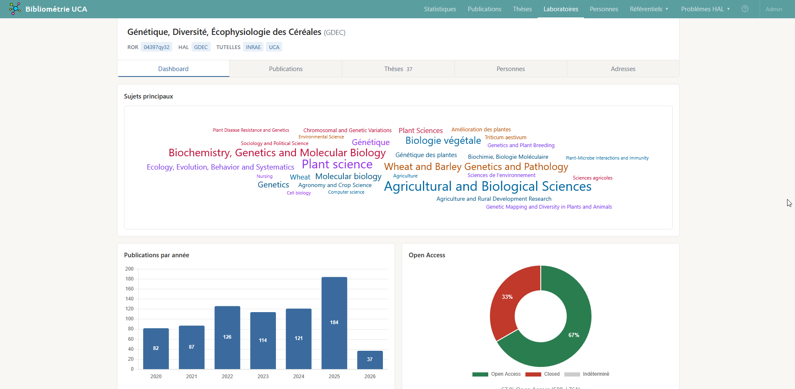

# Pages publiques

*A compléter et mettre à jour*

## Statistiques

`/stats`

Tableaux de bord :
- répartition par [voie *open access*](../glossaire.md#voies-open-access) par année (graphique exportable en png);
- répartition par éditeur (liste);
- répartition par revue (liste).

Filtrable par:
- année de publication,
- laboratoire,
- voie *open access*,
- paiement d'APC.

Restreint aux publications de type article et *review*.<!--TODO: glossaire? et voir si d'autres types sont pertinents--> Quels que soient les filtres en place, un bouton "Voir les publications" donne accès à la liste complète des publications concernées.

## Publications

### Liste `/publications`

Liste des publications filtrable par :
- type de document,
- année de publication,
- laboratoires,
- accès (ouvert/fermé),
- [voie *open access*](../glossaire.md#voies-open-access),
- paiement d'[APC](../glossaire.md#apc),
- pays des co-auteurs,
- sources.

Filtre de recherche (interroge le titre et les sujets liés).

Export csv.

Certaines colonnes+facettes sont masquées par défaut: un bouton permet de choisir les colonnes affichées.

### Détails `/publications/{id}`

Vue détaillée : métadonnées, auteurs, sources contributrices.

Vue alignée des auteurs par source pour détecter d'éventuelles incohérences.<!--TODO: à supprimer de l'UI publique, à réserver à une future page admin.-->

## Thèses

`/theses`

TODO: à compléter

(La page "détails thèse" est la même que "détails publication".)

## Personnes

### Liste `/persons`

Liste des personnes avec leurs identifiants (ORCID, idHAL) et affiliations.
Filtrable par:
- présence ou non dans la [base RH](../sources/10-imports-manuels.md#extraction-rh),
- données RH (rôle, affiliation),
- identifiants (ORCID, idHAL).

### Détails `/persons/{id}`

Vue détaillée d'un chercheur. Identifiants, données RH si existent.
3 ou 4 onglets:
- dashboard
- publications
- thèses, si la personne est liée à une ou plusieurs thèses
- adresses (adresses liées à cette personne dans les publications)
<!-- TODO: Distinguer les onglets visibles selon rôle utilisateur: les onglets "identités" et "adresses" sont des outils internes, sans intérêt pour le chercheur -->
<!-- TODO: Onglet adresses des pages personnes/id et laboratoire/id: afficher nombre de publications liées à chaque adresse; créer possibilité de consulter la liste?; normaliser adresses pour diminuer le nombre de variantes liées à des différences de ponctuation? -->

## Laboratoires

### Liste `/laboratories`

Liste des laboratoires avec tutelles, identifiant ROR et lien vers collection HAL.

### Détails `/laboratories/{id}`

Vue détaillée d'un laboratoire.

Onglets:
- Dashboard (sujets, production, taux d'accès ouvert, collaborations internationales);
- Publications;
- Thèses;
- Personnes: affiche les personnes liées à ce laboratoire via une publication (ne repose pas sur l'affiliation renseignée dans la base RH);
- Adresses (adresses ayant permis la détection de ce laboratoire dans les publications).

## Revues

### Liste `/journals`

Liste des revues avec filtres : recherche par nom, type de revue, présence dans le DOAJ, modèle d'accès ouvert. Triable par nombre de publications.

### Détails `/journals/{id}`

Vue détaillée d'une revue. Onglets : Dashboard, Publications.

## Éditeurs

### Liste `/publishers`

Liste des éditeurs avec leurs revues associées et leur volume de publications.

### Détails `/publishers/{id}`

Vue détaillée d'un éditeur. Onglets : Dashboard, Revues, Publications.

## Sujets

### Liste `/subjects`

### Détails `/subjects/{id}`

## Problèmes HAL

`/hal-problems/*`

Pages dédiées à relever les problèmes de qualité spécifiques à HAL :

- **Comptes en double** : auteurs HAL ayant plusieurs comptes
- **Publications en double** : documents HAL doublonnés
- **Manques dans les collections** : affiliations manquantes: publications HAL qui devraient être dans une collection HAL mais n'y sont pas
- **Conflits d'affiliation** : publications HAL avec une affiliation UCA suspecte, en contradiction avec les autres sources
