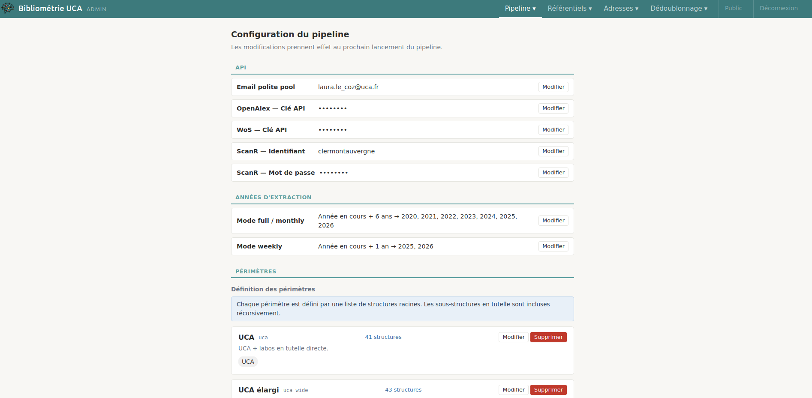

# Pages d'administration

*A compléter et mettre à jour.*

## Pipeline

### Configuration

`/admin/config`

Configuration du [moissonnage](../pipeline/02-extract.md) :
- email (*polite pool*);
- clés API;
- années interrogées (modes *weekly* et *full*);
- définition et CRUD des périmètres (`uca`, `uca_wide`);
- périmètre utilisé à différentes étapes du pipeline (extraction, détection des affiliations, création de personnes).

## Logs
TODO: à compléter

## Référentiels

### Structures

#### Liste `/admin/structures`

Affiche la liste des structures.

#### Détails `/admin/structures/{id}`

Gestion du CRUD des structures, et de leurs relations et formes de noms.

Pour chaque structure:
- **Détails** (nom, acronyme, identifiant ROR, collection HAL, identifiants dans les sources);
- **Relations** (2 relations: tutelle, partenaire);
- **Formes de noms** pour l'identification des structures dans les adresses.

### Personnes

`/admin/persons`

Gestion du référentiel de personnes :

- **Édition du nom**.
- **Rejet** : marquer une personne comme fausse entité (mauvais parsing, noms d'équipes de recherche…).
- **Identifiants** : [ORCID](../glossaire.md#orcid), [idHAL](../glossaire.md#idhal), [IdRef](../glossaire.md#idref) avec statut (en attente, confirmé, rejeté). Les boutons ✓ et ✗ permettent de confirmer ou rejeter. Ajout d'identifiants.
- **Formes de nom** : chaque personne a des formes de nom normalisées issues des sources. Un badge orange indique une forme **ambiguë** (partagée avec une autre personne). Cliquer sur une forme ouvre un modal permettant de consulter les authorships liées et de les détacher.
- **Fusion** : le bouton "Fusionner" permet de chercher un doublon et de fusionner deux personnes. Bloqué si les deux ont une fiche RH.

#### Authorships orphelines (`/admin/orphan-authorships`)

Authorships UCA dont l'auteur n'est pas encore identifié (`person_id = NULL`). Pour chaque authorship, on peut :

- **Attribuer** à une personne existante (recherche par nom)
- **Créer** une nouvelle personne et lui attribuer l'authorship
- **Traitement par lot** : sélectionner plusieurs authorships et les attribuer en une fois

Le dropdown de recherche affiche le département RH (si existant) ou l'id interne (sinon) pour départager les homonymes.

### Éditeurs
TODO: à compléter

### Revues
TODO: à compléter

## Adresses

### Affiliations des adresses

`/admin/addresses`

Contrôle des adresses d'affiliation résolues automatiquement par la phase `resolve_addresses` du pipeline.
Confirmer ou rejeter manuellement les associations adresse → structure.

#### Qualité de la détection

`/admin/feedback`

Affiche les faux positifs et faux négatifs dans la détection de structures dans les adresses:
- **faux négatifs**: affiliations adresse-structure non détectées par le script mais créées manuellement => action nécessaire: repérer les formes de nom non détectées et les ajouter dans `admin/structures/{id}`.
- **faux positifs**: affiliations détectées par le script mais rejetées manuellement => action nécessaire: supprimer une forme de nom trop permissive ou lui ajouter un contexte plus contraignant.

Les ajouts/suppressions de formes de noms seront prises en compte à la prochaine exécution du pipeline ([phase `affiliations`](../pipeline/04-affiliations.md)).

### Liens adresses-pays

`/admin/countries`

Attribution et correction des pays liés aux adresses.
Les corrections se propagent automatiquement aux publications liées, sans besoin de relancer le pipeline.

## Dédoublonnage

### Publications

`/admin/duplicates`

Paires de publications potentiellement identiques (logique de détection dans [infrastructure/queries/publication_duplicates.py](https://github.com/Y33sha/bibliometrie-uca/blob/master/infrastructure/queries/publication_duplicates.py)).<!--TODO: à réviser et documenter-->

Pour chaque paire, on peut :

- **Fusionner** : absorber une publication dans l'autre
- **Marquer comme distinctes** : indiquer que ce n'est pas un doublon
- **Passer** : reporter la décision

### Personnes

`/admin/person-duplicates`

Paires de personnes potentiellement identiques. Mêmes opérations que pour les doublons de publications.

Deux modes de détection des candidats au dédoublonnage:
- Par similitude de noms (tolérance aux initiales et aux noms composés vs simples);
- Par conflit entre sources (deux personnes en même position auteur sur la même publication).
