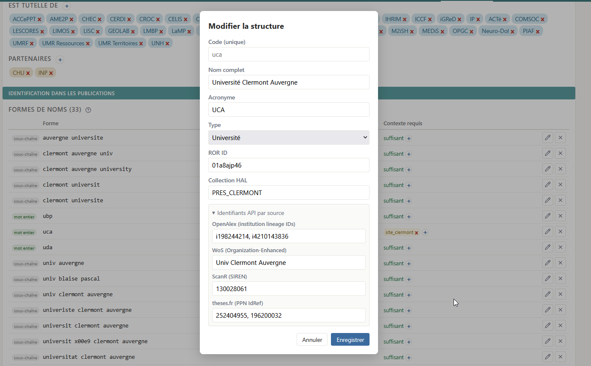
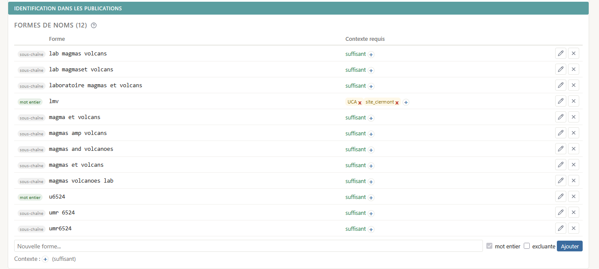
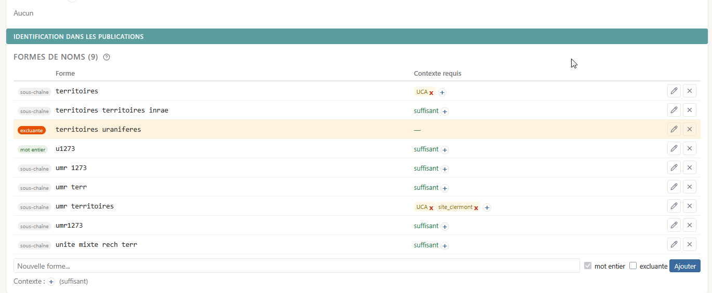
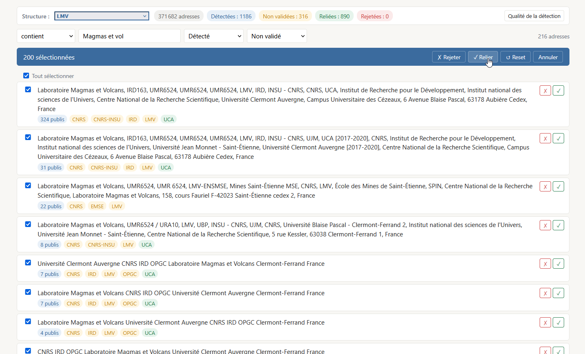
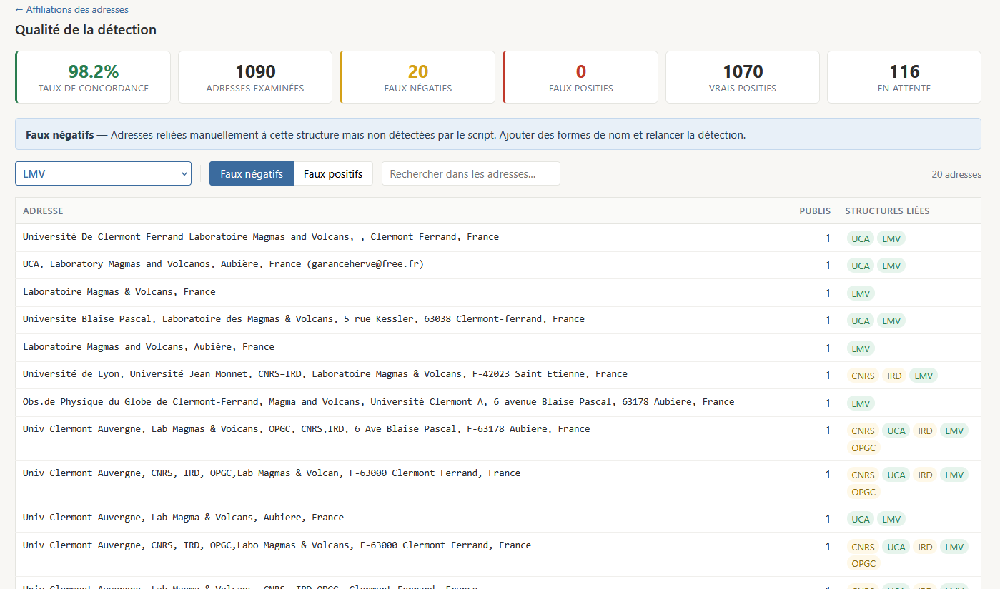
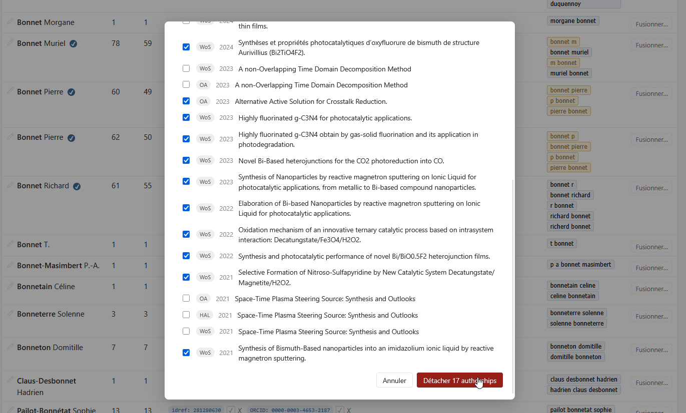
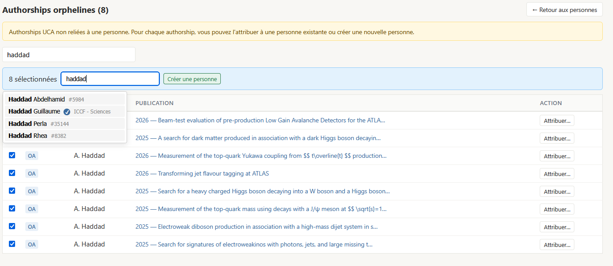

# Workflow admin

*A compléter et mettre à jour.*

## En amont du pipeline

### Définition des structures

`admin/structures`

- Le moissonnage nécessite des **structures**. Pour les sources bibliographiques où les structures sont désignées par des identifiants ([OpenAlex](../glossaire#openalex), [ScanR](../glossaire#scanr)) ou des formes de nom standardisées ([WoS](../glossaire.md#wos), intitulés de [collection HAL](../glossaire#collection-hal)), il faut connaître les identifiants en question et les ajouter aux structures qu'on souhaite moissonner.



- Le repérage des affiliations (étape [affiliations](../pipeline/04-affiliations.md) du pipeline) nécessite des **formes de nom** à détecter dans les [adresses](../glossaire.md#adresse) des publications. On peut commencer par indiquer les plus évidentes (nom complet, acronyme, numéro d'UMR). Les contrôles post-pipeline permettent d'affiner en fonction des formes effectivement présentes dans les adresses liées aux publications.



> Pour les formes susceptibles d'être **ambiguës** (acronymes, numéros d'UMR non-uniques), il est possible d'ajouter une contrainte de contexte: la forme identifiera la structure seulement si une autre structure (parmi une liste spécifiée) est détectée indépendamment.
>
> Exemple: la forme de nom *LMV* identifie le *Laboratoire Magmas et Volcans* seulement si l'UCA ou le site clermontois sont identifiés dans l'adresse.
>
> ```Université Clermont Auvergne, CNRS, F-63000 Clermont-Ferrand, IRD, OPGC, LMV, France``` => Identification via la forme de nom "LMV"
>
> ```LMV - Laboratoire de Mathématiques de Versailles (Bâtiment Fermat - UFR de sciences 45 avenue des Etats-Unis 78035 VERSAILLES - France)``` => Pas d'identification



> Si une forme de nom reste trop permissive, on peut **exclure** certaines expressions contenant une forme reconnue.
>
> Exemple: L'*UMR Territoires* peut être identifiée par le mot *territoires*, à condition que l'UCA soit reconnue dans l'adresse. Cela peut conduire à de fausses identifications si une autre structure contient ce mot très courant.
>
> La forme *territoires uranifères* est définie au niveau de l'UMR Territoires comme excluant l'identification :  ```Université Clermont Auvergne, CNRS, GEOLAB, Clermont-Ferrand 63000, France; LTSER "Zone Atelier Territoires Uranifères", Clermont-Ferrand, Aubière F-63000, France``` => pas de rattachement malgré *territoires* + *UCA*.

### Configuration du pipeline

Tout se passe dans `admin/config`.

#### Credentials {#credentials}

Certaines sources requièrent une clé API ([WoS](../sources/04-wos.md)) ou un couple d'identifiants ([ScanR](../sources/05-scanr.md)). D'autres requièrent une adresse mail pour le polite pool ([OpenAlex](../sources/03-openalex.md), [Crossref](../sources/06-crossref.md)). Voir la doc de chaque source pour l'obtention des *credentials*.

#### Années {#years}

Le pipeline a [deux modes](../pipeline/01-vue-d-ensemble.md): *daily* et *full*.

Le mode *full* interroge les sources depuis une année de début jusqu'à l'année courante (le critère est l'année de publication, donc des années civiles complètes). Le mode *daily* ne réinterroge que les nouveaux dépôts HAL depuis le dernier lancement.

L'année de début est l'argument `--start-year` ; à défaut, la valeur configurée dans `admin/config` (par défaut 2017).

#### Périmètres {#perimeters}

*A compléter.*

## En aval du pipeline

### Rapports de pipeline

*A compléter.*

### Contrôle des affiliations

Facultatif, mais permet d'affiner la liste des formes de nom par structure, pour améliorer progressivement la fiabilité du repérage:

- Validation/rejet manuel des liens adresse-structure détectés par le script, individuellement ou par batch;



- Contrôle qualité: visualiser les divergences entre détection automatisée et contrôle manuel => permet de repérer les formes de nom non détectées (à ajouter dans `admin/structures`) ou trop permissives (à supprimer, ou ajouter contexte plus contraignant).



Les ajouts ou suppressions de formes de noms deviennent effectifs au *run* suivant du pipeline, y compris pour les adresses déjà présentes en base. En cas de contradiction entre détection automatique et classement manuel, l'action manuelle fait autorité. Les actions manuelles ne sont jamais écrasées par un *re-run* du pipeline.


### Gestion du référentiel de personnes

#### Fusion des doublons

Lorsque les auteurs des publications ne sont pas identifiés par un [PID](../glossaire.md#pid), la phase de [matching personnes](../pipeline/09-persons.md) recourt aux formes de noms pour identifier les auteurs. Des formes de noms multiples pour la même personne conduiront donc à créer des doublons de personnes.

Il est nécessaire, en particulier apès les premiers runs, de **fusionner** les doublons de personnes. Une fusion de personnes entraîne:
- le transfert des formes de noms vers la personne cible (tous les futurs matchs par forme de nom aboutiront à cette personne);
- le transfert des PIDs;
- le transfert des publications.

Un garde-fou empêche de fusionner ensemble deux personnes présentes dans l'[extraction RH](../sources/10-imports-manuels.md).

Des scripts en ligne de commande permettent d'accélérer le travail:
- [merge_duplicate_persons_by_publication](https://github.com/Y33sha/bibliometrie-uca/blob/master/interfaces/cli/maintenance/merge_duplicate_persons_by_publication.py) : personnes distinctes figurant comme auteur de la même publication (repérée sur différentes sources), en même position auteur, avec des noms compatibles (au sens de la fonction [names_compatible](https://github.com/Y33sha/bibliometrie-uca/blob/master/domain/persons/name_matching.py))
- [merge_person_duplicates_by_lab](https://github.com/Y33sha/bibliometrie-uca/blob/master/interfaces/cli/maintenance/merge_person_duplicates_by_lab.py) : personnes distinctes ayant signé des publications pour le même laboratoire et portant un nom compatible<!--TODO: corriger le script pour qu'il utilise la fonction names_compatible et pas une identité stricte; accessoirement, harmoniser le nommage des deux scripts--> (validation requise au cas par cas)

#### Détachement des authorships attribuées à tort

Quand on repère une publication attribuée au mauvais auteur, on peut détacher le lien depuis `admin/persons`. Circuit: trouver la personne; cliquer sur la ou les formes de nom concernées; sélectionner les publications liées et cliquer sur "Détacher *n* authorships".



Pour réattribuer les authorships en question: cf [Authorships orphelines](#orphan-authorships)

#### Vérification des identifiants de personne

Travail au long cours.

Les PIDs présents dans les publications sont rattachés aux personnes pendant la phase de [matching personnes](../pipeline/09-persons.md).

Un PID se définit par: un **type** (`orcid`, `idref`, `idhal`) et une **valeur**.

Un PID peut avoir trois statuts: *pending*, *confirmed*, *rejected*. Par défaut, ils ont un statut *pending*. La confirmation ou le rejet se fait manuellement depuis `admin/persons`, après vérification. Si une personne n'a pas de PID, on peut aussi les ajouter manuellement après recherche sur http://orcid.org/ ou https://www.idref.fr/.

Les PIDs sont stockés dans la table [`person_identifiers`](../donnees/04-personnes.md). Un PID ne peut être attribué qu'à une personne. Une tentative de réattribuer un PID déjà attribué (avec statut *confirmed* ou *pending*) lèvera une exception. La réattribution est possible quand le PID a un statut *rejected*.

> **Pourquoi un statut *rejected* ?**
>
> Certaines sources (OpenAlex, WOS) rattachent des PIDs à des publications de manière algorithmique, via leur propre référentiel auteurs. (Cf doc [sources](../sources/01-vue-d-ensemble.md#entites-auteurs)) Certaines attributions sont erronées (homonymes, initiale du prénom identique…)
>
> Conserver les PIDs rejetés garantit que s'ils réapparaissent dans les sources lors des prochains runs du pipeline, ils ne seront pas réaffectés à la même personne.
>
> Les PIDs rejetés n'apparaissent pas dans l'UI publique et sont exclus de toutes les *queries* (décomptes, facettes…).

#### Correction du nom

La page `admin/persons` permet de corriger le nom et prénom si ceux issus des sources sont incorrects. C'est souvent le cas des patronymes composés: le parsing des sources a tendance à mettre la première partie du patronyme dans le prénom. Ex. : Alain Le Grand => prénom: "Alain Le", nom: "Grand". On constate aussi parfois des inversions nom-prénom.

#### Authorships orphelines: rattachement à une personne existante ou création de personne {#orphan-authorships}

La page `admin/orphan-authorships` donne accès aux [authorships](../glossaire.md#authorship) orphelines, c'est-à-dire:
- relevant du périmètre (signature UCA en l'occurrence)
- mais non rattachées à une personne.

Il y a deux raisons possibles à cela:
- Soit ces authorships ont été détachées manuellement d'un auteur;
- Soit le pipeline n'a pas réussi à les attribuer, ce qui se produit dans un seul cas de figure: aucun matching par PID n'était possible *et* la forme normalisée du nom d'auteur est ambiguë (au moins 2 personnes peuvent y correspondre, ce qui est souvent le cas pour les publications où le prénom est réduit à l'initiale).

La page `admin/orphan-authorships` permet de rattacher les authorships en question, individuellement ou par batch, soit à une personne existante, soit à une nouvelle personne créée manuellement.



### Gestion des référentiels d'éditeurs et de revues

*A compléter*

- Doublons d'éditeurs: possibilité de fusionner ('Elsevier' vs 'Elsevier BV' selon source).
- Doublons de revues: idem
- Enrichissement des informations sur les éditeurs et revue ->> clarifier ce qui est fait automatiquement par le pipeline

### Legacy
- Pages dédoublonnage (personne, publication): TODO: à améliorer ou supprimer
- Page adresses/pays: workflow un peu clunky, à revoir (automatiser un max).
