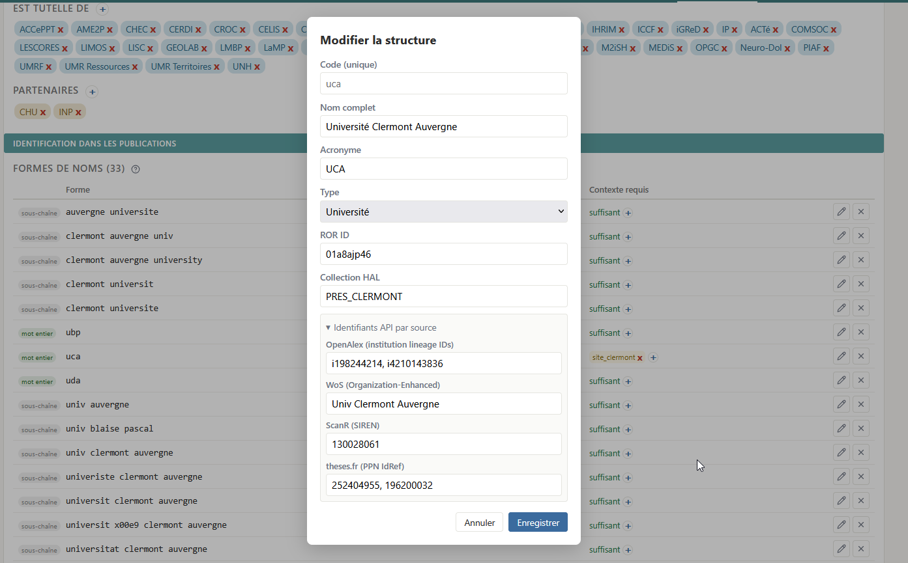
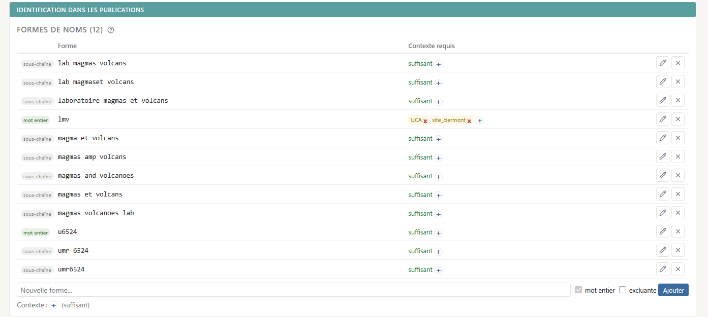
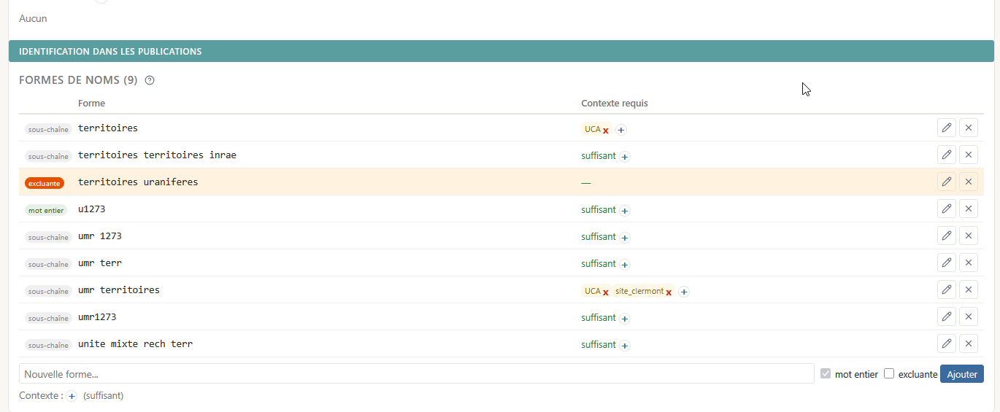
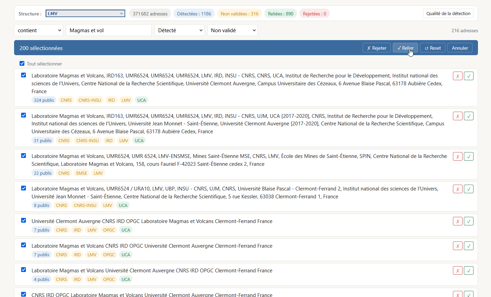
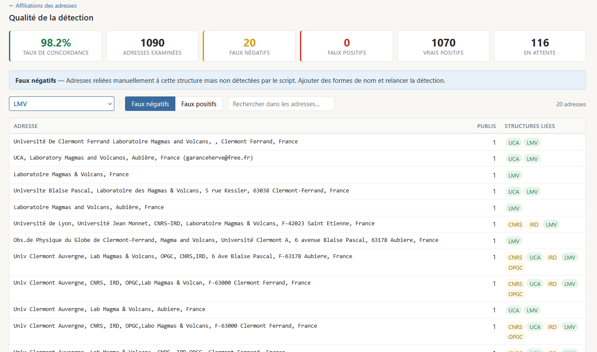
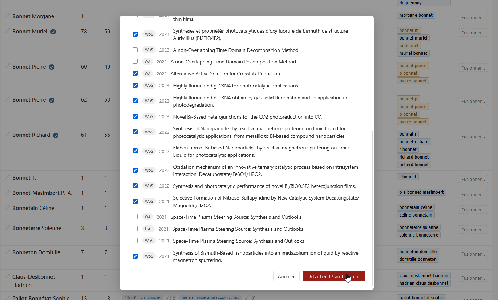
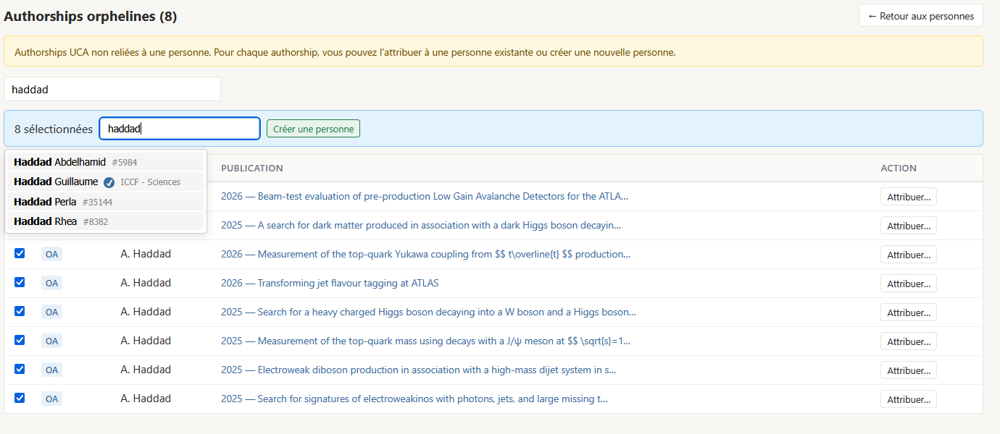

# Workflow admin

*A compléter et mettre à jour.*

## En amont du pipeline

### Définition des structures

`admin/structures`

Le moissonnage nécessite des **structures** :
* Créer les structures dont on veut moissonner les publications.
* Renseigner les relations de tutelle entre structures.
* Pour le moissonnage, renseigner les identifiants de structure (au moins pour l'établissement de tutelle):
    * identifiant [OpenAlex](../glossaire.md#openalex), de forme `I198244214`
    * theses.fr : PPN correspondant à l'établissement (ex.: `252404955`)
    * N° SIREN pour la source [ScanR](../glossaire.md#scanr) (ex. `130028061`)
    * forme de nom standardisée [WoS](../glossaire.md#web-of-science-wos) (ex.: `Univ Clermont Auvergne`)
    * nom de [collection HAL](../glossaire.md#collection-hal) (ex.: `PRES_CLERMONT`)

    Chaque champ peut contenir plusieurs identifiants séparés par des virgules.



* Pour chaque structure à identifier dans les publications, renseigner les **formes de nom** à détecter dans les adresses institutionnelles.
    On peut commencer par indiquer les plus évidentes (nom complet, acronyme, numéro d'UMR). Les contrôles ultérieurs permettont d'affiner en fonction des formes effectivement présentes dans les adresses liées aux publications.



> Pour les formes susceptibles d'être **ambiguës** (acronymes, numéros d'UMR non-uniques), il est possible d'ajouter une contrainte de contexte: la forme identifiera la structure seulement si une autre structure (parmi une liste spécifiée) est détectée indépendamment.
>
> Exemple: la forme de nom *LMV* identifie le *Laboratoire Magmas et Volcans* seulement si l'UCA ou le site clermontois sont identifiés dans l'adresse.
>
> ```Université Clermont Auvergne, CNRS, F-63000 Clermont-Ferrand, IRD, OPGC, LMV, France``` => UCA identifiée => identification du laboratoire par la forme de nom "LMV"
>
> ```LMV - Laboratoire de Mathématiques de Versailles (Bâtiment Fermat - UFR de sciences 45 avenue des Etats-Unis 78035 VERSAILLES - France)``` => Pas d'identification



> Si une forme de nom reste trop permissive, on peut **exclure** certaines expressions contenant une forme reconnue.
>
> Exemple: L'*UMR Territoires* peut être identifiée par le mot *territoires*, à condition que l'UCA soit reconnue dans l'adresse. Cela peut générer de fausses identifications si une autre structure contient le même mot.
>
> La forme *territoires uranifères* est définie au niveau de l'UMR Territoires comme excluant l'identification :  ```Université Clermont Auvergne, CNRS, GEOLAB, Clermont-Ferrand 63000, France; LTSER "Zone Atelier Territoires Uranifères", Clermont-Ferrand, Aubière F-63000, France``` => pas d'identification, malgré *territoires* + *Université Clermont Auvergne*.

### Configuration du pipeline

Les années et les périmètres moissonnés se règlent dans `admin/config`.

#### Années

Le pipeline a [deux modes](../pipeline/01-vue-d-ensemble.md): *full* et *daily*.

- Le mode *full* interroge les sources depuis une année de début (`--start-year`) jusqu'à l'année courante. Sans argument `--start-year`, l'année par défaut est la valeur configurée dans `admin/config`.

- Le mode *daily* ne réinterroge que les nouveaux dépôts HAL depuis le dernier lancement.

#### Périmètres

Le moissonnage porte sur un *périmètre*.

Un périmètre se définit par une ou plusieurs structures racines, et inclut automatiquement tous leurs descendants.

Pour moissonner tous les laboratoires d'une université:
- Créer l'université et ses laboratoires dans `admin/structures` et renseigner leurs relations de tutelle.
- Créer un périmètre avec l'université pour structure racine.
- Dans la section "Rôles des périmètres", sélectionner le périmètre concerné à chacune des deux étapes.

#### Identifiants d'accès aux sources

Certaines sources requièrent une clé API ([WoS](../sources/04-wos.md)) ou un couple d'identifiants ([ScanR](../sources/05-scanr.md)). D'autres requièrent une adresse mail pour le polite pool ([OpenAlex](../sources/03-openalex.md), [Crossref](../sources/06-crossref.md)). Voir la doc de chaque source pour l'obtention des *credentials*.

Ces clés sont stockées dans l'environnement du serveur. Cf [documentation d'exploitation](../exploitation/03-pipeline.md#identifiants-daccès-aux-sources). Une source non renseignée est sautée au lancement, avec un avertissement, sans interrompre le run.


## En aval du pipeline

### Rapports de pipeline

*A compléter.*

### Contrôle des affiliations

Permet d'affiner la liste des formes de nom par structure, pour améliorer progressivement la fiabilité du repérage:

- Validation/rejet manuel des liens adresse-structure détectés par le script, individuellement ou par batch;



- Contrôle qualité: visualiser les divergences entre détection automatisée et contrôle manuel => permet de repérer les formes de nom non détectées (à ajouter dans `admin/structures`) ou trop permissives (à supprimer, ou ajouter contexte plus contraignant).



Les ajouts ou suppressions de formes de noms deviennent effectifs au *run* suivant du pipeline, y compris pour les adresses déjà présentes en base. En cas de contradiction entre détection automatique et classement manuel, l'action manuelle prévaut. Les actions manuelles ne sont jamais écrasées.


### Gestion du référentiel de personnes

#### Fusion des doublons

Lorsque les auteurs des publications ne sont pas identifiés par un [PID](../glossaire.md#pid), la phase de [résolution des personnes](../pipeline/08-persons.md) recourt aux formes de noms pour identifier les auteurs. Des formes de noms multiples pour la même personne conduiront donc à créer des doublons de personnes.

Il est nécessaire, en particulier apès les premiers runs, de **fusionner** les doublons de personnes. Une fusion de personnes entraîne:
- le transfert des formes de noms vers la personne cible (tous les futurs matchs par forme de nom aboutiront à cette personne);
- le transfert des PIDs;
- le transfert des publications.

Un garde-fou empêche de fusionner ensemble deux personnes présentes dans l'[extraction RH](../sources/10-imports-manuels.md).

La fusion s'opère depuis `admin/persons`: la file des doublons par nom (doublons probables en tête, homonymes en fin) présente les paires candidates; pour chacune, on fusionne vers la personne à conserver, ou on la marque comme distincte — elle sort alors de la file.

#### Détachement des authorships attribuées à tort

Quand on repère une publication attribuée au mauvais auteur, on peut détacher le lien depuis `admin/persons`. Circuit: trouver la personne; cliquer sur la ou les formes de nom concernées; sélectionner les publications liées et cliquer sur "Détacher *n* publications".



Pour réattribuer les publications en question: cf [Authorships orphelines](#authorships-orphelines)

#### Vérification des identifiants de personne

Travail au long cours.

Les PIDs présents dans les publications sont rattachés aux personnes pendant la phase de [résolution des personnes](../pipeline/08-persons.md).

Un PID se définit par: un **type** (`orcid`, `idref`, `idhal`) et une **valeur**.

Un PID peut avoir quatre statuts: *pending*, *confirmed*, *rejected*, *authenticated*. Le statut par défaut est *pending*. La confirmation ou le rejet se fait manuellement depuis `admin/persons`, après vérification. Si une personne n'a pas de PID, on peut aussi les ajouter manuellement après recherche sur http://orcid.org/ ou https://www.idref.fr/.

Les PIDs sont stockés dans la table [`person_identifiers`](../donnees/04-personnes.md). Un PID ne peut être attribué qu'à une personne. Une tentative de réattribuer un PID déjà attribué (avec statut *confirmed* ou *pending*) lèvera une exception. La réattribution est possible quand le PID a un statut *rejected*.

TODO: expliquer *authenticated*

> **Pourquoi un statut *rejected* ?**
>
> Certaines sources (OpenAlex, WOS) rattachent des PIDs à des publications de manière algorithmique, via leur propre référentiel auteurs. (Cf doc [sources](../sources/01-vue-d-ensemble.md#entités-auteurs)) Certaines attributions sont erronées (homonymes, initiale du prénom identique…)
>
> Conserver les PIDs rejetés garantit que s'ils réapparaissent dans les sources lors des prochains runs du pipeline, ils ne seront pas réaffectés à la même personne.
>
> Les PIDs rejetés n'apparaissent pas dans l'UI publique et sont exclus de toutes les requêtes (décomptes, facettes…).

#### Correction du nom

La page `admin/persons` permet de corriger le nom et prénom si ceux issus des sources sont incorrects. C'est souvent le cas des patronymes composés: le parsing des sources a tendance à mettre la première partie du patronyme dans le prénom. Ex. : Alain Le Grand => prénom: "Alain Le", nom: "Grand". On constate aussi parfois des inversions nom-prénom.

#### Authorships orphelines

La page `admin/orphan-authorships` donne accès aux [authorships](../glossaire.md#authorship) orphelines, c'est-à-dire:
- relevant du périmètre (signature UCA en l'occurrence)
- mais non rattachées à une personne.

Il y a deux raisons possibles à cela:
- Soit ces authorships ont été détachées manuellement d'un auteur;
- Soit le pipeline n'a pas réussi à les attribuer, ce qui se produit dans un seul cas de figure: aucune résolution par PID n'était possible *et* la forme normalisée du nom d'auteur est ambiguë (au moins 2 personnes peuvent y correspondre, ce qui est fréquent pour les publications où le prénom est réduit à l'initiale).

La page `admin/orphan-authorships` permet de rattacher les authorships en question, individuellement ou par batch, soit à une personne existante, soit à une nouvelle personne créée manuellement.



### Gestion des référentiels d'éditeurs et de revues

*A compléter*

- Doublons d'éditeurs: possibilité de fusionner ('Elsevier' vs 'Elsevier BV' selon source).
- Doublons de revues: idem
- Enrichissement des informations sur les éditeurs et revue ->> clarifier ce qui est fait automatiquement par le pipeline

### Legacy
- Pages dédoublonnage (personne, publication): TODO: à améliorer ou supprimer
- Page adresses/pays: workflow un peu clunky, à revoir (automatiser un max).
