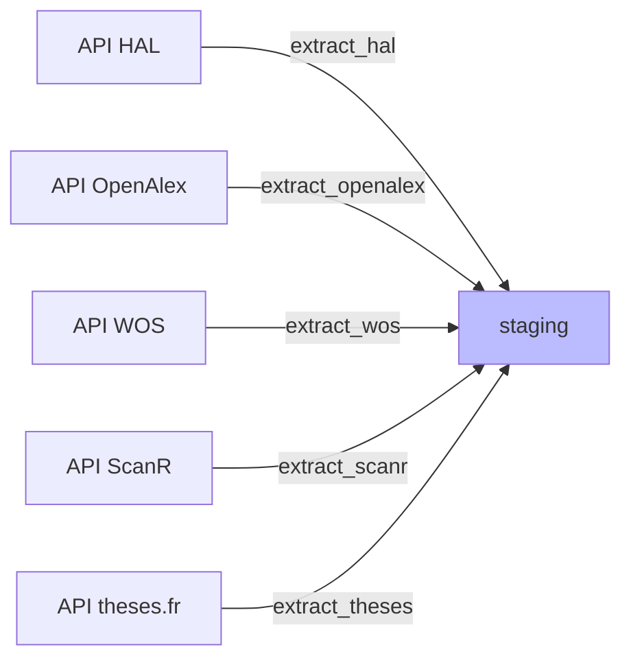
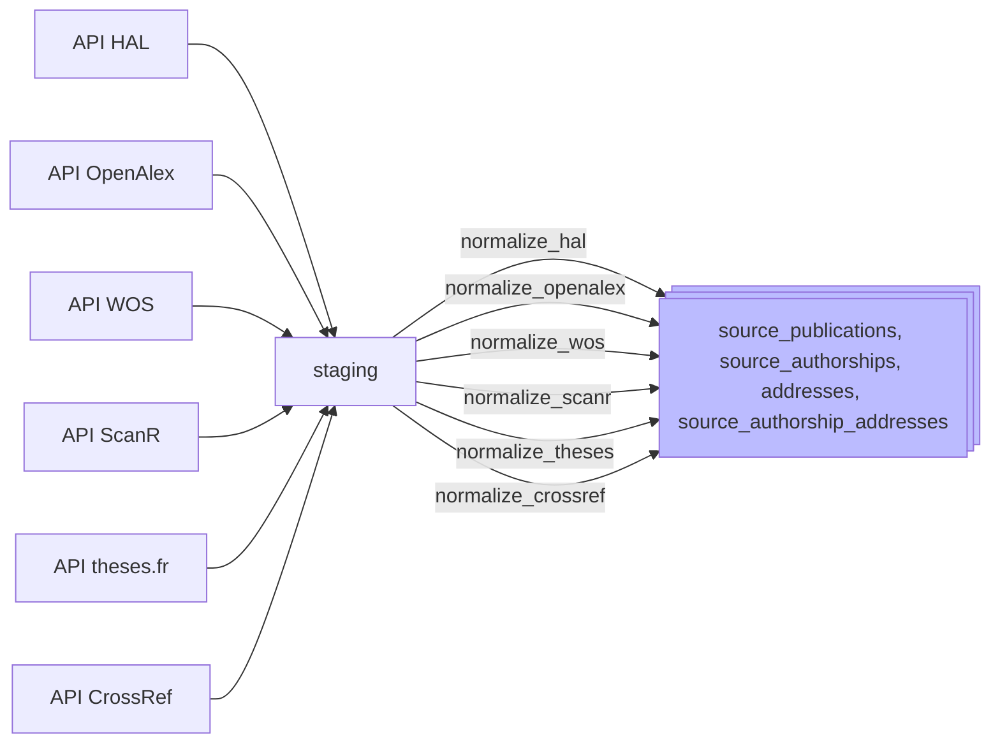
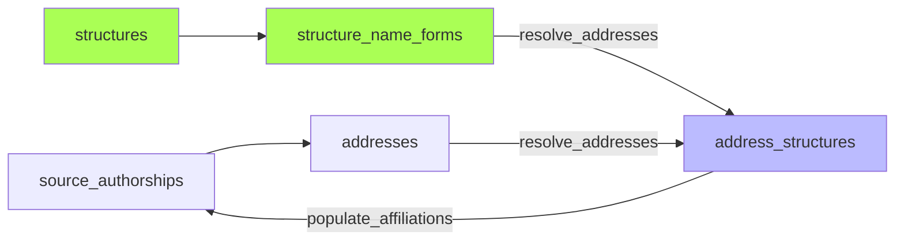
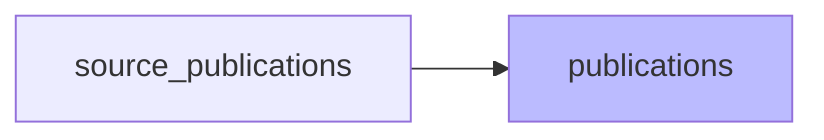
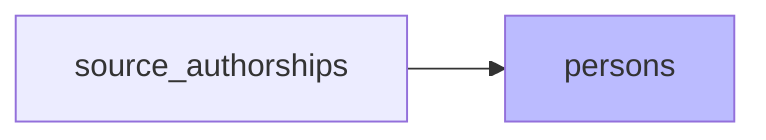
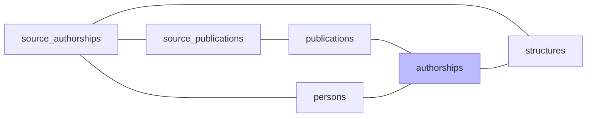
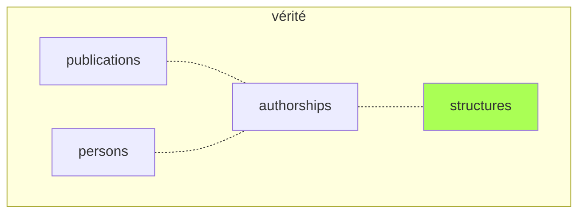
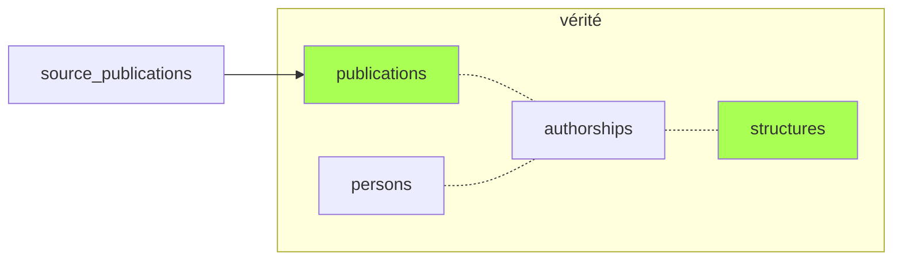
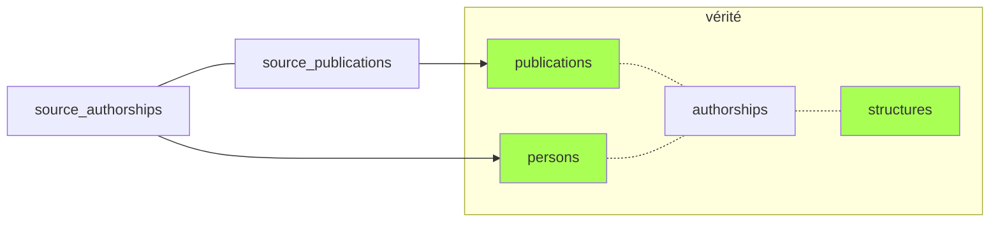
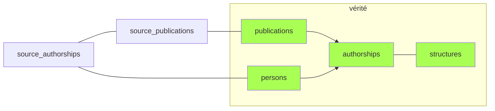

# Pipeline de traitement — Bibliométrie UCA

*Document à jour au 2026-05-13.*

Ce fichier présente la logique du pipeline de traitement. Pour les modalités d'exécution, voir [Guide d'exploitation](exploitation#pipeline).

## Vue d'ensemble

Le peuplement de la base s'effectue via un *pipeline* composé des étapes suivantes :

### Moissonnage
- [Moissonnage](#extract) : récupère les données brutes depuis les API et les stocke en JSONB dans la table de *staging*.
- [Cross-imports](#cross_imports) : deux mécanismes de rattrapage cross-source enchaînés — (1) docs HAL manquants repérés par hal-id ou NNT dans d'autres sources, (2) recherche par DOI des records absents d'une source mais présents dans une autre.

### Normalisation
- [Normalisation](#normalize) : transforme les données brutes (*staging*) en tables structurées *par source* (`source_publications`, `source_authorships`). Crée également les `addresses` et leurs liens `source_authorship_addresses`.

### Repérage des affiliations
- [Affiliations](#affiliations) : résout les adresses → structures via les formes de noms (`structure_name_forms`), puis renseigne `in_perimeter` et `structure_ids` sur les [authorships](glossaire#authorship) sources.

### Création/rattachement des publications
- [Publications](#publications) : peuple la table canonique `publications` à partir des publications sources *via* les authorships sources ayant `in_perimeter = true`. Dédoublonne.

### Création/rattachement des personnes
- [Personnes](#persons) : peuple la table canonique `persons` et ses tables satellites `person_name_forms` et `person_identifiers` (ORCID, idHAL, IdRef) *via* les authorships sources ayant `in_perimeter = true`. Mappe les authorships sources aux `person_id` créées.
- [Authorships](#authorships) : peuple la table canonique `authorships` (liens entre `publications` canoniques et `persons` canoniques) à partir des `person_id` référencés dans les authorships sources.

### Enrichissements divers
- [Pays](#countries) : détection automatisée des pays des adresses. Utile pour interroger les collaborations internationales.
- [Sujets](#subjects) : deux étapes enchaînées — (1) ingestion des sujets/mots-clés des `source_publications` vers les tables canoniques `subjects` et `publication_subjects`, (2) recalcul de `subjects.usage_count` + table `subject_cooccurrences` (paires de sujets co-présents sur une même publication).
- [Statut open access et APC](#enrich) : statut OA via Unpaywall (plus à jour que les sources) ; montant APC par revue via OpenAlex Sources.

## Phases détaillées

### `extract` : Moissonnage

Récupère les données brutes depuis les API et les stocke en JSONB dans le *staging*.

**Critères de requête**:
- **années** de publication (configurables dans admin/config : *weekly* couvre les années n et n-1, *full* fait une repasse complète sur les années n-5 à n);
- **affiliation** des publications (UCA, CHU, INP). Il s'agit des affiliations *telles qu'elles sont renseignées dans chaque source*. Elles peuvent varier d'une source à l'autre et être incomplètes ou erronées. Ce point est géré dans les étapes ultérieures.

**Gestion des changements**:
- Chaque *record* est hashé (MD5) pour détecter les changements lors des réexécutions. Une publication dont les métadonnées ont changé sera ré-importée et re-traitée.
- Même sans changement, la colonne `last_seen_at` documente la dernière date où une publication a été détectée par le script d'import. En cas de disparition d'une publication dans les sources (par ex. dédoublonnage dans HAL), cette colonne permettra de détecter les suppressions et de nettoyer la base. Rien n'est en place pour l'instant.
<!-- TODO: Mettre en place le process pour détecter les publications disparues et les nettoyer de la base (ou les archiver?). -->

**Cas particulier**:

L'API OpenAlex limite les authorships à 100 par publication dans les requêtes *bulk*. Un *refetch* individuel des publications avec 100 authorships est nécessaire.

**`refetch_truncated.py`** — re-télécharge un par un les works OpenAlex tronqués à 100 auteurs.
Pour éviter d'écraser ces publications lors de l'import suivant, un *hash* est calculé en faisant abstraction des authorships.
<!-- TODO: Tester que le meta_hash fonctionne effectivement et que les publis de >100 auteurs ne sont pas écrasées au réimport. -->

### `cross_imports` : Rattrapage cross-source

Deux étapes enchaînées, chacune adressant un cas distinct de "doc visible dans une source mais absent d'une autre".

**Étape 1 — `fetch_missing_hal_id` : HAL ids manquants.**
Télécharge depuis HAL les documents référencés (par hal-id ou NNT) dans d'autres sources mais absents de notre staging HAL. Code dans `infrastructure/sources/hal/fetch_missing_hal_id.py`. Auto-borné, tourne dans tous les modes : les hal-ids/NNT introuvables sont marqués `not_found=TRUE` dans staging et ne sont jamais re-interrogés (HAL = source native pour les hal-ids, un 404 est définitif).

**Étape 2 — `fetch_missing_doi` : DOI manquants par source.**
Pour chaque source cible (OpenAlex, HAL, WoS, ScanR, Crossref), recherche par DOI les records trouvés dans les autres sources mais absents de celle-ci. La plupart sont effectivement absents ; certains sont repêchés (cause : affiliations différentes selon source). Dispatcher dans `interfaces/cli/pipeline/fetch_missing_doi.py`, adapter par source dans `infrastructure/sources/<source>/fetch_missing_doi.py`. Sources cibles et scope (`unprocessed` vs `all`) déterminés par la policy du mode (cf. `domain/pipeline_modes.py`).

**Pourquoi les deux étapes ont des règles de scope différentes** : le pool de hal-ids/NNT à re-tenter est *fini par construction* (un hal-id non trouvé sort définitivement du pool via `not_found=TRUE`). À l'inverse, le pool de DOI à cross-importer est potentiellement non borné dans le modèle actuel — les DOI 404 chez HAL/OpenAlex/WoS/ScanR ne sont pas tracés, donc retentés à chaque run. D'où la scope policy : daily/weekly se limite aux DOI jamais tentés (`unprocessed`), full ré-essaie aussi les anciens (`all`), et WoS est exclu hors `full` à cause de son quota API contractuel.

Cette asymétrie disparaîtra avec le chantier [`DATA_cycle-vie-staging.md`](chantiers/DATA_cycle-vie-staging.md) : un backoff temporel (`not_found_at` + `next_retry`) sur les sources non natives rendra le pool DOI également auto-borné et convergent.

### `normalize` : Normalisation

Transforme les données brutes (staging) en tables structurées par source (`source_publications`, `source_authorships`). Crée également les `addresses` et les liens `source_authorship_addresses` via le port `AddressLinker` (les adresses brutes extraites de chaque authorship sont dédoublonnées dans la table canonique `addresses`). Pas d'adresses brutes dans HAL → on utilise la chaîne de caractères du nom de la structure et on la traite fictivement comme une adresse.
> **TODO :** filtrage à mettre en place côté UI pour ne pas afficher les pseudo-adresses de source HAL dans les onglets "adresses".

### `affiliations` : Résolution et propagation

Deux sous-étapes enchaînées :

1. **`resolve_addresses`** — matche les adresses normalisées avec les formes de nom des structures (`structure_name_forms`). Résultat dans `address_structures` (avec `matched_form_id` pour la traçabilité). Code applicatif : `application/pipeline/affiliations/resolve_addresses.py`, entry point CLI : `interfaces/cli/pipeline/resolve_addresses.py`.
2. **`populate_affiliations`** — calcule `in_perimeter` et `structure_ids` sur les `source_authorships` à partir des `address_structures`. Code applicatif : `application/pipeline/affiliations/populate_affiliations.py`.

Deux périmètres :
- **Restreint** (UCA + labos UCA) → détermine `in_perimeter` (bool)
- **Large** (restreint + CHU, INP…) → détermine `structure_ids`

Périmètre centralisé dans `infrastructure/perimeter.py` (port : `application/ports/perimeter.py`).

> **TODO :** documenter plus précisément la logique de `resolve_addresses`.

### `publications` : Peuplement de la table Publications

Les publications sources sont mappées aux publications canoniques:
- par **DOI** (même DOI = même publi, sauf cas particuliers).
- par **NNT** (numéro national de thèse)
- par **hal-id** (un document OpenAlex ou ScanR qui référence un document HAL)

Les cas douteux (métadonnées identiques ou similaires) sont préservés et sont fusionnés manuellement via la page admin/duplicates.

> **Evolutions envisagées**
> - Ajouter de nouveaux identifiants pouvant servir de clé de déduplication: pmid (Pubmed)...
> - Affiner la détection de DOI faussement distincts référençant le même document (DOI versionnés, concept DOI...)
> - Développer un algorithme de déduplication par identité de métadonnées. Piégeux: beaucoup de cas limites ou difficiles. Logique à soigner.

### `persons` : Rattachement et création de personnes

`create_persons_from_source_authorships` — algorithme en 3 étapes :

> **Etape initiale à ajouter** : matching par ORCID attesté dans les métadonnées Crossref (= source auteur garantie => meilleur critère possible)

1. **Même nom + même publication + même position auteur** : pour chaque authorship sans `person_id`, cherche sur la même publication (même position) une *authorship* d'une **autre source** déjà rattachée à une personne. Si le nom est compatible → rattacher. Approche conservatrice (requiert position identique dans la liste des auteurs. TODO : voir si cette condition peut être assouplie sans perte de qualité).

> **Limité aux publications de 50 auteurs max** : les méga-papers (plusieurs centaines voire milliers d'auteurs) contiennent souvent des homonymes + l'initiale au lieu du prénom + de fréquents désalignements de position auteur entre sources, pouvant conduire à de faux rattachemements.

2. **Identifiant Idref/ORCID connu** : si l'authorship est liée à un ORCID ou un IdRef déjà présent en base (table `person_identifiers`, avec `status ≠ rejected`) → rattacher. Priorité aux IdRef. Les ORCID/IdRef sont lus depuis la colonne JSONB `source_authorships.person_identifiers`.

> Les ORCID provenant de métadonnées OpenAlex ou WoS sont souvent douteux. Ils sont liés à l'entité du référentiel personnes propre à chaque base, mais ces entités sont peu fiables. L'ORCID est généralement absent de la publication : c'est donc un matching algorithmique qui a permis d'associer tel ORCID à tel auteur d'une publication. Étudier la pertinence de conserver cette étape du matching.

3. **Recherche par nom** : lookup par nom normalisé dans `person_name_forms`.
   - Nom mappé à 1 personne → rattacher
   - Nom mappé à >1 personnes → laisser orphelin (pour traitement manuel via `admin/orphan-authorships`)
   - **Nom inconnu → créer nouvelle personne**

`populate_person_name_forms` — recalcule les formes de nom depuis les sources (HAL, OpenAlex, WoS, ScanR, theses, CrossRef).
- Lors de la création d'une personne (ou d'une correction manuelle du nom/prénom) : génération automatique des variantes normalisées "prénom nom", "nom prénom", "initiales nom", "nom initiales".
- Lors d'un rattachement d'authorship : les formes de nom liées sont ajoutées aux name_forms de cette personne.

Fonctions de compatibilité de noms dans `domain/names.py`.

**Identifiants par observation** : les identifiants normalisés
(`orcid`, `idhal`, `idref`, `hal_person_id`, `researcher_id`) sont
portés au niveau de chaque `source_authorships` dans la colonne
JSONB `person_identifiers` — pas d'agrégation côté sources. Le
référentiel canonique consolidé vit sur la table `person_identifiers`
(alimentée par le pipeline personnes).

### `authorships` : Construction des authorships canoniques

`build_authorships` construit la table `authorships` en 4 étapes :

1. **Insertion** des paires (publication_id, person_id) manquantes, depuis les `source_authorships` non exclues (toutes sources : HAL, OpenAlex, WoS, ScanR, theses, CrossRef)
2. **FK** : rattache chaque `source_authorships` à son authorship canonique via `source_authorships.authorship_id`
3. **Métadonnées** : propage `author_position` et `is_corresponding` selon `SOURCE_PRIORITY` (theses > CrossRef > ScanR > HAL > OpenAlex > WoS)
4. **UCA** : propage `in_perimeter` et `structure_ids` depuis toutes les sources (union, déjà calculées dans la phase [affiliations](#affiliations))

Les authorships sources marquées `excluded = TRUE` sont ignorées à toutes les étapes. Les publications de type `peer_review` et `memoir` (cf. `OUT_OF_SCOPE_DOC_TYPES` dans `domain/publications/scope.py`) sont exclues de la propagation UCA.

### `countries` : Pays des publications

Trois étapes enchaînées :

1. **`interfaces/cli/pipeline/detect_address_countries.py`** : détection automatique du pays des adresses sans pays. Parse le dernier segment après la dernière virgule et le matche contre la table `country_name_forms` (276 formes, 140 pays, variantes anglais/français/codes ISO/abréviations WoS). Rapide et fiable.

2. **`interfaces/cli/pipeline/suggest_address_countries.py`** : pour les adresses restantes (pays absent du dernier segment), cherche une adresse similaire avec pays connu via LIKE sur le texte normalisé (index trigramme). Plus lent, résultats stockés dans `suggested_countries` pour validation manuelle via l'interface admin.

3. **`interfaces/cli/pipeline/refresh_publication_countries.py`** : recalcule `publications.countries` comme union des `source_publications.countries` de toutes les sources rattachées à chaque publication canonique.

### `subjects` : Sujets, mots-clés et co-occurrences

Deux étapes enchaînées, indissociables (l'une sans l'autre n'a pas de sens).

**Étape 1 — Ingestion.**
Pour chaque source : purge les liens `publication_subjects` existants pour cette source (idempotence), puis ré-ingère les sujets/mots-clés des `source_publications` rattachées à une publication canonique. Dispatch par source dans `application/pipeline/subjects/ingest_<source>.py` ; un `SubjectCache` partagé évite les UPSERT répétés sur les sujets récurrents.

Le référentiel `subjects` n'est jamais purgé : un sujet peut rester orphelin si plus aucune publication ne le référence (historique des labels observés).

**Étape 2 — Co-occurrences.**
Recalcule depuis `publication_subjects` :
1. `subjects.usage_count` — nombre de publications distinctes par sujet.
2. `subject_cooccurrences` — paires de sujets co-présents sur une même publication, avec leur effectif. Filtré par `min_count >= 2` par défaut pour borner la cardinalité.

Idempotent : le résultat ne dépend que de l'état courant de `publication_subjects`.

### `enrich` : Enrichissements optionnels

Exécutée uniquement en mode `full` :

| Script | Rôle |
|--------|------|
| `interfaces/cli/pipeline/enrich_oa_status.py` | Statut *open access* via API [Unpaywall](glossaire#unpaywall) => souvent plus à jour que le statut renseigné dans les sources |
| `interfaces/cli/pipeline/enrich_journal_apc.py` | Montant APC par revue via API OpenAlex Sources => **ne sert à rien pour l'instant**, voir si on garde ou pas |

## Résumé: Peuplement des tables canoniques

1. Les **structures** préexistent au pipeline.

2. La phase [`publications`](#publications) peuple la table **publications** à partir des publications sources.

3. Après repérage des affiliations dans les authorships sources, la phase [`persons`](#persons) crée les **personnes** correspondant aux *authorships* UCA (ou les rattache aux personnes existantes).

4. Les **authorships** canoniques sont déduites à partir des sources dans la phase [`authorships`](#authorships). L'information (`person_id`, `structure_ids`) présente dans les *authorships* sources est donc répliquée dans la table *authorships* canonique, pour deux raisons :
    - optimiser les requêtes;
    - servir de source d'autorité ultime en cas d'erreur dans une des sources (une *authorship* source peut être `excluded`).

