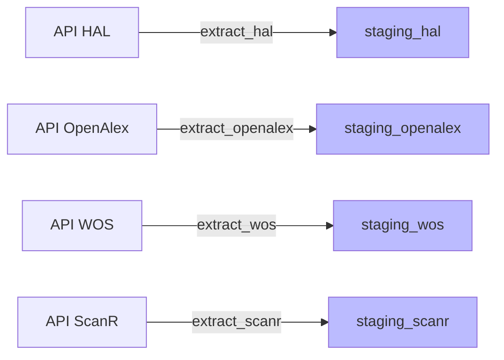
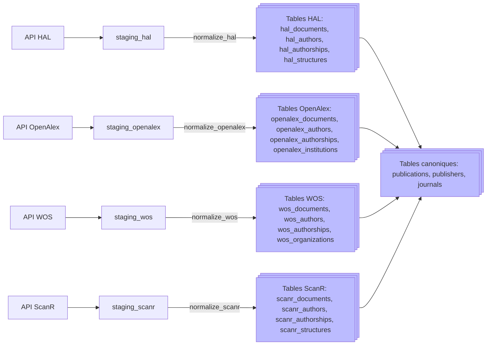
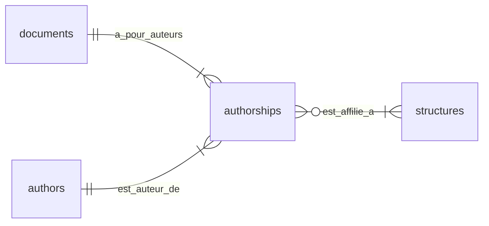
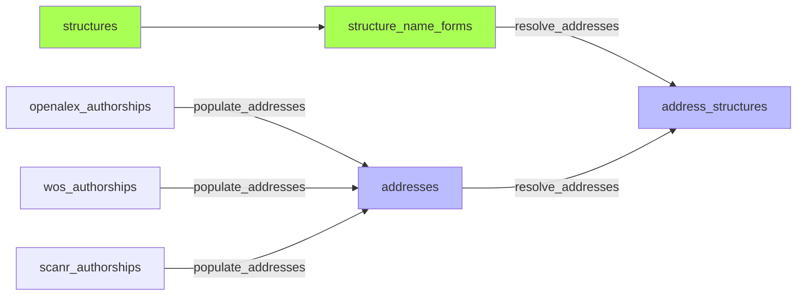
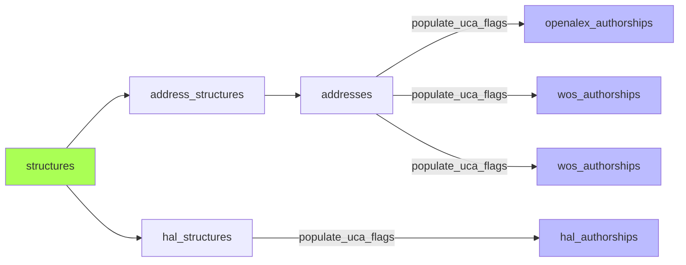
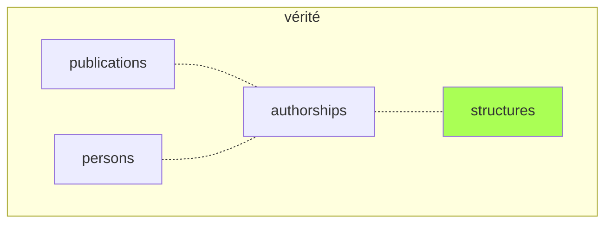
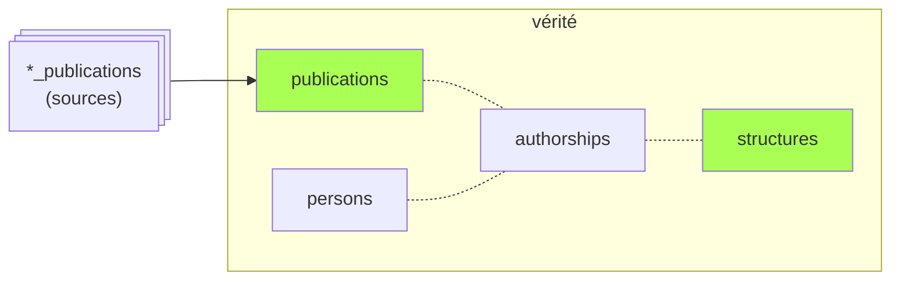
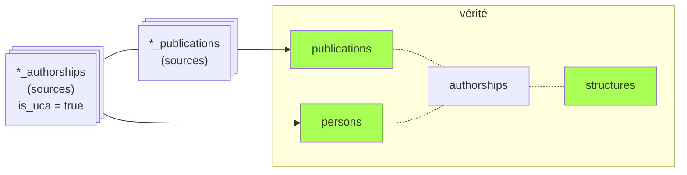
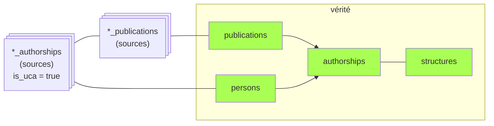

# Pipeline de traitement — Bibliométrie UCA

## Vue d'ensemble

Le peuplement de la base s'effectue en 10 étapes:

- **Moissonnage**: Récupère les données brutes depuis les API et les stocke en JSONB dans les tables de *staging*.
- **Cross-imports**: Tente de combler les lacunes par des imports croisés ciblés (documents HAL référencés par OpenAlex mais absents de notre import HAL; recherche ciblée des DOI manquant dans chaque source)
- **Normalisation**: Transforme les données brutes (*staging*) en tables structurées *par source*: `*_publications`, `*_authors`, `*_authorships`, `*_structures`. Peuple la table canonique `publications`  à partir des publications sources.
- **Adresses**: Peuple la table `addresses` à partir des adresses brutes associées aux [authorships](glossaire#authorship) OpenAlex et WOS. Résout les affiliations des adresses à l'aide des formes de noms associées aux structures canoniques.
- **Flag UCA**: Renseigne le bool `is_uca` et les `structure_ids` des authorships sources. (A partir des adresses pour OpenAlex et WOS, à partir du mapping des structures pour HAL.)
- **Identifiants**: Enrichit la table `hal_authors` (ORCID, IdRef) à partir de l'API Auteurs de HAL.
- **Personnes**: Peuple la table canonique `persons` et ses tables satellites `person_name_forms` et `person_identifiers` (ORCID, idHAL, IdRef) *via* les authorhips souces ayant `is_uca` = true. Mappe les authorships sources aux `person_id` créées.
- **Authorships**: Peuple la table canonique `authorships` (liens entre `publications` canoniques et `persons` canoniques) à partir des `person_id` référencés dans les authorships sources.
- **Pays** des adresses. Utile pour interroger les collaborations internationales.
- **Enrichissements** divers (API Unpaywall...)

## Exécution

```bash
# Pipeline complet
python run_pipeline.py

# Reprise à partir d'une phase
python run_pipeline.py --from persons

# Une seule phase
python run_pipeline.py --only authorships

# Dry-run (affiche le plan sans exécuter)
python run_pipeline.py --dry-run

# Mode hebdomadaire (incrémental, 6 derniers mois)
python run_pipeline.py --mode weekly

# Lister les phases disponibles
python run_pipeline.py --list
```

**Modes :**
- `full` : pipeline complet avec cross-imports et enrichissements
- `monthly` : pipeline complet (cross-imports inclus)
- `weekly` : incrémental (années récentes, pas de cross-imports ni enrichissements)


## Phases détaillées

### Phase 1 — `extract` : Moissonnage

Récupère les données brutes depuis les API et les stocke en JSONB dans les tables de *staging*.



**Critères de requête**:
- **années** de publication (2 modes, configurables dans admin/config: *weekly*: années n et n-1; *monthly*: repasse complète sur les années n-5 à n);
- **affiliation** des publications (UCA, CHU, INP). Il s'agit des affiliations *telles qu'elles sont renseignées dans chaque source*. Elles peuvent varier d'une source à l'autre et être incomplètes ou erronées. Ce point est géré dans les étapes ultérieures.

**Gestion des changements**:
- Chaque *record* est hashé (MD5) pour détecter les changements lors des réexécutions. Une publication dont les métadonnées ont changé sera ré-importée et re-traitée.
- Même sans changement, la colonne `last_seen_at` documente la dernière date où une publication a été détectée par le script d'import. En cas de disparition d'une publication dans les sources (par ex. dédoublonnage dans HAL), cette colonne permettra de détecter les suppressions et de nettoyer la base. Rien n'est en place pour l'instant.
<!-- TODO: Mettre en place le process pour détecter les publications disparues et les nettoyer de la base (ou les archiver?). -->

**Cas particulier**:

L'API OpenAlex limite les authorships à 100 par publication. Un *refetch* ciblé des publications avec 100 authorships est nécessaire.

**`refetch_truncated.py`** — re-télécharge un par un les works OpenAlex tronqués à 100 auteurs.
Pour éviter d'écraser ces publications lors de l'import suivant, un *hash* est calculé en faisant abstraction des authorships.
<!-- TODO: Tester que le meta_hash fonctionne effectivement et que les publis de >100 auteurs ne sont pas écrasées au réimport. -->

### Phase 2 — `cross_imports` : Re-moissonnages croisés

Comble certaines lacunes dans les données moissonnées.

1. **`fetch_missing_hal.py`** — télécharge depuis HAL les documents référencés comme source par des works OpenAlex mais absents de notre staging.
2. **`cross_import_openalex.py`, `cross_import_hal.py`, `cross_import_wos.py`, `cross_import_scanr.py`** — cherche dans chaque source les DOI trouvés dans les autres mais non trouvés dans cette source; la plupart sont effectivement absents, mais beaucoup sont repêchés (cause: affiliations différentes selon source).

### <span id='normalize'></span>Phase 3 — `normalize` : Normalisation

Transforme les données brutes (staging) en tables structurées par source.



Le processus de normalisation peuple non seulement les tables sources, mais aussi la table canonique **publications** et ses tables satellites **publishers** et **journals**.

Les publications sont fusionnées:
- par **identité de DOI** (même DOI = même publi, sauf cas particuliers).
- par **référence directe** (un document OpenAlex qui pointe vers un document HAL comme sa source)
- par **identité de métadonnées**, seulement pour les documents de type *article* (mêmes titre, journal, année…) (TODO compléter)

Les cas douteux sont préservés et sont fusionnés manuellement via la page admin/duplicates.

#### Relations internes des tables dans chaque source

Les tables sources sont indépendantes les unes des autres et s'organisent selon un schéma toujours identique:



<!-- TODO: Tables `publisher_name_forms` et `journal_name_forms` pour gérer les formes de noms multiples en l'absence d'identifiant unique (ISSN pour les journals): "Elsevier", "Elsevier BV"; "JHEP", "Journal of High Energy Particles" -->

### Phase 4 — `addresses` : Adresses et affiliations

Cette étape extrait les adresses brutes des authorships sources (OpenAlex, WoS, ScanR) et les relie aux structures. (Pour le détail des différences de gestion des affiliations d'une source à l'autre: cf [doc sources](sources#sources-affiliations))



1. **`populate_addresses.py`** — split les `raw_affiliation` (séparateur ` | `) en adresses individuelles, déduplique dans la table `addresses`, crée les liens `*_authorship_addresses`
2. **`resolve_addresses.py`** — matche les adresses normalisées avec les formes de nom des structures (`structure_name_forms`). Résultat dans `address_structures`


### <span id='uca_flags'></span>Phase 5 — `uca_flags` : Flags UCA

Script : `processing/populate_uca_flags.py`



Calcule `is_uca` et `structure_ids` sur les authorships des 3 sources :
- **HAL** : `hal_struct_ids` → mapping via `hal_structures.structure_id` → `structure_ids`, puis vérification contre le périmètre UCA restreint → `is_uca`
- **OpenAlex / WoS** : via `address_structures` (adresses résolues) → même logique

Deux périmètres :
- **Restreint** (UCA + labos UCA) → détermine `is_uca` (bool)
- **Large** (restreint + CHU, INP…) → détermine `structure_ids`

Périmètre centralisé dans `utils/uca_perimeter.py`.


### Phase 6 — `identifiers` : Moissonnage identifiants HAL

Script : `processing/harvest_hal_identifiers.py`

Interroge l'API `ref/author` de HAL pour récupérer les ORCID et IdRef des `hal_authors` avec `hal_person_id`. Met à jour `hal_authors` et `person_identifiers`.

Placée avant la phase `persons` pour que la création de personnes dispose des identifiants. Les ORCID du staging HAL (`authOrcid_s`) sont déjà exploités à la normalisation (phase 2) ; ce script complète avec les ORCID qui ne sont pas dans les métadonnées des publications, + les identifiants IdRef. <!--TODO: vérifier s'il n'y a pas des idref dans le staging de HAL.-->

Exécutée en mode `full` et `monthly` uniquement.

L'opération équivalente ne serait pas pertinente sur les autres sources:
- les `openalex_authors` et `wos_authors` sont des entités créées de manière algorithmique et peu fiable (fréquent saucissonnage d'un auteur en entités multiples; parfois fusion de plusieurs personnes dans la même entité). Les `hal_authors` moissonnés correspondent à des comptes HAL réels, et les identifiants qui y sont associés ont été ajoutés directement par les chercheurs.

<!--TODO: Vérifier si l'API Personnes de ScanR apporte une plus-value par rapport aux données récupérées avec les métadonnées des documents.-->


### <span id='creation-personnes'></span>Phase 7 — `persons` : Création de personnes

**`create_persons_from_source_authorships.py`** — algorithme en 4 étapes :

1. **Comptes HAL** : les `hal_authors` avec `hal_person_id` (= entités fiables, cf [doc sources](sources#entites-auteurs)) sont rattachés ou créent une personne. Propagation aux authorships liées. Récupération ORCID, idHAL, IdRef éventuellement liés au compte.
2. **Même nom + même publication + même position auteur** : pour chaque authorship sans person_id, cherche sur la même publication (même position) une authorship d'une autre source déjà rattachée à une personne. Si le nom est compatible → rattacher. Approche conservatrice (requiert position identique dans la liste des auteurs).
3. **ORCID connu** : si l'authorship est liée à un ORCID déjà présent en base (`person_identifiers`, status != rejected) et mappé à une personne → rattacher.
4. **Recherche par nom** : lookup par nom normalisé dans `person_name_forms`.
   - Nom mappé à 1 personne → rattacher
   - Nom mappé à >1 personnes → laisser orphelin (pour traitement manuel dans admin/orphan-authorships)
   - Nom inconnu → créer nouvelle personne

**`populate_person_name_forms.py`** — recalcule les formes de nom depuis les 4 sources (persons, HAL, OpenAlex, WoS). Pour chaque personne, génère les variantes : "prénom nom", "nom prénom", "initiales nom", "nom initiales".

Fonctions de compatibilité de noms dans `utils/names.py`.


### <span id='authorships'></span>Phase 8 — `authorships` : Construction des authorships canoniques

**`build_authorships.py`** construit la table `authorships` en 4 étapes :

1. **Insertion** des paires (publication_id, person_id) manquantes, depuis les authorships sources non exclues
2. **FK** : rattache chaque authorship canonique à ses authorships sources (`hal_authorship_id`, `openalex_authorship_id`, `wos_authorship_id`)
3. **Métadonnées** : propage `author_position` et `is_corresponding`
4. **UCA** : propage `is_uca` et `structure_ids` depuis les 3 sources (union). Même logique pour les 3 sources (déjà calculées par `populate_uca_flags.py`).

Les authorships sources marquées `excluded = TRUE` sont ignorées à toutes les étapes. Les publications de type `peer_review` sont exclues de la propagation UCA.


### Phase 9 — `countries` : Pays des publications

Trois scripts enchaînés :

1. **`scripts/detect_address_countries.py`** : détection automatique du pays des adresses sans pays. Parse le dernier segment après la dernière virgule et le matche contre la table `country_name_forms` (276 formes, 140 pays, variantes anglais/français/codes ISO/abréviations WoS). Rapide et fiable (seul le dernier segment est analysé, pas de faux positif).

2. **`scripts/suggest_address_countries.py`** : pour les adresses restantes (pays absent du dernier segment), cherche une adresse similaire avec pays connu via LIKE sur le texte normalisé. Plus lent, résultats stockés dans `suggested_countries` (validation manuelle via l'interface admin).

3. **`processing/refresh_publication_countries.py`** : recalcule `publications.countries` en faisant l'union des pays des 4 sources (HAL via structures, OpenAlex/WoS/ScanR via adresses résolues).

### Phase 10 — `enrich` : Enrichissements optionnels

Exécutée uniquement en mode `full` et `monthly` :

| Script | Rôle |
|--------|------|
| `processing/enrich_oa_unpaywall.py` | Statut OA via API Unpaywall |
| `processing/enrich_journal_apc.py` | Coûts APC via API OpenAlex Sources |

## <span id='tables-canoniques'></span>Peuplement des tables canoniques


1. Les **structures** préexistent au pipeline.



2. La [phase 3](#normalize) (`normalize`) peuple la table **publications** par mapping et fusion à partir des publications sources.



3. Après repérage des affiliations dans les authorships sources, la [phase 7](#creation-personnes) `persons` crée les **personnes** correspondant aux *authorships* UCA (ou les mappe aux personnes existantes).



4. Les **authorships** canoniques sont déduites à partir des sources dans la [phase 8](#authorships) (`authorships`). L'information (`person_id`, `structure_ids`) est donc répliquée dans la table canonique, pour deux raisons:
- simplifier les requêtes;
- servir de source d'autorité ultime en cas d'erreur dans une des sources (une authorship source peut être `excluded`).




## Utilitaires partagés

| Module | Contenu |
|--------|---------|
| `utils/doi.py` | `clean_doi` — nettoyage DOI |
| `utils/hal.py` | `extract_hal_id_from_url`, `HAL_FIELDS` — constantes et utilitaires HAL |
| `utils/names.py` | `names_compatible`, `parse_raw_author_name` — compatibilité de noms |
| `utils/normalize.py` | `normalize_text`, `normalize_name` — normalisation texte |
| `utils/uca_perimeter.py` | `get_uca_structure_ids`, `get_uca_structure_ids_wide` — périmètre UCA |
| `utils/log.py` | `setup_logger` — configuration logging avec fichier |
| `extraction/common.py` | `compute_hash`, `get_existing_ids` — fonctions d'extraction |
| `services/persons.py` | Création, rattachement, identifiants, formes de noms |
| `services/publications.py` | `find_or_create`, déduplication par DOI + titre |
| `services/journals.py` | Publishers, journals, APC |
