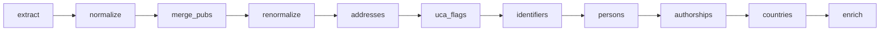

# Pipeline de traitement — Bibliométrie UCA

Le pipeline transforme les données brutes des 3 sources bibliographiques (HAL, OpenAlex, Web of Science) en un référentiel dédupliqué de publications, personnes et authorships.

## Vue d'ensemble

```
Sources externes          Staging (brut)           Source (normalisé)         Vérité
────────────────         ──────────────           ──────────────────         ──────

API HAL ──────────→ staging_hal ──────→ hal_documents ─────────────┐
                                        hal_authors                │
                                        hal_authorships            ├──→ publications
                                                                   │
API OpenAlex ─────→ staging_openalex ─→ openalex_documents ────────┤    persons
                                        openalex_authors           │    person_name_forms
                                        openalex_authorships       ├──→ person_identifiers
                                                                   │
API/fichiers WoS ─→ staging_wos ──────→ wos_documents ────────────┤    authorships
                                        wos_authors                │
                                        wos_authorships ───────────┘
```

## Exécution

```bash
# Pipeline complet
python run_pipeline.py

# Reprise à partir d'une phase
python run_pipeline.py --from persons

# Une seule phase
python run_pipeline.py --only authorships

# Dry-run (affiche le plan sans exécuter)
python run_pipeline.py --dry-run

# Mode hebdomadaire (incrémental, 6 derniers mois)
python run_pipeline.py --mode weekly

# Lister les phases disponibles
python run_pipeline.py --list
```

**Modes :**
- `full` : pipeline complet avec cross-imports et enrichissements
- `monthly` : pipeline complet (cross-imports inclus)
- `weekly` : incrémental (années récentes, pas de cross-imports ni enrichissements)


## Phases détaillées

### Phase 1 — `extract` : Moissonnage

Récupère les données brutes depuis les API et les stocke en JSONB dans les tables staging. Chaque record est hashé (MD5) pour détecter les changements lors des réexécutions.

| Source | Script | Table cible |
|--------|--------|-------------|
| HAL | `extraction/hal/extract_hal.py` | `staging_hal` |
| OpenAlex | `extraction/openalex/extract_openalex.py` | `staging_openalex` |
| WoS | `extraction/wos/extract_wos.py` | `staging_wos` |

HAL est extrait en deux passes : par collection labo, puis via le portail global (pour attraper les publications hors collection).

Mode `weekly` : ne moissonne que les années récentes, WoS exclu.

Fonctions partagées dans `extraction/common.py` : `compute_hash`, `clean_doi`, `get_existing_ids`, `setup_logger`.


### Phase 2 — `normalize` : Normalisation

Transforme les données brutes (staging) en tables structurées par source.

| Script | Entrée | Sorties |
|--------|--------|---------|
| `processing/normalize_openalex.py` | `staging_openalex` | `openalex_documents`, `openalex_authors`, `openalex_authorships`, `openalex_institutions` |
| `processing/normalize_hal.py` | `staging_hal` | `hal_documents`, `hal_authors`, `hal_authorships` |
| `processing/normalize_wos.py` | `staging_wos` | `wos_documents`, `wos_authors`, `wos_authorships` |
| `processing/enrich_hal_structures.py` | API HAL ref/structure | `hal_structures` (métadonnées, pays) |

Chaque normalisation :
- Crée/retrouve les publishers et journals (tables partagées)
- Crée/retrouve les publications via `services/publications.py` (déduplication par DOI + titre)
- Extrait les auteurs et authorships avec identifiants (ORCID depuis `authOrcid_s` pour HAL)
- Calcule `author_name_normalized` via la fonction SQL `normalize_name_form()`


### Phase 3 — `merge_pubs` : Fusion inter-sources

Déduplique les publications entre les sources et effectue les cross-imports.

1. **`merge_hal_openalex_pubs.py`** — fusionne HAL ↔ OpenAlex quand un work OA pointe vers un document HAL (même `landing_page_url`)
2. **`fetch_missing_hal.py`** — télécharge depuis HAL les documents référencés par OpenAlex mais absents de notre staging
3. **`cross_import_openalex.py`** — cherche dans OpenAlex les DOI trouvés dans HAL/WoS
4. **`refetch_truncated.py`** — re-télécharge les works OpenAlex tronqués à 100 auteurs


### Phase 3b — `renormalize` : Re-normalisation

Re-normalise les records OpenAlex et HAL nouvellement importés par les cross-imports.


### Phase 4 — `addresses` : Adresses et affiliations

Extrait les adresses brutes des authorships sources (OpenAlex, WoS) et les résout en structures. HAL n'a pas d'adresses (les affiliations passent par `hal_struct_ids`).

1. **`populate_addresses.py`** — split les `raw_affiliation` (séparateur ` | `) en adresses individuelles, déduplique dans la table `addresses`, crée les liens `*_authorship_addresses`
2. **`resolve_addresses.py`** — matche les adresses normalisées avec les formes de nom des structures (`structure_name_forms`), en tenant compte du contexte (tutelles). Résultat dans `address_structures`


### Phase 5 — `uca_flags` : Flags UCA

Script : `processing/populate_uca_flags.py`

Calcule `is_uca` et `structure_ids` sur les authorships des 3 sources :
- **HAL** : `hal_struct_ids` → mapping via `hal_structures.structure_id` → `structure_ids`, puis vérification contre le périmètre UCA restreint → `is_uca`
- **OpenAlex / WoS** : via `address_structures` (adresses résolues) → même logique

Deux périmètres :
- **Restreint** (UCA + labos tutellés) → détermine `is_uca`
- **Large** (restreint + partenaires CHU, INP…) → détermine `structure_ids`

Périmètre centralisé dans `utils/uca_perimeter.py`.


### Phase 5b — `identifiers` : Moissonnage identifiants HAL

Script : `processing/harvest_hal_identifiers.py`

Interroge l'API `ref/author` de HAL pour récupérer les ORCID et IdRef des `hal_authors` avec `hal_person_id`. Met à jour `hal_authors` et `person_identifiers`.

Placée avant la phase `persons` pour que la création de personnes dispose des identifiants. Les ORCID du staging HAL (`authOrcid_s`) sont déjà exploités à la normalisation (phase 2) ; ce script complète avec ceux qui ne sont pas dans les métadonnées des publications.

Exécutée en mode `full` et `monthly` uniquement.


### <span id='creation-personnes'></span>Phase 6 — `persons` : Création de personnes

**`create_persons_from_source_authorships.py`** — algorithme en 4 étapes :

1. **Comptes HAL** : les `hal_authors` avec `hal_person_id` sont rattachés ou créent une personne. Propagation aux authorships liées. Récupération ORCID, idHAL.
2. **Cross-source** : pour chaque authorship sans personne, cherche sur la même publication (même position) une authorship d'une autre source déjà rattachée à une personne. Si le nom est compatible → rattacher. Approche conservatrice (même position requise).
3. **ORCID connu** : si l'authorship a un ORCID déjà présent en base (`person_identifiers`, status != rejected) et mappé à une personne → rattacher. L'ORCID ne prime pas sur le cross-source (risque d'ORCID erroné dans OA/WoS supérieur au risque d'homonymie en cross-source).
4. **Person name forms** : lookup par nom normalisé dans `person_name_forms`.
   - Mappé à 1 personne → rattacher
   - Mappé à >1 personnes → orphelin (traitement manuel)
   - Forme inconnue → créer nouvelle personne

**`populate_person_name_forms.py`** — recalcule les formes de nom depuis les 4 sources (persons, HAL, OpenAlex, WoS). Pour chaque personne, génère les variantes : "prénom nom", "nom prénom", "initiales nom", "nom initiales".

Fonctions de compatibilité de noms dans `utils/names.py`.


### Phase 7 — `authorships` : Construction des authorships vérité

**`build_authorships.py`** construit la table `authorships` en 4 étapes :

1. **Insertion** des paires (publication_id, person_id) manquantes, depuis les authorships sources non exclues
2. **FK** : rattache chaque authorship vérité à ses authorships sources (`hal_authorship_id`, `openalex_authorship_id`, `wos_authorship_id`)
3. **Métadonnées** : propage `author_position` et `is_corresponding`
4. **UCA** : propage `is_uca` et `structure_ids` depuis les 3 sources (union). Même logique pour les 3 sources (déjà calculées par `populate_uca_flags.py`).

Les authorships sources marquées `excluded = TRUE` sont ignorées à toutes les étapes. Les publications de type `peer_review` sont exclues de la propagation UCA.


### Phase 8 — `countries` : Pays des publications

Script : `processing/refresh_publication_countries.py`

Deux étapes :
1. **HAL** : propage `hal_structures.country` → `hal_documents.countries`
2. **Publications** : recalcule `publications.countries` en faisant l'union des pays des 3 sources (HAL via structures, OpenAlex/WoS via adresses résolues)

Les pays des adresses (`addresses.countries`) sont assignés manuellement via l'interface admin ou par suggestion automatique (`scripts/suggest_address_countries.py`).


### Phase 9 — `enrich` : Enrichissements optionnels

Exécutée uniquement en mode `full` et `monthly` :

| Script | Rôle |
|--------|------|
| `processing/enrich_oa_unpaywall.py` | Statut OA via API Unpaywall |
| `processing/enrich_journal_apc.py` | Coûts APC via API OpenAlex Sources |


## Dépendances entre phases



```
extract → normalize → merge_pubs → renormalize → addresses → uca_flags → identifiers → persons → authorships → countries → enrich
```

Chaque phase dépend de la précédente. Il est possible de relancer une phase individuelle avec `--only`, à condition que ses prérequis soient à jour.

**Règle critique** : `uca_flags` doit précéder `identifiers`, qui doit précéder `persons`, qui doit précéder `authorships`. Inverser cet ordre produit des données incohérentes.

## Utilitaires partagés

| Module | Contenu |
|--------|---------|
| `utils/doi.py` | `clean_doi` — nettoyage DOI |
| `utils/hal.py` | `extract_hal_id_from_url`, `HAL_FIELDS` — constantes et utilitaires HAL |
| `utils/names.py` | `names_compatible`, `parse_raw_author_name` — compatibilité de noms |
| `utils/normalize.py` | `normalize_text`, `normalize_name` — normalisation texte |
| `utils/uca_perimeter.py` | `get_uca_structure_ids`, `get_uca_structure_ids_wide` — périmètre UCA |
| `utils/log.py` | `setup_logger` — configuration logging avec fichier |
| `extraction/common.py` | `compute_hash`, `get_existing_ids` — fonctions d'extraction |
| `services/persons.py` | Création, rattachement, identifiants, formes de noms |
| `services/publications.py` | `find_or_create`, déduplication par DOI + titre |
| `services/journals.py` | Publishers, journals, APC |
