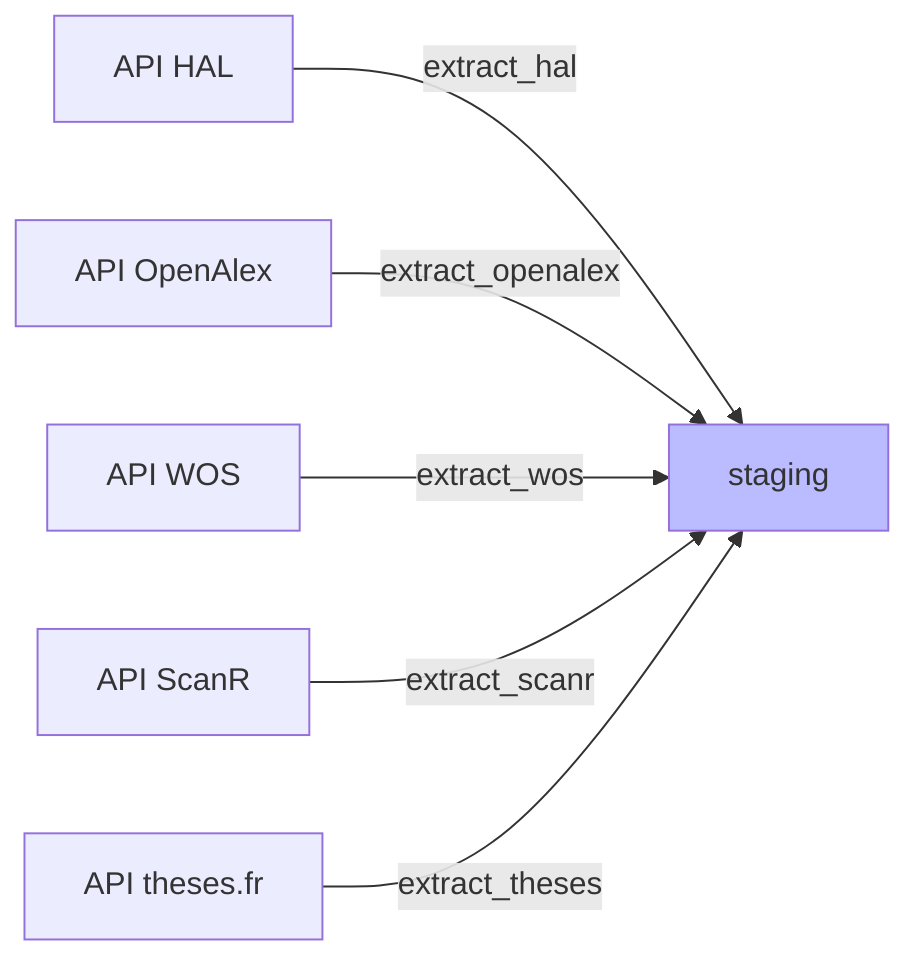
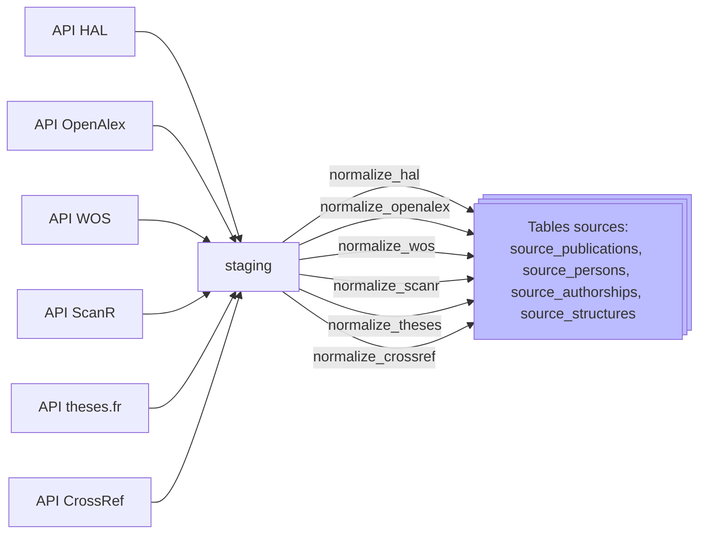
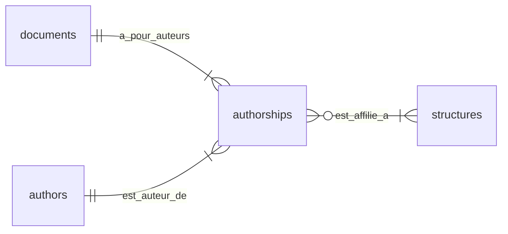
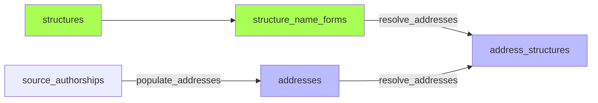
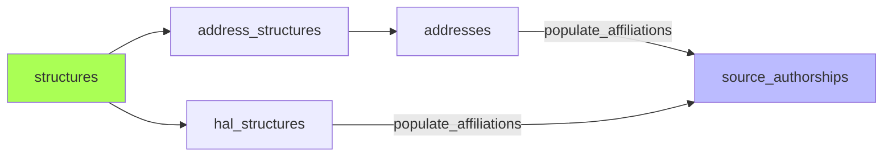
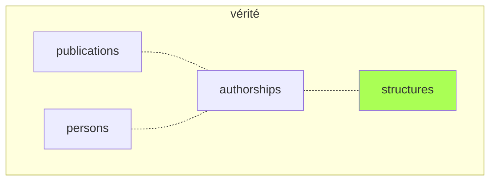
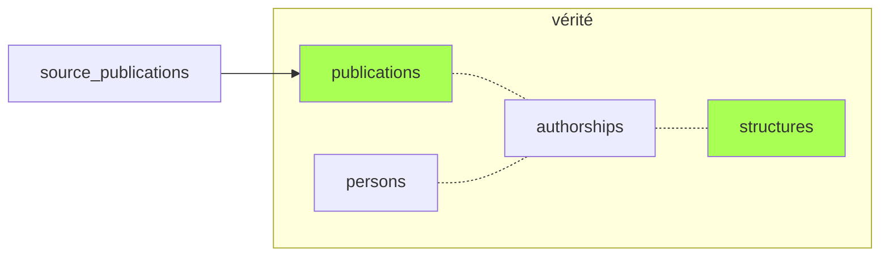
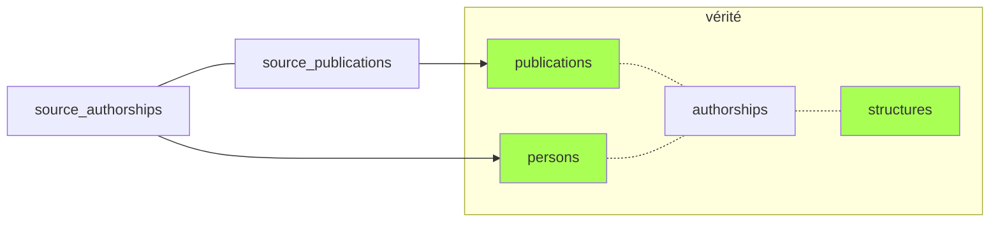
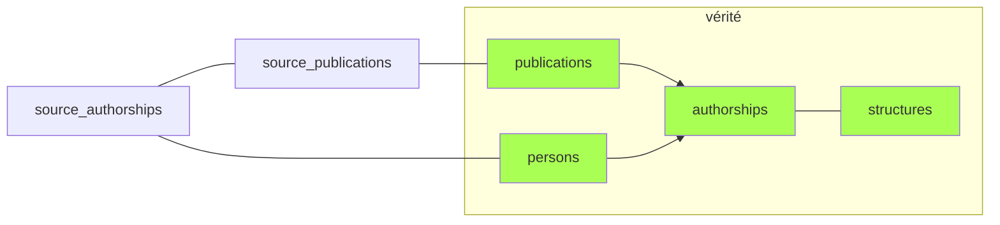

# Pipeline de traitement — Bibliométrie UCA

## Vue d'ensemble

Le peuplement de la base s'effectue via un *pipeline* composé des étapes suivantes:

### Moissonnage
- [Moissonnage](#extract): Récupère les données brutes depuis les API et les stocke en JSONB dans la table de *staging*.
- [Cross-imports](#cross_imports): Tente de combler les lacunes par des imports croisés ciblés (documents HAL référencés par OpenAlex ou ScanR mais absents de notre import HAL; recherche ciblée des DOI manquant dans chaque source)
### Normalisation
- [Normalisation](#normalize): Transforme les données brutes (*staging*) en tables structurées *par source*: `*_publications`, `*_authors`, `*_authorships`, `*_structures`.
### Repérage des affiliations
- [Adresses](#addresses): Peuple la table `addresses` à partir des adresses brutes associées aux [authorships](glossaire#authorship). Résout les affiliations des adresses à l'aide des formes de noms associées aux structures canoniques.
- [Affiliations](#affiliations): Renseigne le bool `in_perimeter` et les `structure_ids` des authorships sources.
### Création/rattachement des publications
- Publications: Peuple la table canonique `publications`  à partir des publications sources *via* les authorhips souces ayant `in_perimeter` = true. Dédoublonne.
### Création/rattachement des personnes
- [Personnes](#creation-personnes): Peuple la table canonique `persons` et ses tables satellites `person_name_forms` et `person_identifiers` (ORCID, idHAL, IdRef) *via* les authorhips souces ayant `in_perimeter` = true. Mappe les authorships sources aux `person_id` créées.
- [Authorships](#authorships): Peuple la table canonique `authorships` (liens entre `publications` canoniques et `persons` canoniques) à partir des `person_id` référencés dans les authorships sources.
### Enrichissements divers
- [Pays](#countries): détection automatisée des pays des adresses. Utile pour interroger les collaborations internationales.
- [Statut open access](#enrich): interrogation de l'API Unpaywall pour obtenir le statut *open access* le plus à jour

## Exécution

```bash
# Pipeline complet
python run_pipeline.py

# Reprise à partir d'une phase
python run_pipeline.py --from persons

# Une seule phase
python run_pipeline.py --only authorships

# Dry-run (affiche le plan sans exécuter)
python run_pipeline.py --dry-run

# Mode hebdomadaire (incrémental, 6 derniers mois)
python run_pipeline.py --mode weekly

# Lister les phases disponibles
python run_pipeline.py --list
```

**Modes :**
- `full` : pipeline complet avec cross-imports et enrichissements
- `monthly` : pipeline complet (cross-imports inclus)
- `weekly` : incrémental (années récentes, pas de cross-imports ni enrichissements)


## Phases détaillées

### <span id="extract"></span>Phase 1 — `extract` : Moissonnage

Récupère les données brutes depuis les API et les stocke en JSONB dans le *staging*.



**Critères de requête**:
- **années** de publication (2 modes, configurables dans admin/config: *weekly*: années n et n-1; *monthly*: repasse complète sur les années n-5 à n);
- **affiliation** des publications (UCA, CHU, INP). Il s'agit des affiliations *telles qu'elles sont renseignées dans chaque source*. Elles peuvent varier d'une source à l'autre et être incomplètes ou erronées. Ce point est géré dans les étapes ultérieures.

**Gestion des changements**:
- Chaque *record* est hashé (MD5) pour détecter les changements lors des réexécutions. Une publication dont les métadonnées ont changé sera ré-importée et re-traitée.
- Même sans changement, la colonne `last_seen_at` documente la dernière date où une publication a été détectée par le script d'import. En cas de disparition d'une publication dans les sources (par ex. dédoublonnage dans HAL), cette colonne permettra de détecter les suppressions et de nettoyer la base. Rien n'est en place pour l'instant.
<!-- TODO: Mettre en place le process pour détecter les publications disparues et les nettoyer de la base (ou les archiver?). -->

**Cas particulier**:

L'API OpenAlex limite les authorships à 100 par publication. Un *refetch* ciblé des publications avec 100 authorships est nécessaire.

**`refetch_truncated.py`** — re-télécharge un par un les works OpenAlex tronqués à 100 auteurs.
Pour éviter d'écraser ces publications lors de l'import suivant, un *hash* est calculé en faisant abstraction des authorships.
<!-- TODO: Tester que le meta_hash fonctionne effectivement et que les publis de >100 auteurs ne sont pas écrasées au réimport. -->

### <span id="cross_imports"></span>Phase 2 — `cross_imports` : Re-moissonnages croisés

Comble certaines lacunes dans les données moissonnées.

1. **`fetch_missing_hal.py`** — télécharge depuis HAL les documents référencés comme source par des works OpenAlex ou ScanR mais absents de notre staging.
2. **`cross_import_openalex.py`, `cross_import_hal.py`, `cross_import_wos.py`, `cross_import_scanr.py`** — cherche dans chaque source les DOI trouvés dans les autres mais non trouvés dans cette source; la plupart sont effectivement absents, mais beaucoup sont repêchés (cause: affiliations différentes selon source).

### <span id="normalize"></span>Phase 3 — `normalize` : Normalisation

Transforme les données brutes (staging) en tables structurées par source.




#### Relations internes des tables dans chaque source

Les tables sources sont indépendantes les unes des autres et s'organisent selon un schéma toujours identique:



<!-- TODO: Tables `publisher_name_forms` et `journal_name_forms` pour gérer les formes de noms multiples en l'absence d'identifiant unique (ISSN pour les journals): "Elsevier", "Elsevier BV"; "JHEP", "Journal of High Energy Particles" -->

### <span id="addresses"></span>Phase 4 — `addresses` : Adresses et affiliations

Cette étape extrait les adresses brutes des *authorships* sources pourvues d'une adresse (OpenAlex, WoS, ScanR) et les relie aux structures. (Pour le détail des différences de gestion des affiliations d'une source à l'autre: cf [doc sources](sources#sources-affiliations))



1. **`populate_addresses.py`** — split les `raw_affiliation` (séparateur ` | `) en adresses individuelles, déduplique dans la table `addresses`, crée les liens `*_authorship_addresses`
2. **`resolve_addresses.py`** — matche les adresses normalisées avec les formes de nom des structures (`structure_name_forms`). Résultat dans `address_structures`


### <span id="affiliations"></span>Phase 5 — `affiliations` : Propagation des affiliations

Script : `processing/populate_affiliations.py`



Calcule `in_perimeter` et `structure_ids` sur les authorships des 4 sources :
- **HAL** : `hal_struct_ids` → mapping via `hal_structures.structure_id` → `structure_ids`, puis vérification contre le périmètre UCA restreint → `in_perimeter`
- **OpenAlex / WoS / ScanR** : via `address_structures` (adresses résolues) → même logique

Deux périmètres :
- **Restreint** (UCA + labos UCA) → détermine `in_perimeter` (bool)
- **Large** (restreint + CHU, INP…) → détermine `structure_ids`

Périmètre centralisé dans `utils/uca_perimeter.py`.


### <span id="publications"></span>Phase 6 — `publications` : Peuplement de la table Publications

Les publications sources sont fusionnées:
- par **identité de DOI** (même DOI = même publi, sauf cas particuliers).
- par **référence directe** (un document OpenAlex ou ScanR qui pointe vers un document HAL)

Les cas douteux (métadonnées identiques ou similaires) sont préservés et sont fusionnés manuellement via la page admin/duplicates.


### <span id="persons"></span>Phase 7 — `persons` : Création de personnes

**`create_persons_from_source_authorships.py`** — algorithme en 4 étapes :

1. **Comptes HAL** : les authorships HAL liées à un compte HAL identifié (`source_persons` HAL avec `hal_person_id`, *déjà* lié à une `person`) sont rattachées à la même personne. Cette phase ne crée pas de nouvelle personne.
2. **Même nom + même publication + même position auteur** : pour chaque authorship sans `person_id`, cherche sur la même publication (même position) une *authorship* d'une **autre source** déjà rattachée à une personne. Si le nom est compatible → rattacher. Approche conservatrice (requiert position identique dans la liste des auteurs. TODO: voir si cette condition peut être assouplie sans perte de qualité).
3. **Identifiant ORCID/Idref connu** : si l'authorship est liée à un ORCID ou un IdRef déjà présent en base (table `person_identifiers`, avec `status ≠ rejected`) → rattacher. Priorité aux IdRef. Les ORCID/IdRef sont lus depuis `source_persons.orcid`/`source_persons.idref` quand un `source_persons` existe (HAL+`hal_person_id`, ScanR+idref, theses+PPN), sinon depuis `source_authorships.identifiers`.
4. **Recherche par nom** : lookup par nom normalisé dans `person_name_forms`.
   - Nom mappé à 1 personne → rattacher
   - Nom mappé à >1 personnes → laisser orphelin (pour traitement manuel via `admin/orphan-authorships`)
   - **Nom inconnu → créer nouvelle personne**

**`populate_person_name_forms.py`** — recalcule les formes de nom depuis les sources (persons, HAL, OpenAlex, WoS, ScanR, theses, CrossRef).
- Lors de la création d'une personne (ou d'une correction manuelle du nom/prénom): génération automatique des variantes normalisées "prénom nom", "nom prénom", "initiales nom", "nom initiales".
- Lors d'un rattachement d'authorship: les formes de nom liées sont ajoutées aux name_forms de cette personne.

Fonctions de compatibilité de noms dans `utils/names.py`.

**Notes sur `source_persons`** (cf. [chantier source_persons](chantiers/source-persons.md)) :
- La table héberge uniquement les entités auteurs avec un identifiant stable côté source (HAL+`hal_person_id`, ScanR+idref, theses+PPN).
- Pour les sources sans identifiant stable (OA, WoS, CrossRef, et les comptes HAL non identifiés / ScanR sans idref / theses sans PPN), `source_authorships.source_person_id` reste NULL et les identifiants normalisés vivent sur `source_authorships.identifiers` (JSONB).


### <span id="authorships"></span>Phase 8 — `authorships` : Construction des authorships canoniques

**`build_authorships.py`** construit la table `authorships` en 4 étapes :

1. **Insertion** des paires (publication_id, person_id) manquantes, depuis les `source_authorships` non exclues (toutes sources : HAL, OpenAlex, WoS, ScanR, theses, CrossRef)
2. **FK** : rattache chaque `source_authorships` à son authorship canonique via `source_authorships.authorship_id`
3. **Métadonnées** : propage `author_position` et `is_corresponding` selon `SOURCE_PRIORITY` (theses > CrossRef > ScanR > HAL > OpenAlex > WoS)
4. **UCA** : propage `in_perimeter` et `structure_ids` depuis toutes les sources (union, déjà calculées par `populate_affiliations.py`)

Les authorships sources marquées `excluded = TRUE` sont ignorées à toutes les étapes. Les publications de type `peer_review` sont exclues de la propagation UCA.


### <span id="countries"></span>Phase 9 — `countries` : Pays des publications

Trois scripts enchaînés :

1. **`interfaces/cli/detect_address_countries.py`** : détection automatique du pays des adresses sans pays. Parse le dernier segment après la dernière virgule et le matche contre la table `country_name_forms` (276 formes, 140 pays, variantes anglais/français/codes ISO/abréviations WoS). Rapide et fiable.

2. **`interfaces/cli/suggest_address_countries.py`** : pour les adresses restantes (pays absent du dernier segment), cherche une adresse similaire avec pays connu via LIKE sur le texte normalisé. Plus lent, résultats stockés dans `suggested_countries` (validation manuelle via l'interface admin).

3. **`processing/refresh_publication_countries.py`** : recalcule `publications.countries` en faisant l'union des pays des 4 sources (HAL via structures, OpenAlex/WoS/ScanR via adresses résolues).

### <span id="enrich"></span>Phase 10 — `enrich` : Enrichissements optionnels

Exécutée uniquement en mode `full` et `monthly` :

| Script | Rôle |
|--------|------|
| `processing/enrich_oa_unpaywall.py` | Statut *open access* via API [Unpaywall](glossaire#unpaywall) => souvent plus à jour que le statut renseigné dans les sources |
| `processing/enrich_journal_apc.py` | Montant APC par revue via API OpenAlex Sources => **ne sert à rien pour l'instant**, voir si on garde ou pas |

## <span id='tables-canoniques'></span>Peuplement des tables canoniques


1. Les **structures** préexistent au pipeline.



2. La [phase 3](#normalize) (`normalize`) peuple la table **publications** par mapping et fusion à partir des publications sources.



3. Après repérage des affiliations dans les authorships sources, la [phase 7](#creation-personnes) `persons` crée les **personnes** correspondant aux *authorships* UCA (ou les rattache aux personnes existantes).



4. Les **authorships** canoniques sont déduites à partir des sources dans la [phase 8](#authorships) (`authorships`). L'information (`person_id`, `structure_ids`) présente dans les *authorships* sources est donc répliquée dans la table *authorships* canonique, pour deux raisons:
- simplifier les requêtes dans l'interface;
- servir de source d'autorité ultime en cas d'erreur dans une des sources (une *authorship* source peut être `excluded`).




## Utilitaires partagés

| Module | Contenu |
|--------|---------|
| `utils/doi.py` | `clean_doi` — nettoyage DOI |
| `utils/hal.py` | `extract_hal_id_from_url`, `HAL_FIELDS` — constantes et utilitaires HAL |
| `utils/names.py` | `names_compatible`, `parse_raw_author_name` — compatibilité de noms |
| `utils/normalize.py` | `normalize_text`, `normalize_name` — normalisation texte |
| `utils/uca_perimeter.py` | `get_uca_structure_ids`, `get_uca_structure_ids_wide` — périmètre UCA |
| `utils/log.py` | `setup_logger` — configuration logging avec fichier |
| `extraction/common.py` | `compute_hash`, `get_existing_ids` — fonctions d'extraction |
| `application/persons.py` | Création, rattachement, identifiants, formes de noms |
| `application/publications.py` | `find_or_create`, déduplication par DOI + titre |
| `application/journals.py` | Publishers, journals, APC |
