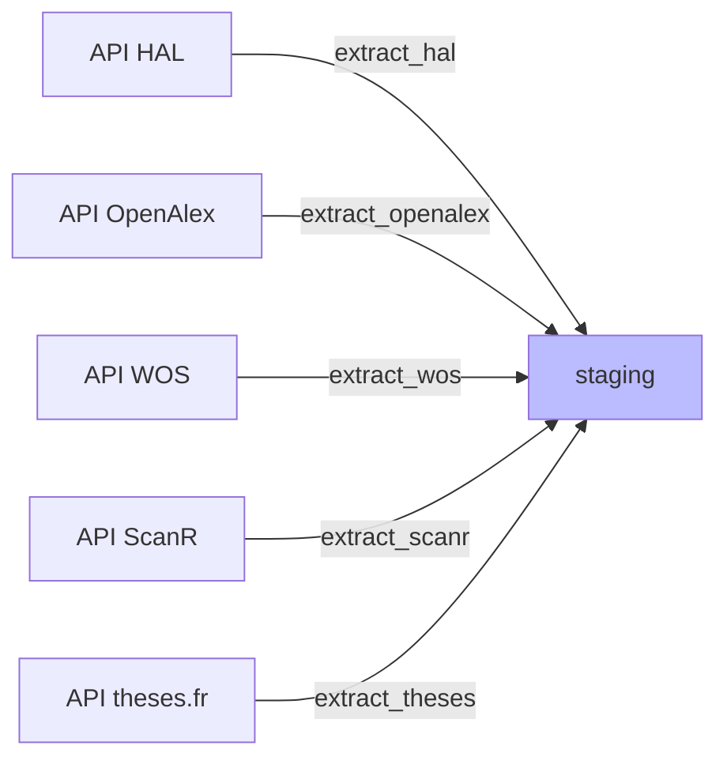

# Moissonnage

*À jour le 2026-06-30.*

Récupère les données brutes depuis les API et les stocke en JSONB dans le *staging*.

## Moissonnage initial {#extract}

**Critères de requête**:
- **années** de publication : de l'année de début à l'année courante. L'année de début est l'argument `--start-year`, à défaut la valeur [configurable](../guide-utilisateur/03-workflow-admin.md#years) dans `admin/config` (par défaut 2017, année de la fusion UCA) ;
- **affiliation** des publications ([périmètre configurable](../guide-utilisateur/03-workflow-admin.md#perimeters) dans `admin/config`). Il s'agit des affiliations *telles qu'elles sont renseignées dans chaque source*. Elles peuvent varier d'une source à l'autre et être incomplètes ou erronées. Ce point est géré dans les étapes ultérieures.

**Gestion des changements**:
- Chaque *record* est hashé (MD5) pour détecter les changements lors des réexécutions. Une publication dont les métadonnées ont changé sera ré-importée et re-traitée.
- Même sans changement, la colonne `last_seen_at` est bumpée à chaque fois qu'un doc est re-vu (moisson bulk ou refetch).
> Une publication qui cesse d'apparaître dans sa source (par ex. dédoublonnage dans HAL) est détectée puis confirmée par la phase [Refresh & disparitions](#refresh-stale), qui pose un marqueur `disappeared_at`.

## Résolution des Registration Agencies {#resolve-ra}

Phase `resolve_ra`, enchaînée entre le moissonnage initial et les imports croisés. Elle résout la Registration Agency (Crossref ou DataCite) des préfixes DOI, pour que l'[import croisé par DOI](#cross-imports) route chaque DOI vers la bonne API au lieu de l'interroger contre les deux.

Crossref et DataCite gèrent des ensembles de DOI disjoints. Sans la RA du préfixe, chaque DOI candidat devrait être tenté contre les deux API, générant 50% d'erreurs 404.

Pour chaque préfixe pas encore résolu, interroge `doi.org/ra` et enregistre la RA dans `doi_prefixes` (`unknown` quand elle n'est pas classée). Auto-bornée : seuls les préfixes absents de `doi_prefixes` sont traités, donc la phase converge. Le pool de DOI candidats est défini une seule fois par la vue `candidate_dois` — union du *staging*, des DOI liés (`related_dois`) des `source_publications`, des cibles de `publication_relations` et des DOI DataCite dérivés d'arXiv —, consommée à l'identique ici et par l'import croisé, qui ne peuvent donc pas diverger.

Une row `doi_prefixes` naît ici avec sa seule RA ; le [volet éditeur](05-publishers-journals.md) la complète ensuite (nom et `publisher_id` via les API `/prefixes`), une fois que `normalize` a créé les éditeurs mentionnés par les sources.

## Imports croisés {#cross-imports}

Phase `cross_imports`: deux étapes enchaînées, chacune adressant un cas distinct de "doc visible dans une source mais absent d'une autre".

**Étape 1 — `fetch_missing_hal_id` : HAL ids manquants.**
Télécharge depuis HAL les documents référencés (par hal-id ou NNT) dans d'autres sources mais absents de notre staging HAL. Orchestrateur dans `application/pipeline/extract/fetch_missing_hal_id.py`, adapter HAL dans `infrastructure/sources/hal/fetch_missing_hal_id.py`. Auto-borné, tourne dans tous les modes : les hal-ids/NNT introuvables sont marqués `not_found_at` dans staging et ne sont jamais re-interrogés (HAL = source native pour les hal-ids, un 404 est définitif).

**Étape 2 — `fetch_missing_doi` : DOI manquants par source.**
Pour chaque source cible (OpenAlex, HAL, WoS, ScanR, Crossref), recherche par DOI les records trouvés dans les autres sources mais absents de celle-ci. La plupart sont effectivement absents ; certains sont repêchés (cause : affiliations différentes selon source). Dispatcher dans `application/pipeline/extract/fetch_missing_doi.py`, adapter par source dans `infrastructure/sources/<source>/fetch_missing_doi.py`. Sources cibles déterminées par la policy du mode (`application/pipeline/modes.py`) ; le pool de DOI est auto-borné par le backoff `doi_lookups`.
<!--TODO: nommage incohérent: fetch_missing_hal_id cherche nnt-->

**Les deux étapes sont auto-bornées et convergentes.** Le pool de hal-ids/NNT à re-tenter est fini par construction (un hal-id 404 sort définitivement via `not_found_at`, HAL étant source native). Le pool de DOI l'est aussi grâce au backoff : un DOI absent d'une source *non native* (HAL/OpenAlex/WoS/ScanR) est enregistré dans `doi_lookups` avec `next_retry = now() + 30 jours` ; `get_cross_import_dois` ne le ressort qu'une fois ce délai écoulé. Le 1er pass tente tout, les passes suivantes ne reprennent que les nouveaux DOI et ceux dont le backoff a expiré.

## Refresh & disparitions {#refresh-stale}

Phase `refresh_stale`, enchaînée après les imports croisés, **à chaque run**. Elle rafraîchit les documents dont la dernière vue (`last_seen_at`) dépasse `STALE_REFRESH_AFTER_DAYS` (90 j) et détecte les disparitions.

Pour chaque DOI stale, refetch via l'adapter `fetch_missing_doi` de sa source : trouvé → `raw_data` rafraîchi (re-traité si le hash a changé) + `last_seen_at` bumpé ; 404 confirmé → `disappeared_at` posé ; erreur transitoire → laissé, re-tenté plus tard. Les rows stale **sans DOI** (non refetchables, mais re-moissonnées par le bulk) sont marquées disparues directement.

Tournant à chaque run, le seuil étale la charge : une passe ne ramasse que ce qui vient de franchir 90 j. La fenêtre fixe du mode `full` (rétention cumulative) garde la plupart des natifs frais via le bulk, donc le lot stale reste petit (cross-imports + natifs réellement disparus). Pas de filtre par source : sous cadence normale theses et wos ne deviennent jamais stale.

`disappeared_at` est pour l'instant un **marqueur seul** — aucune suppression / exclusion / propagation en aval (à décider plus tard sur cas concrets).

## Works OpenAlex tronqués {#refetch-truncated}

Phase `refetch_truncated`, enchaînée après `refresh_stale` et avant `normalize`. L'[API OpenAlex](../sources/03-openalex.md) plafonne la liste des auteurs à 100 par réponse ; au-delà, les auteurs surnuméraires sont absents du payload moissonné.

Les works concernés sont marqués à l'extraction par le drapeau `staging.authors_truncated` (payload bulk à exactement 100 auteurs). Cette phase re-télécharge un par un les works marqués, récupère la liste complète des auteurs et lève le drapeau (genuine 100 auteurs : levé sans réécriture). Le marqueur étant explicite, il survit à la normalisation (qui purge `raw_data`) : un work qui échappe à cette phase — OpenAlex indisponible, budget API épuisé — reste marqué et est repris au run suivant. Placée après les imports croisés et le refresh pour voir aussi les works qu'ils ramènent, et avant `normalize` pour qu'il écrive directement les auteurs complets.

Pour éviter d'être écrasé par un moissonnage bulk ultérieur, le refetch met à jour `raw_data` mais conserve `raw_hash` (hash du payload bulk initial) ; tant que le bulk renvoie le même payload, l'UPSERT bulk ne touche pas `raw_data`.
