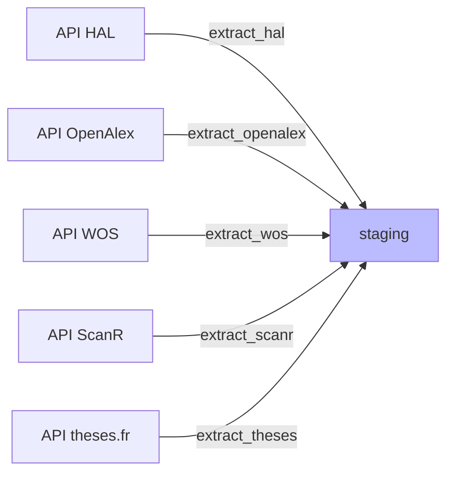

# Moissonnage

Récupère les données brutes depuis les API et les stocke en JSONB dans le *staging*.

## Moissonnage initial {#extract}

**Critères de requête**:
- **années** de publication (configurables dans admin/config : *weekly* couvre les années n et n-1, *full* fait une repasse complète sur les années n-5 à n);
- **affiliation** des publications (UCA, CHU, INP). Il s'agit des affiliations *telles qu'elles sont renseignées dans chaque source*. Elles peuvent varier d'une source à l'autre et être incomplètes ou erronées. Ce point est géré dans les étapes ultérieures.

**Gestion des changements**:
- Chaque *record* est hashé (MD5) pour détecter les changements lors des réexécutions. Une publication dont les métadonnées ont changé sera ré-importée et re-traitée.
- Même sans changement, la colonne `last_seen_at` documente la dernière date où une publication a été détectée par le script d'import. En cas de disparition d'une publication dans les sources (par ex. dédoublonnage dans HAL), cette colonne permettra de détecter les suppressions et de nettoyer la base. Rien n'est en place pour l'instant.
<!-- TODO: Mettre en place le process pour détecter les publications disparues et les nettoyer de la base (ou les archiver?). -->

**Cas particulier**:

L'API OpenAlex limite les authorships à 100 par publication dans les requêtes *bulk*. Un *refetch* individuel des publications avec 100 authorships est nécessaire.

**`refetch_truncated.py`** — re-télécharge un par un les works OpenAlex tronqués à 100 auteurs. Pour éviter d'écraser la liste complète lors d'un bulk ultérieur, le refetch met à jour `raw_data` mais conserve `raw_hash` (hash du payload bulk initial) ; tant que le bulk renvoie le même payload, l'UPSERT bulk ne touche pas `raw_data`.

## Imports croisés {#cross-imports}

Phase `cross_imports`: deux étapes enchaînées, chacune adressant un cas distinct de "doc visible dans une source mais absent d'une autre".

**Étape 1 — `fetch_missing_hal_id` : HAL ids manquants.**
Télécharge depuis HAL les documents référencés (par hal-id ou NNT) dans d'autres sources mais absents de notre staging HAL. Code dans `infrastructure/sources/hal/fetch_missing_hal_id.py`. Auto-borné, tourne dans tous les modes : les hal-ids/NNT introuvables sont marqués `not_found=TRUE` dans staging et ne sont jamais re-interrogés (HAL = source native pour les hal-ids, un 404 est définitif).

**Étape 2 — `fetch_missing_doi` : DOI manquants par source.**
Pour chaque source cible (OpenAlex, HAL, WoS, ScanR, Crossref), recherche par DOI les records trouvés dans les autres sources mais absents de celle-ci. La plupart sont effectivement absents ; certains sont repêchés (cause : affiliations différentes selon source). Dispatcher dans `interfaces/cli/pipeline/fetch_missing_doi.py`, adapter par source dans `infrastructure/sources/<source>/fetch_missing_doi.py`. Sources cibles et scope (`unprocessed` vs `all`) déterminés par la policy du mode (cf. `domain/pipeline_modes.py`).

**Pourquoi les deux étapes ont des règles de scope différentes** : le pool de hal-ids/NNT à re-tenter est *fini par construction* (un hal-id non trouvé sort définitivement du pool via `not_found=TRUE`). À l'inverse, le pool de DOI à cross-importer est potentiellement non borné dans le modèle actuel — les DOI 404 chez HAL/OpenAlex/WoS/ScanR ne sont pas tracés, donc retentés à chaque run. D'où la scope policy : daily/weekly se limite aux DOI jamais tentés (`unprocessed`), full ré-essaie aussi les anciens (`all`), et WoS est exclu hors `full` à cause de son quota API contractuel.

Cette asymétrie disparaîtra avec le chantier `DATA_cycle-vie-staging.md` : un backoff temporel (`not_found_at` + `next_retry`) sur les sources non natives rendra le pool DOI également auto-borné et convergent.
