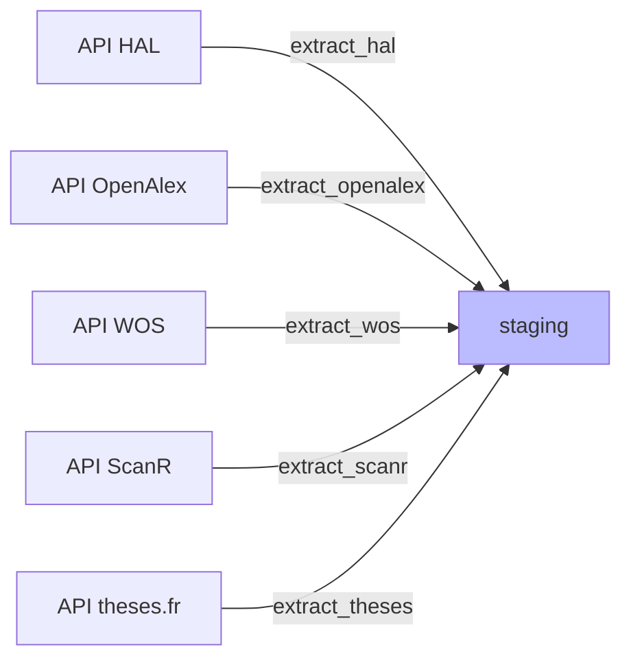

# `extract` : Moissonnage

Récupère les données brutes depuis les API et les stocke en JSONB dans le *staging*.

**Critères de requête**:
- **années** de publication (configurables dans admin/config : *weekly* couvre les années n et n-1, *full* fait une repasse complète sur les années n-5 à n);
- **affiliation** des publications (UCA, CHU, INP). Il s'agit des affiliations *telles qu'elles sont renseignées dans chaque source*. Elles peuvent varier d'une source à l'autre et être incomplètes ou erronées. Ce point est géré dans les étapes ultérieures.

**Gestion des changements**:
- Chaque *record* est hashé (MD5) pour détecter les changements lors des réexécutions. Une publication dont les métadonnées ont changé sera ré-importée et re-traitée.
- Même sans changement, la colonne `last_seen_at` documente la dernière date où une publication a été détectée par le script d'import. En cas de disparition d'une publication dans les sources (par ex. dédoublonnage dans HAL), cette colonne permettra de détecter les suppressions et de nettoyer la base. Rien n'est en place pour l'instant.
<!-- TODO: Mettre en place le process pour détecter les publications disparues et les nettoyer de la base (ou les archiver?). -->

**Cas particulier**:

L'API OpenAlex limite les authorships à 100 par publication dans les requêtes *bulk*. Un *refetch* individuel des publications avec 100 authorships est nécessaire.

**`refetch_truncated.py`** — re-télécharge un par un les works OpenAlex tronqués à 100 auteurs. Pour éviter d'écraser la liste complète lors d'un bulk ultérieur, le refetch met à jour `raw_data` mais conserve `raw_hash` (hash du payload bulk initial) ; tant que le bulk renvoie le même payload, l'UPSERT bulk ne touche pas `raw_data`.
