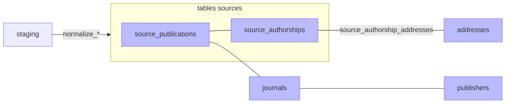

#  Normalisation

Phase `normalize` : transforme les données brutes (staging) en tables structurées propres à chaque source — `source_publications` et `source_authorships`. Peuple au passage les référentiels `publishers` et `journals`, et crée les `addresses` ainsi que les liens `source_authorship_addresses` qui rattachent une signature d'auteur à ses adresses.

Chaque `source_publication` est écrite avec `publication_id = NULL`. La normalisation se borne à structurer les données de chaque source ; le regroupement des doublons et la création des publications canoniques ont lieu plus loin, en phase [publications](07-publications.md).

Chaque normaliseur reporte dans `source_authorships` ce que sa source fournit pour chaque signature : identifiants de l'auteur (ORCID, IdRef…) et affiliations.

En fin de phase, le `raw_data` du staging est vidé (voir ci-dessous), puis l'espace disque est récupéré par un `VACUUM` — un `VACUUM FULL`, plus lourd mais qui rend réellement l'espace au système d'exploitation, lors des repasses complètes.

**Archivage du payload brut.** À la fin du traitement de chaque ligne, `mark_done` vide le `raw_data` du staging (libère l'espace TOAST). Juste **avant** la vidange, le payload est archivé hors BDD dans le **raw store** ([`infrastructure/raw_store/`](../../infrastructure/raw_store/)) — JSON canonique gzippé sous la clé `{source}/{source_id}`, *write-once*, best-effort (un échec d'écriture logge un warning sans casser la normalisation). Comme `mark_done` est l'unique point de vidange, ce témoin capture **tout** ce qui transite par le staging (bulk, cross-imports, refetch, refresh). But : re-normaliser sans re-moissonner, audit, et à terme alléger la BDD. Le contenu est le JSON canonique (même forme que `staging.raw_hash`), donc `md5(raw store) == raw_hash` par construction.

> **Pourquoi vider les raw_data?** — Contrainte conjoncturelle liée aux sauvegardes quotidiennes sur le cloud (plan gratuit limité à 10 Go). Aucune raison de maintenir cette vidange en prod, à moins que l'espace de stockage soit fortement contraint. L'archivage des raw_data sur le *raw store* est un palliatif.
