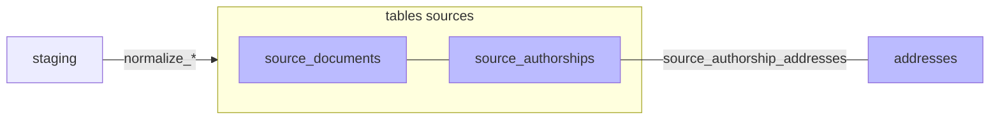

#  Normalisation

Phase `normalize`: transforme les données brutes (staging) en tables structurées par source (`source_publications`, `source_authorships`). Crée également les `addresses` et les liens `source_authorship_addresses` via le port `AddressLinker` (les adresses brutes extraites de chaque authorship sont dédoublonnées dans la table canonique `addresses`). Pas d'adresses brutes dans HAL → on utilise la chaîne de caractères du nom de la structure et on la traite fictivement comme une adresse.

**Archivage du payload brut.** À la fin du traitement de chaque ligne, `mark_done` vide le `raw_data` du staging (libère l'espace TOAST). Juste **avant** la vidange, le payload est archivé hors BDD dans le **raw store** ([`infrastructure/raw_store/`](../../infrastructure/raw_store/)) — JSON canonique gzippé sous la clé `{source}/{source_id}`, *write-once*, best-effort (un échec d'écriture logge un warning sans casser la normalisation). Comme `mark_done` est l'unique point de vidange, ce témoin capture **tout** ce qui transite par le staging (bulk, cross-imports, refetch, refresh). But : re-normaliser sans re-moissonner, audit, et à terme alléger la BDD. Le contenu est le JSON canonique (même forme que `staging.raw_hash`), donc `md5(raw store) == raw_hash` par construction.

> **TODO :** filtrage à mettre en place côté UI pour ne pas afficher les pseudo-adresses de source HAL dans les onglets "adresses".
