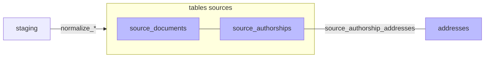

#  Normalisation

Phase `normalize`: transforme les données brutes (staging) en tables structurées par source (`source_publications`, `source_authorships`). Crée également les `addresses` et les liens `source_authorship_addresses` via le port `AddressLinker` (les adresses brutes extraites de chaque authorship sont dédoublonnées dans la table canonique `addresses`). Pas d'adresses brutes dans HAL → on utilise la chaîne de caractères du nom de la structure et on la traite fictivement comme une adresse.

> **TODO :** filtrage à mettre en place côté UI pour ne pas afficher les pseudo-adresses de source HAL dans les onglets "adresses".
