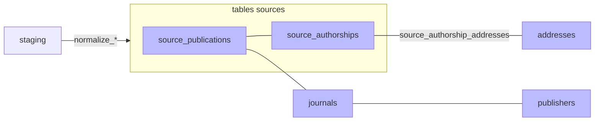

#  Normalisation

*À jour le 2026-09-06.*

```mermaid
flowchart LR
    B[staging]-->|normalize_*|G
    subgraph G[tables sources]
        direction TB
        C[source_publications]---D[source_authorships]
    end
    C---journals---publishers
    D---|source_authorship_addresses|F[addresses]
    classDef new  fill:#bbf
    class C,D,F,journals,publishers new;
```

Phase `normalize` : transforme les données brutes (`staging`) en tables structurées propres à chaque source — `source_publications` et `source_authorships`. Peuple au passage les référentiels `publishers` et `journals`, et crée les `addresses` ainsi que les liens `source_authorship_addresses` qui rattachent une signature d'auteur à ses adresses.

Chaque normaliseur reporte dans `source_authorships` ce que sa source fournit pour chaque signature : identifiants de l'auteur (ORCID, IdRef…) et affiliations.

En fin de phase, les `source_publications` d'un document marqué `disappeared_at` par [`fetch_stale`](02-extract.md#documents-périmés-et-disparus-fetch_stale) sont supprimées, emportant leurs `source_authorships` par cascade. La publication vidée de ses dernières sources est supprimée par la phase [`publications`](07-publications.md). La ligne de `staging` reste, avec sa marque.

Conservés en base, les payloads bruts la font grossir hors de proportion avec les données normalisées qu'on en tire. En fin de phase, le `raw_data` du staging est donc vidé, puis un `VACUUM` récupère l'espace.

## Archivage du payload brut

Avant de vider `raw_data`, la normalisation dépose le payload hors base, dans le [raw store](../../infrastructure/raw_store/) : un fichier `data/raw_store/{source}/{source_id}.json.gz` par document. L'option [`--raw-store`](../exploitation/03-pipeline.md#divers) déclenche cet archivage : sans elle, le payload est perdu à la vidange. Cette option est inopérante en production, où la racine du conteneur est en lecture seule.

Le script `interfaces/cli/maintenance/rehydrate_staging_from_raw_store.py` réinjecte les payloads d'une source, pour rejouer sa normalisation.
