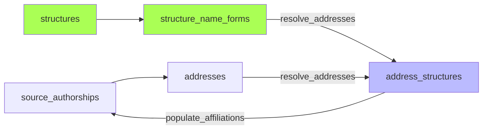

# Résolution des affiliations

*À jour le 2026-06-30.*

Phase `affiliations` : trois sous-étapes enchaînées.

1. **`refresh_perimeter_structures`** — rematérialise la table `perimeter_structures`, qui liste, pour chaque périmètre configuré, l'ensemble des structures qu'il englobe (clôture récursive des relations de tutelle `est_tutelle_de`). Les deux sous-étapes suivantes s'appuient sur cette liste à jour.

2. **`resolve_addresses`** — rapproche chaque adresse normalisée des structures connues, en cherchant leurs formes de nom (`structure_name_forms`) dans le texte de l'adresse. Le résultat est écrit dans `address_structures`, avec `matched_form_id` pour la traçabilité (quelle forme a déclenché la détection). Code : `application/pipeline/affiliations/resolve_addresses.py`.

   Le rapprochement cherche les formes de nom comme sous-chaînes du texte de l'adresse, à l'aide d'un [automate d'Aho-Corasick](https://tryalgo.org/fr/strings/2024/09/11/aho-corasick/). Trois garde-fous limitent les faux positifs :
   - une forme courte ou marquée « mot entier » ne compte que si elle est délimitée par des non-lettres ;
   - une forme « excluante » retire au contraire sa structure du résultat ;
   - une forme « à contexte requis » n'est retenue que si une autre structure (en général sa structure de tutelle) est elle aussi reconnue dans l'adresse.

3. **`populate_affiliations`** — pose `in_perimeter` sur les `source_authorships` : une signature est `in_perimeter` dès qu'une de ses adresses est rattachée à une structure du périmètre. La liaison fine d'une signature à ses structures n'est pas recopiée sur `source_authorships` ; elle reste disponible via la vue matérialisée `source_authorship_structures`, qui joint les adresses résolues au périmètre. Code : `application/pipeline/affiliations/populate_affiliations.py`.

`in_perimeter` désigne l'appartenance au périmètre de l'établissement : les structures dont on veut recenser la production. Une signature dont aucune adresse ne se rattache à ce périmètre reste hors-périmètre, et ne donnera pas lieu à la création d'une personne ni d'une publication canonique.
