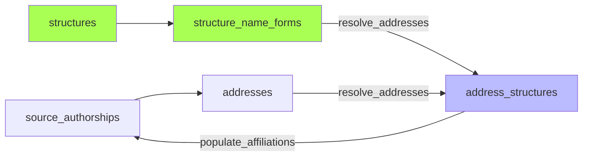

# Résolution des affiliations

*À jour le 2026-09-06.*

```mermaid
flowchart LR
    A[source_authorships]-->B[addresses]
    D[structures]-->E[structure_name_forms]
    E-->|resolve_addresses|F[address_structures]
    B-->|resolve_addresses|F
    F-->|populate_affiliations|A
    classDef new  fill:#bbf
    classDef valid  fill:#af5
    class F new;
    class D,E valid;
```

La phase `affiliations` reconnaît les structures dans le texte des adresses, et marque les signatures rattachées au périmètre.

1. **`refresh_perimeter_structures`** — rematérialise la table `perimeter_structures`, qui liste, pour chaque périmètre configuré, l'ensemble des structures qu'il englobe (clôture récursive des tutelles). Les deux sous-étapes suivantes s'appuient sur cette liste à jour.

2. **`resolve_addresses`** — rapproche chaque adresse normalisée des structures connues, en cherchant leurs formes de nom (`structure_name_forms`) dans le texte de l'adresse. Le résultat est écrit dans `address_structures`, avec `matched_form_id` pour la traçabilité (quelle forme a déclenché la détection). Code : `application/pipeline/affiliations/resolve_addresses.py`.

   La résolution cherche les formes de nom comme sous-chaînes du texte de l'adresse, à l'aide d'un [automate d'Aho-Corasick](https://tryalgo.org/fr/strings/2024/09/11/aho-corasick/). Trois garde-fous limitent les faux positifs :
   - une forme courte ou marquée « mot entier » ne compte que si elle est délimitée par des non-lettres ;
   - une forme « à contexte requis » n'est retenue que si une autre structure (en général sa structure de tutelle) est elle aussi reconnue dans l'adresse ;
   - une forme « excluante » interdit la reconnaissance d'une structure dans l'adresse qui contient cette forme.

3. **`populate_affiliations`** — rafraîchit la vue matérialisée `source_authorship_structures`, qui rattache chaque signature aux structures de ses adresses. Le drapeau `in_perimeter` des `source_authorships` se déduit de cette vue : une signature est `in_perimeter` dès qu'une de ses structures appartient au périmètre. Code : `application/pipeline/affiliations/populate_affiliations.py`.
