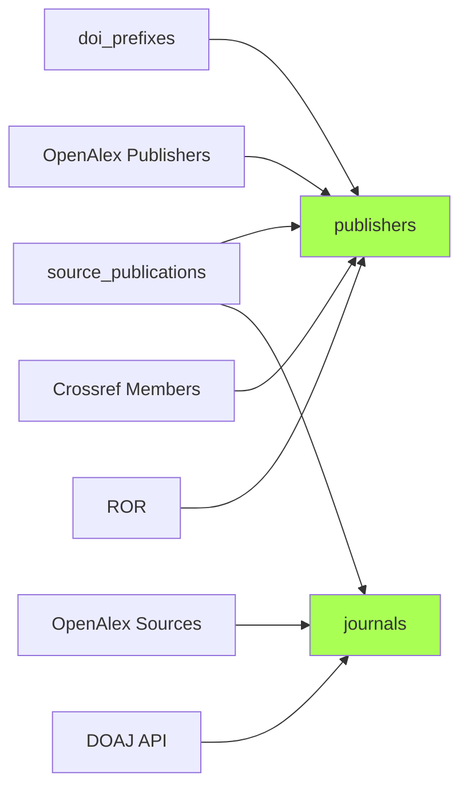

# Enrichissement des référentiels publishers et journals

Phase `publishers_journals` : enrichissement des **référentiels** `publishers` et `journals` après leur création initiale en phase [normalize](03-normalize.md). Positionnée entre `normalize` et [`affiliations`](05-affiliations.md). Six sub-steps enchaînés ; le 1er tourne dans tous les modes du pipeline, les 5 suivants sont gated par le mode `full`.

| Sub-step | Source | Cible | Mode |
|---|---|---|---|
| `resolve_doi_prefixes` | Crossref `/prefixes/{prefix}` + DataCite `/dois?prefix=` | `doi_prefixes` (préfixe → Registration Agency + éditeur Crossref / repository DataCite) | tous |
| `enrich_journals_from_openalex` | [OpenAlex Sources](../sources/03-openalex.md) | `journals.apc_amount`, `apc_currency`, `is_in_doaj` (flag), `journal_type` | full |
| `enrich_journals_from_doaj` | [DOAJ API](../sources/08-sources-supplementaires.md#doaj) | `journals.doaj_payload` (JSONB au format CSV), `doaj_imported_at`, `is_in_doaj` | full |
| `enrich_publishers_from_openalex` | [OpenAlex Publishers](../sources/03-openalex.md) | `publishers.country` (ISO-2), `publishers.ror` (ID ROR) | full |
| `enrich_publishers_from_crossref_members` | [Crossref Members](../sources/06-crossref.md) | `publishers.country` (fallback pour les publishers manqués par OpenAlex) | full |
| `enrich_publishers_from_ror` | [ROR](../sources/08-sources-supplementaires.md#ror) | `publishers.publisher_type` (typage `commercial` / `academic_institution` / `learned_society` / `repository` via `types` ROR) | full |

## Idempotence

Chaque sub-step est incrémental — filtres d'éligibilité :

- `resolve_doi_prefixes` : préfixes absents de `doi_prefixes`.
- `enrich_journals_from_openalex` : revues avec `openalex_id` et `apc_amount IS NULL` (sauf `--reset`).
- `enrich_journals_from_doaj` : revues avec au moins un ISSN ET `doaj_imported_at IS NULL OR > 30 jours`. Sur 404 DOAJ, le timestamp est posé quand même (`payload=NULL`) pour éviter de retenter perpétuellement les ~12k revues hors-DOAJ.
- `enrich_publishers_from_openalex` : publishers avec `openalex_id` à qui il manque `country` ou `ror`.
- `enrich_publishers_from_crossref_members` : publishers sans `country` avec au moins un `doi_prefixes.crossref_member_id`.
- `enrich_publishers_from_ror` : publishers avec `ror` non-NULL et `publisher_type='unknown'`.

Politique d'écrasement : « NULL only » sur tous les sub-steps (préserve les valeurs admin explicites). Le sub-step DOAJ direct surclasse `is_in_doaj` posé par OpenAlex (DOAJ > OpenAlex stale).

## Code

- Orchestration : `run_pipeline.py:phase_publishers_journals`.
- Sub-steps : `application/pipeline/publishers_journals/`.
- Sources externes : `infrastructure/sources/doaj/`, `infrastructure/sources/ror.py`, `infrastructure/sources/crossref/members.py`, `infrastructure/sources/doi_prefixes/`, `infrastructure/sources/openalex/`.

## Bootstrap & catch-up

Pour DOAJ, un import CSV bootstrap (`interfaces/cli/imports/import_doaj_csv.py`) reste utilisable pour seeder rapidement depuis un dump complet — même format de stockage que le sub-step API.
