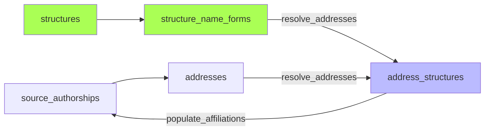

# `affiliations` : Résolution et propagation

Deux sous-étapes enchaînées :

1. **`resolve_addresses`** — matche les adresses normalisées avec les formes de nom des structures (`structure_name_forms`). Résultat dans `address_structures` (avec `matched_form_id` pour la traçabilité). Code applicatif : `application/pipeline/affiliations/resolve_addresses.py`, entry point CLI : `interfaces/cli/pipeline/resolve_addresses.py`.
2. **`populate_affiliations`** — calcule `in_perimeter` et `structure_ids` sur les `source_authorships` à partir des `address_structures`. Code applicatif : `application/pipeline/affiliations/populate_affiliations.py`.

Deux périmètres :
- **Restreint** (UCA + labos UCA) → détermine `in_perimeter` (bool)
- **Large** (restreint + CHU, INP…) → détermine `structure_ids`

Périmètre centralisé dans `infrastructure/perimeter.py` (port : `application/ports/perimeter.py`).

> **TODO :** documenter plus précisément la logique de `resolve_addresses`.
