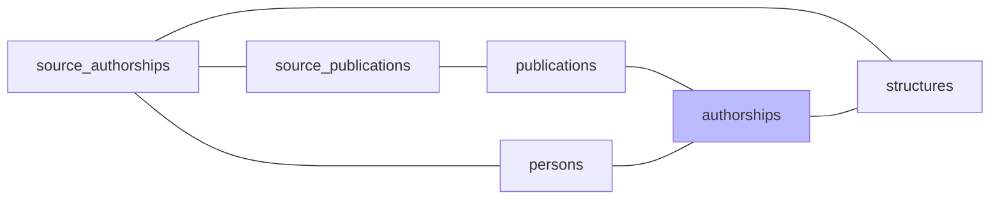

#  Authorships canoniques

Phase `authorships`: `build_authorships` construit la table `authorships` en 4 étapes :

1. **Insertion** des paires (publication_id, person_id) manquantes, depuis les `source_authorships` non exclues (toutes sources : HAL, OpenAlex, WoS, ScanR, theses, CrossRef)
2. **FK** : rattache chaque `source_authorships` à son authorship canonique via `source_authorships.authorship_id`
3. **Métadonnées** : propage `author_position` et `is_corresponding` selon `SOURCE_PRIORITY` (theses > CrossRef > ScanR > HAL > OpenAlex > WoS)
4. **UCA** : propage `in_perimeter` et `structure_ids` depuis toutes les sources (union, déjà calculées dans la phase [affiliations](04-affiliations.md))

Les authorships sources marquées `excluded = TRUE` sont ignorées à toutes les étapes. Les publications de type `peer_review` et `memoir` (cf. `OUT_OF_SCOPE_DOC_TYPES` dans `domain/publications/scope.py`) sont exclues de la propagation UCA.
