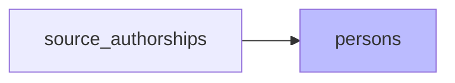

# `persons` : Rattachement et création de personnes

`create_persons_from_source_authorships` — algorithme en 3 étapes :

> **Etape initiale à ajouter** : matching par ORCID attesté dans les métadonnées Crossref (= source auteur garantie => meilleur critère possible)

1. **Même nom + même publication + même position auteur** : pour chaque authorship sans `person_id`, cherche sur la même publication (même position) une *authorship* d'une **autre source** déjà rattachée à une personne. Si le nom est compatible → rattacher. Approche conservatrice (requiert position identique dans la liste des auteurs. TODO : voir si cette condition peut être assouplie sans perte de qualité).

> **Limité aux publications de 50 auteurs max** : les méga-papers (plusieurs centaines voire milliers d'auteurs) contiennent souvent des homonymes + l'initiale au lieu du prénom + de fréquents désalignements de position auteur entre sources, pouvant conduire à de faux rattachemements.

2. **Identifiant Idref/ORCID connu** : si l'authorship est liée à un ORCID ou un IdRef déjà présent en base (table `person_identifiers`, avec `status ≠ rejected`) → rattacher. Priorité aux IdRef. Les ORCID/IdRef sont lus depuis la colonne JSONB `source_authorships.person_identifiers`.

> Les ORCID provenant de métadonnées OpenAlex ou WoS sont souvent douteux. Ils sont liés à l'entité du référentiel personnes propre à chaque base, mais ces entités sont peu fiables. L'ORCID est généralement absent de la publication : c'est donc un matching algorithmique qui a permis d'associer tel ORCID à tel auteur d'une publication. Étudier la pertinence de conserver cette étape du matching.

3. **Recherche par nom** : lookup par nom normalisé dans `person_name_forms`.
   - Nom mappé à 1 personne → rattacher
   - Nom mappé à >1 personnes → laisser orphelin (pour traitement manuel via `admin/orphan-authorships`)
   - **Nom inconnu → créer nouvelle personne**

`populate_person_name_forms` — recalcule les formes de nom depuis les sources (HAL, OpenAlex, WoS, ScanR, theses, CrossRef).
- Lors de la création d'une personne (ou d'une correction manuelle du nom/prénom) : génération automatique des variantes normalisées "prénom nom", "nom prénom", "initiales nom", "nom initiales".
- Lors d'un rattachement d'authorship : les formes de nom liées sont ajoutées aux name_forms de cette personne.

Fonctions de compatibilité de noms dans `domain/names.py`.

**Identifiants par observation** : les identifiants normalisés
(`orcid`, `idhal`, `idref`, `hal_person_id`, `researcher_id`) sont
portés au niveau de chaque `source_authorships` dans la colonne
JSONB `person_identifiers` — pas d'agrégation côté sources. Le
référentiel canonique consolidé vit sur la table `person_identifiers`
(alimentée par le pipeline personnes).
