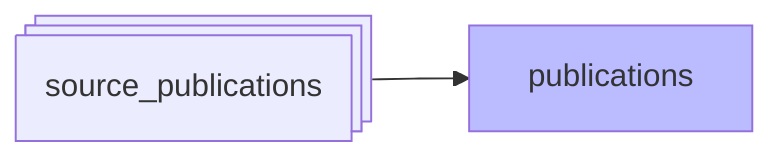
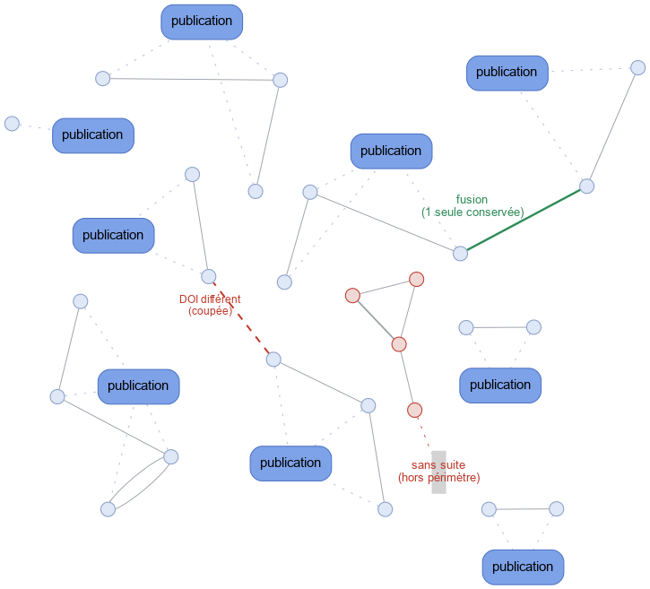

#  Création et dédoublonnage des publications

*À jour le 2026-06-30.*

Phase `publications` : maintient la table canonique `publications` à partir des `source_publications`. Une publication canonique regroupe toutes les `source_publications` qui attestent du même document, quelles que soient leurs sources. La phase rattache chaque `source_publication` à la bonne publication, en crée une lorsqu'aucune ne convient, et fusionne ou scinde les publications existantes quand le regroupement le commande.

## Reconnaître le même document

Deux `source_publications` désignent le même document si elles partagent une **clé de confirmation**. Deux familles de clés :

- **Identifiants** : DOI, NNT (numéro national de thèse), HAL id, PMID (PubMed). Égalité directe.
- **Bloc de métadonnées** : le triplet `type de document | titre normalisé | année`. Deux documents de même type, même titre et même année sont tenus pour identiques. Une longueur minimale de titre écarte les collisions de titres trop génériques.

Ces clés sont projetées par `domain/source_publications/keys.py`, à partir des colonnes déjà normalisées (phase `normalize`) puis corrigées (phase `metadata_correction`).

## Regrouper, puis assigner

Les `source_publications` reliées par au moins une clé partagée forment les **composantes connexes** d'un graphe. Une règle prime sur le regroupement : **deux DOI distincts ne désignent jamais le même document** (le DOI fait identité). Une composante qui porte plusieurs DOI est donc découpée en une partition par DOI ; chaque partition doit aboutir sur une seule publication.

Pour chaque partition, l'assignation choisit la publication cible :

- **Rattachement** : la partition contient déjà une publication existante → toutes ses `source_publications` y sont rattachées. La publication porteuse du DOI est privilégiée comme cible.
- **Création** : la partition ne contient aucune publication existante → une nouvelle publication est créée, à condition qu'au moins une `source_publication` soit **dans le périmètre UCA** et fournisse les métadonnées minimales (titre + année). Le périmètre ne conditionne que la *création* : une `source_publication` hors-périmètre est rattachée sans réserve à une publication existante, mais ne peut pas à elle seule faire entrer un nouveau document dans le référentiel.
- **Sans suite** : une partition faite uniquement de `source_publications` orphelines et hors-périmètre ne crée rien ; ces `source_publications` restent sans publication.

## Fusion et scission

Fusion et scission découlent du même regroupement :

- **Fusion** : si une partition réunit plusieurs publications existantes, une seule est conservée et les autres sont absorbées. Les données curatées qui pointaient sur une publication absorbée (`distinct_publications`, `apc_payments`) sont reportées sur la publication survivante avant que la publication vidée ne soit supprimée.
- **Scission** : si une publication existante se retrouve à cheval sur plusieurs partitions (par exemple parce qu'elle agrégeait à tort deux DOI distincts), les partitions perdantes reçoivent chacune une nouvelle publication.

*Chaque nœud est une `source_publication`, chaque arête pleine relie deux `source_publications` qui partagent une clé de confirmation, chaque ligne en pointillés rattache une `source_publication` à sa publication (boîtes).*

## Traitement incrémental

Recalculer tout le graphe à chaque run serait inutilement coûteux. Une `source_publication` modifiée (insérée, re-normalisée, corrigée) est marquée *à recalculer*, et la phase ne traite que le **voisinage direct** de ces `source_publications` — elles et celles avec lesquelles elles partagent une clé. C'est suffisant puisque toute nouvelle relation a forcément une extrémité parmi les `source_publications` modifiées.

> **Conséquence** :
> En cas de modification de la logique de déduplication, pour que les changements soient pris en compte au prochain run du pipeline, il faut marquer toutes les publications *à recalculer*, ce qui peut se faire:
> - en lançant le script `interfaces/cli/maintenance/redirty_publications.py`;
> - ou en lançant le pipeline suivant avec l'option `--rebuild-publications`;

## Rafraîchissement des métadonnées canoniques

Une fois les rattachements posés, les métadonnées de chaque publication touchée sont recalculées par agrégation de ses `source_publications`. Les publications vidées de toutes leurs `source_publications` sont supprimées. Enfin, le décompte de publications par adresse (`addresses.pub_count`) est recalculé pour refléter les créations, fusions et scissions.
